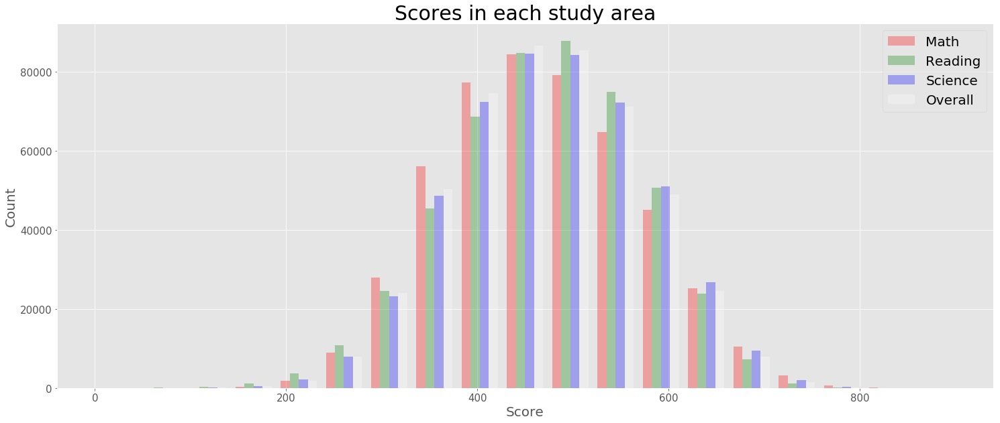
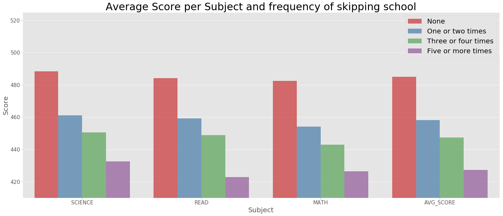
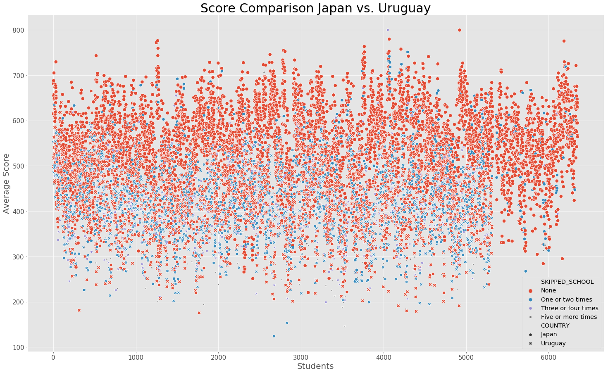

# PISA Data Findings
## by Josip Matic  

## Introduction

### PISA

> PISA is a worldwide study developed by the Organisation for Economic Co-operation and Development (OECD) to examine the skills of 15-year-old school students around the world. The study assesses students’ maths, science, and reading skills and contains a wealth of information on students’ background, their school and the organisation of the education system. For most countries, the sample is around 5,000 students, but in some countries the number is even higher. [source: https://www.oecd.org/pisa/  ]

This dataset used for this project is from the PISA study in 2012.

## Import and Load


```python
# import all packages and set plots to be embedded inline
import numpy as np
import pandas as pd
import matplotlib.pyplot as plt
import matplotlib.style as style
style.available
style.use('ggplot')
import seaborn as sb

%matplotlib inline
```

I am using two datasets. *pisa* will be the main dataset with all the records from 2012. and *pisa_dict* will be used as an encryption for the column names.


```python
# Used other encoding as encoding error occured, therefore, default UTF-8 could not be used
# low_memory is used to supress an error notification
pisa = pd.read_csv(r'C:\Users\Josip\Documents\_Udacity\ND_DA\5_Assessment\pisa2012.csv', encoding = "ISO-8859-1", low_memory=False)
pisa_dict = pd.read_csv(r'C:\Users\Josip\Documents\_Udacity\ND_DA\5_Assessment\pisadict2012.csv', encoding = "ISO-8859-1", names=['ColName','Definition'])
```

## Data Assessment  
### What is the structure of your dataset?  


```python
pisa.info()
```

    <class 'pandas.core.frame.DataFrame'>
    RangeIndex: 485490 entries, 0 to 485489
    Columns: 636 entries, Unnamed: 0 to VER_STU
    dtypes: float64(250), int64(18), object(368)
    memory usage: 2.3+ GB
    

The dataset contains float, integer and strings and is more than 2.3 GB in size.


```python
pisa_dict.info()
```

    <class 'pandas.core.frame.DataFrame'>
    RangeIndex: 636 entries, 0 to 635
    Data columns (total 2 columns):
    ColName       635 non-null object
    Definition    636 non-null object
    dtypes: object(2)
    memory usage: 10.0+ KB
    

This dataset is an additional source of information for the main dataset *pisa*. It describes in detail the column names. The column ColName has one object missing. This will be investigated later.


```python
# As the dataset contains 636 variables this function enables to display all columns and content of each cell
# for the dataset pisa_dict
pd.set_option('display.max_rows', 636)
# for the dataset pisa
pd.set_option('display.max_columns', 636)
# Displays complete content of each cell
pd.set_option('display.max_colwidth', -1)
```


```python
pisa.shape
```


    (485490, 636)


There are in total 636 variables and a little less than half a million records.


```python
pisa.sample(10)
```


<div>
<style scoped>
    .dataframe tbody tr th:only-of-type {
        vertical-align: middle;
    }

    .dataframe tbody tr th {
        vertical-align: top;
    }

    .dataframe thead th {
        text-align: right;
    }
</style>
<table border="1" class="dataframe">
  <thead>
    <tr style="text-align: right;">
      <th></th>
      <th>Unnamed: 0</th>
      <th>CNT</th>
      <th>SUBNATIO</th>
      <th>STRATUM</th>
      <th>OECD</th>
      <th>NC</th>
      <th>SCHOOLID</th>
      <th>STIDSTD</th>
      <th>ST01Q01</th>
      <th>ST02Q01</th>
      <th>ST03Q01</th>
      <th>ST03Q02</th>
      <th>ST04Q01</th>
      <th>ST05Q01</th>
      <th>ST06Q01</th>
      <th>ST07Q01</th>
      <th>ST07Q02</th>
      <th>ST07Q03</th>
      <th>ST08Q01</th>
      <th>ST09Q01</th>
      <th>ST115Q01</th>
      <th>ST11Q01</th>
      <th>ST11Q02</th>
      <th>ST11Q03</th>
      <th>ST11Q04</th>
      <th>ST11Q05</th>
      <th>ST11Q06</th>
      <th>ST13Q01</th>
      <th>ST14Q01</th>
      <th>ST14Q02</th>
      <th>ST14Q03</th>
      <th>ST14Q04</th>
      <th>ST15Q01</th>
      <th>ST17Q01</th>
      <th>ST18Q01</th>
      <th>ST18Q02</th>
      <th>ST18Q03</th>
      <th>ST18Q04</th>
      <th>ST19Q01</th>
      <th>ST20Q01</th>
      <th>ST20Q02</th>
      <th>ST20Q03</th>
      <th>ST21Q01</th>
      <th>ST25Q01</th>
      <th>ST26Q01</th>
      <th>ST26Q02</th>
      <th>ST26Q03</th>
      <th>ST26Q04</th>
      <th>ST26Q05</th>
      <th>ST26Q06</th>
      <th>ST26Q07</th>
      <th>ST26Q08</th>
      <th>ST26Q09</th>
      <th>ST26Q10</th>
      <th>ST26Q11</th>
      <th>ST26Q12</th>
      <th>ST26Q13</th>
      <th>ST26Q14</th>
      <th>ST26Q15</th>
      <th>ST26Q16</th>
      <th>ST26Q17</th>
      <th>ST27Q01</th>
      <th>ST27Q02</th>
      <th>ST27Q03</th>
      <th>ST27Q04</th>
      <th>ST27Q05</th>
      <th>ST28Q01</th>
      <th>ST29Q01</th>
      <th>ST29Q02</th>
      <th>ST29Q03</th>
      <th>ST29Q04</th>
      <th>ST29Q05</th>
      <th>ST29Q06</th>
      <th>ST29Q07</th>
      <th>ST29Q08</th>
      <th>ST35Q01</th>
      <th>ST35Q02</th>
      <th>ST35Q03</th>
      <th>ST35Q04</th>
      <th>ST35Q05</th>
      <th>ST35Q06</th>
      <th>ST37Q01</th>
      <th>ST37Q02</th>
      <th>ST37Q03</th>
      <th>ST37Q04</th>
      <th>ST37Q05</th>
      <th>ST37Q06</th>
      <th>ST37Q07</th>
      <th>ST37Q08</th>
      <th>ST42Q01</th>
      <th>ST42Q02</th>
      <th>ST42Q03</th>
      <th>ST42Q04</th>
      <th>ST42Q05</th>
      <th>ST42Q06</th>
      <th>ST42Q07</th>
      <th>ST42Q08</th>
      <th>ST42Q09</th>
      <th>ST42Q10</th>
      <th>ST43Q01</th>
      <th>ST43Q02</th>
      <th>ST43Q03</th>
      <th>ST43Q04</th>
      <th>ST43Q05</th>
      <th>ST43Q06</th>
      <th>ST44Q01</th>
      <th>ST44Q03</th>
      <th>ST44Q04</th>
      <th>ST44Q05</th>
      <th>ST44Q07</th>
      <th>ST44Q08</th>
      <th>ST46Q01</th>
      <th>ST46Q02</th>
      <th>ST46Q03</th>
      <th>ST46Q04</th>
      <th>ST46Q05</th>
      <th>ST46Q06</th>
      <th>ST46Q07</th>
      <th>ST46Q08</th>
      <th>ST46Q09</th>
      <th>ST48Q01</th>
      <th>ST48Q02</th>
      <th>ST48Q03</th>
      <th>ST48Q04</th>
      <th>ST48Q05</th>
      <th>ST49Q01</th>
      <th>ST49Q02</th>
      <th>ST49Q03</th>
      <th>ST49Q04</th>
      <th>ST49Q05</th>
      <th>ST49Q06</th>
      <th>ST49Q07</th>
      <th>ST49Q09</th>
      <th>ST53Q01</th>
      <th>ST53Q02</th>
      <th>ST53Q03</th>
      <th>ST53Q04</th>
      <th>ST55Q01</th>
      <th>ST55Q02</th>
      <th>ST55Q03</th>
      <th>ST55Q04</th>
      <th>ST57Q01</th>
      <th>ST57Q02</th>
      <th>ST57Q03</th>
      <th>ST57Q04</th>
      <th>ST57Q05</th>
      <th>ST57Q06</th>
      <th>ST61Q01</th>
      <th>ST61Q02</th>
      <th>ST61Q03</th>
      <th>ST61Q04</th>
      <th>ST61Q05</th>
      <th>ST61Q06</th>
      <th>ST61Q07</th>
      <th>ST61Q08</th>
      <th>ST61Q09</th>
      <th>ST62Q01</th>
      <th>ST62Q02</th>
      <th>ST62Q03</th>
      <th>ST62Q04</th>
      <th>ST62Q06</th>
      <th>ST62Q07</th>
      <th>ST62Q08</th>
      <th>ST62Q09</th>
      <th>ST62Q10</th>
      <th>ST62Q11</th>
      <th>ST62Q12</th>
      <th>ST62Q13</th>
      <th>ST62Q15</th>
      <th>ST62Q16</th>
      <th>ST62Q17</th>
      <th>ST62Q19</th>
      <th>ST69Q01</th>
      <th>ST69Q02</th>
      <th>ST69Q03</th>
      <th>ST70Q01</th>
      <th>ST70Q02</th>
      <th>ST70Q03</th>
      <th>ST71Q01</th>
      <th>ST72Q01</th>
      <th>ST73Q01</th>
      <th>ST73Q02</th>
      <th>ST74Q01</th>
      <th>ST74Q02</th>
      <th>ST75Q01</th>
      <th>ST75Q02</th>
      <th>ST76Q01</th>
      <th>ST76Q02</th>
      <th>ST77Q01</th>
      <th>ST77Q02</th>
      <th>ST77Q04</th>
      <th>ST77Q05</th>
      <th>ST77Q06</th>
      <th>ST79Q01</th>
      <th>ST79Q02</th>
      <th>ST79Q03</th>
      <th>ST79Q04</th>
      <th>ST79Q05</th>
      <th>ST79Q06</th>
      <th>ST79Q07</th>
      <th>ST79Q08</th>
      <th>ST79Q10</th>
      <th>ST79Q11</th>
      <th>ST79Q12</th>
      <th>ST79Q15</th>
      <th>ST79Q17</th>
      <th>ST80Q01</th>
      <th>ST80Q04</th>
      <th>ST80Q05</th>
      <th>ST80Q06</th>
      <th>ST80Q07</th>
      <th>ST80Q08</th>
      <th>ST80Q09</th>
      <th>ST80Q10</th>
      <th>ST80Q11</th>
      <th>ST81Q01</th>
      <th>ST81Q02</th>
      <th>ST81Q03</th>
      <th>ST81Q04</th>
      <th>ST81Q05</th>
      <th>ST82Q01</th>
      <th>ST82Q02</th>
      <th>ST82Q03</th>
      <th>ST83Q01</th>
      <th>ST83Q02</th>
      <th>ST83Q03</th>
      <th>ST83Q04</th>
      <th>ST84Q01</th>
      <th>ST84Q02</th>
      <th>ST84Q03</th>
      <th>ST85Q01</th>
      <th>ST85Q02</th>
      <th>ST85Q03</th>
      <th>ST85Q04</th>
      <th>ST86Q01</th>
      <th>ST86Q02</th>
      <th>ST86Q03</th>
      <th>ST86Q04</th>
      <th>ST86Q05</th>
      <th>ST87Q01</th>
      <th>ST87Q02</th>
      <th>ST87Q03</th>
      <th>ST87Q04</th>
      <th>ST87Q05</th>
      <th>ST87Q06</th>
      <th>ST87Q07</th>
      <th>ST87Q08</th>
      <th>ST87Q09</th>
      <th>ST88Q01</th>
      <th>ST88Q02</th>
      <th>ST88Q03</th>
      <th>ST88Q04</th>
      <th>ST89Q02</th>
      <th>ST89Q03</th>
      <th>ST89Q04</th>
      <th>ST89Q05</th>
      <th>ST91Q01</th>
      <th>ST91Q02</th>
      <th>ST91Q03</th>
      <th>ST91Q04</th>
      <th>ST91Q05</th>
      <th>ST91Q06</th>
      <th>ST93Q01</th>
      <th>ST93Q03</th>
      <th>ST93Q04</th>
      <th>ST93Q06</th>
      <th>ST93Q07</th>
      <th>ST94Q05</th>
      <th>ST94Q06</th>
      <th>ST94Q09</th>
      <th>ST94Q10</th>
      <th>ST94Q14</th>
      <th>ST96Q01</th>
      <th>ST96Q02</th>
      <th>ST96Q03</th>
      <th>ST96Q05</th>
      <th>ST101Q01</th>
      <th>ST101Q02</th>
      <th>ST101Q03</th>
      <th>ST101Q05</th>
      <th>ST104Q01</th>
      <th>ST104Q04</th>
      <th>ST104Q05</th>
      <th>ST104Q06</th>
      <th>IC01Q01</th>
      <th>IC01Q02</th>
      <th>IC01Q03</th>
      <th>IC01Q04</th>
      <th>IC01Q05</th>
      <th>IC01Q06</th>
      <th>IC01Q07</th>
      <th>IC01Q08</th>
      <th>IC01Q09</th>
      <th>IC01Q10</th>
      <th>IC01Q11</th>
      <th>IC02Q01</th>
      <th>IC02Q02</th>
      <th>IC02Q03</th>
      <th>IC02Q04</th>
      <th>IC02Q05</th>
      <th>IC02Q06</th>
      <th>IC02Q07</th>
      <th>IC03Q01</th>
      <th>IC04Q01</th>
      <th>IC05Q01</th>
      <th>IC06Q01</th>
      <th>IC07Q01</th>
      <th>IC08Q01</th>
      <th>IC08Q02</th>
      <th>IC08Q03</th>
      <th>IC08Q04</th>
      <th>IC08Q05</th>
      <th>IC08Q06</th>
      <th>IC08Q07</th>
      <th>IC08Q08</th>
      <th>IC08Q09</th>
      <th>IC08Q11</th>
      <th>IC09Q01</th>
      <th>IC09Q02</th>
      <th>IC09Q03</th>
      <th>IC09Q04</th>
      <th>IC09Q05</th>
      <th>IC09Q06</th>
      <th>IC09Q07</th>
      <th>IC10Q01</th>
      <th>IC10Q02</th>
      <th>IC10Q03</th>
      <th>IC10Q04</th>
      <th>IC10Q05</th>
      <th>IC10Q06</th>
      <th>IC10Q07</th>
      <th>IC10Q08</th>
      <th>IC10Q09</th>
      <th>IC11Q01</th>
      <th>IC11Q02</th>
      <th>IC11Q03</th>
      <th>IC11Q04</th>
      <th>IC11Q05</th>
      <th>IC11Q06</th>
      <th>IC11Q07</th>
      <th>IC22Q01</th>
      <th>IC22Q02</th>
      <th>IC22Q04</th>
      <th>IC22Q06</th>
      <th>IC22Q07</th>
      <th>IC22Q08</th>
      <th>EC01Q01</th>
      <th>EC02Q01</th>
      <th>EC03Q01</th>
      <th>EC03Q02</th>
      <th>EC03Q03</th>
      <th>EC03Q04</th>
      <th>EC03Q05</th>
      <th>EC03Q06</th>
      <th>EC03Q07</th>
      <th>EC03Q08</th>
      <th>EC03Q09</th>
      <th>EC03Q10</th>
      <th>EC04Q01A</th>
      <th>EC04Q01B</th>
      <th>EC04Q01C</th>
      <th>EC04Q02A</th>
      <th>EC04Q02B</th>
      <th>EC04Q02C</th>
      <th>EC04Q03A</th>
      <th>EC04Q03B</th>
      <th>EC04Q03C</th>
      <th>EC04Q04A</th>
      <th>EC04Q04B</th>
      <th>EC04Q04C</th>
      <th>EC04Q05A</th>
      <th>EC04Q05B</th>
      <th>EC04Q05C</th>
      <th>EC04Q06A</th>
      <th>EC04Q06B</th>
      <th>EC04Q06C</th>
      <th>EC05Q01</th>
      <th>EC06Q01</th>
      <th>EC07Q01</th>
      <th>EC07Q02</th>
      <th>EC07Q03</th>
      <th>EC07Q04</th>
      <th>EC07Q05</th>
      <th>EC08Q01</th>
      <th>EC08Q02</th>
      <th>EC08Q03</th>
      <th>EC08Q04</th>
      <th>EC09Q03</th>
      <th>EC10Q01</th>
      <th>EC11Q02</th>
      <th>EC11Q03</th>
      <th>EC12Q01</th>
      <th>ST22Q01</th>
      <th>ST23Q01</th>
      <th>ST23Q02</th>
      <th>ST23Q03</th>
      <th>ST23Q04</th>
      <th>ST23Q05</th>
      <th>ST23Q06</th>
      <th>ST23Q07</th>
      <th>ST23Q08</th>
      <th>ST24Q01</th>
      <th>ST24Q02</th>
      <th>ST24Q03</th>
      <th>CLCUSE1</th>
      <th>CLCUSE301</th>
      <th>CLCUSE302</th>
      <th>DEFFORT</th>
      <th>QUESTID</th>
      <th>BOOKID</th>
      <th>EASY</th>
      <th>AGE</th>
      <th>GRADE</th>
      <th>PROGN</th>
      <th>ANXMAT</th>
      <th>ATSCHL</th>
      <th>ATTLNACT</th>
      <th>BELONG</th>
      <th>BFMJ2</th>
      <th>BMMJ1</th>
      <th>CLSMAN</th>
      <th>COBN_F</th>
      <th>COBN_M</th>
      <th>COBN_S</th>
      <th>COGACT</th>
      <th>CULTDIST</th>
      <th>CULTPOS</th>
      <th>DISCLIMA</th>
      <th>ENTUSE</th>
      <th>ESCS</th>
      <th>EXAPPLM</th>
      <th>EXPUREM</th>
      <th>FAILMAT</th>
      <th>FAMCON</th>
      <th>FAMCONC</th>
      <th>FAMSTRUC</th>
      <th>FISCED</th>
      <th>HEDRES</th>
      <th>HERITCUL</th>
      <th>HISCED</th>
      <th>HISEI</th>
      <th>HOMEPOS</th>
      <th>HOMSCH</th>
      <th>HOSTCUL</th>
      <th>ICTATTNEG</th>
      <th>ICTATTPOS</th>
      <th>ICTHOME</th>
      <th>ICTRES</th>
      <th>ICTSCH</th>
      <th>IMMIG</th>
      <th>INFOCAR</th>
      <th>INFOJOB1</th>
      <th>INFOJOB2</th>
      <th>INSTMOT</th>
      <th>INTMAT</th>
      <th>ISCEDD</th>
      <th>ISCEDL</th>
      <th>ISCEDO</th>
      <th>LANGCOMM</th>
      <th>LANGN</th>
      <th>LANGRPPD</th>
      <th>LMINS</th>
      <th>MATBEH</th>
      <th>MATHEFF</th>
      <th>MATINTFC</th>
      <th>MATWKETH</th>
      <th>MISCED</th>
      <th>MMINS</th>
      <th>MTSUP</th>
      <th>OCOD1</th>
      <th>OCOD2</th>
      <th>OPENPS</th>
      <th>OUTHOURS</th>
      <th>PARED</th>
      <th>PERSEV</th>
      <th>REPEAT</th>
      <th>SCMAT</th>
      <th>SMINS</th>
      <th>STUDREL</th>
      <th>SUBNORM</th>
      <th>TCHBEHFA</th>
      <th>TCHBEHSO</th>
      <th>TCHBEHTD</th>
      <th>TEACHSUP</th>
      <th>TESTLANG</th>
      <th>TIMEINT</th>
      <th>USEMATH</th>
      <th>USESCH</th>
      <th>WEALTH</th>
      <th>ANCATSCHL</th>
      <th>ANCATTLNACT</th>
      <th>ANCBELONG</th>
      <th>ANCCLSMAN</th>
      <th>ANCCOGACT</th>
      <th>ANCINSTMOT</th>
      <th>ANCINTMAT</th>
      <th>ANCMATWKETH</th>
      <th>ANCMTSUP</th>
      <th>ANCSCMAT</th>
      <th>ANCSTUDREL</th>
      <th>ANCSUBNORM</th>
      <th>PV1MATH</th>
      <th>PV2MATH</th>
      <th>PV3MATH</th>
      <th>PV4MATH</th>
      <th>PV5MATH</th>
      <th>PV1MACC</th>
      <th>PV2MACC</th>
      <th>PV3MACC</th>
      <th>PV4MACC</th>
      <th>PV5MACC</th>
      <th>PV1MACQ</th>
      <th>PV2MACQ</th>
      <th>PV3MACQ</th>
      <th>PV4MACQ</th>
      <th>PV5MACQ</th>
      <th>PV1MACS</th>
      <th>PV2MACS</th>
      <th>PV3MACS</th>
      <th>PV4MACS</th>
      <th>PV5MACS</th>
      <th>PV1MACU</th>
      <th>PV2MACU</th>
      <th>PV3MACU</th>
      <th>PV4MACU</th>
      <th>PV5MACU</th>
      <th>PV1MAPE</th>
      <th>PV2MAPE</th>
      <th>PV3MAPE</th>
      <th>PV4MAPE</th>
      <th>PV5MAPE</th>
      <th>PV1MAPF</th>
      <th>PV2MAPF</th>
      <th>PV3MAPF</th>
      <th>PV4MAPF</th>
      <th>PV5MAPF</th>
      <th>PV1MAPI</th>
      <th>PV2MAPI</th>
      <th>PV3MAPI</th>
      <th>PV4MAPI</th>
      <th>PV5MAPI</th>
      <th>PV1READ</th>
      <th>PV2READ</th>
      <th>PV3READ</th>
      <th>PV4READ</th>
      <th>PV5READ</th>
      <th>PV1SCIE</th>
      <th>PV2SCIE</th>
      <th>PV3SCIE</th>
      <th>PV4SCIE</th>
      <th>PV5SCIE</th>
      <th>W_FSTUWT</th>
      <th>W_FSTR1</th>
      <th>W_FSTR2</th>
      <th>W_FSTR3</th>
      <th>W_FSTR4</th>
      <th>W_FSTR5</th>
      <th>W_FSTR6</th>
      <th>W_FSTR7</th>
      <th>W_FSTR8</th>
      <th>W_FSTR9</th>
      <th>W_FSTR10</th>
      <th>W_FSTR11</th>
      <th>W_FSTR12</th>
      <th>W_FSTR13</th>
      <th>W_FSTR14</th>
      <th>W_FSTR15</th>
      <th>W_FSTR16</th>
      <th>W_FSTR17</th>
      <th>W_FSTR18</th>
      <th>W_FSTR19</th>
      <th>W_FSTR20</th>
      <th>W_FSTR21</th>
      <th>W_FSTR22</th>
      <th>W_FSTR23</th>
      <th>W_FSTR24</th>
      <th>W_FSTR25</th>
      <th>W_FSTR26</th>
      <th>W_FSTR27</th>
      <th>W_FSTR28</th>
      <th>W_FSTR29</th>
      <th>W_FSTR30</th>
      <th>W_FSTR31</th>
      <th>W_FSTR32</th>
      <th>W_FSTR33</th>
      <th>W_FSTR34</th>
      <th>W_FSTR35</th>
      <th>W_FSTR36</th>
      <th>W_FSTR37</th>
      <th>W_FSTR38</th>
      <th>W_FSTR39</th>
      <th>W_FSTR40</th>
      <th>W_FSTR41</th>
      <th>W_FSTR42</th>
      <th>W_FSTR43</th>
      <th>W_FSTR44</th>
      <th>W_FSTR45</th>
      <th>W_FSTR46</th>
      <th>W_FSTR47</th>
      <th>W_FSTR48</th>
      <th>W_FSTR49</th>
      <th>W_FSTR50</th>
      <th>W_FSTR51</th>
      <th>W_FSTR52</th>
      <th>W_FSTR53</th>
      <th>W_FSTR54</th>
      <th>W_FSTR55</th>
      <th>W_FSTR56</th>
      <th>W_FSTR57</th>
      <th>W_FSTR58</th>
      <th>W_FSTR59</th>
      <th>W_FSTR60</th>
      <th>W_FSTR61</th>
      <th>W_FSTR62</th>
      <th>W_FSTR63</th>
      <th>W_FSTR64</th>
      <th>W_FSTR65</th>
      <th>W_FSTR66</th>
      <th>W_FSTR67</th>
      <th>W_FSTR68</th>
      <th>W_FSTR69</th>
      <th>W_FSTR70</th>
      <th>W_FSTR71</th>
      <th>W_FSTR72</th>
      <th>W_FSTR73</th>
      <th>W_FSTR74</th>
      <th>W_FSTR75</th>
      <th>W_FSTR76</th>
      <th>W_FSTR77</th>
      <th>W_FSTR78</th>
      <th>W_FSTR79</th>
      <th>W_FSTR80</th>
      <th>WVARSTRR</th>
      <th>VAR_UNIT</th>
      <th>SENWGT_STU</th>
      <th>VER_STU</th>
    </tr>
  </thead>
  <tbody>
    <tr>
      <th>171692</th>
      <td>171693</td>
      <td>Estonia</td>
      <td>2330000</td>
      <td>EST0001</td>
      <td>OECD</td>
      <td>Estonia</td>
      <td>36</td>
      <td>797</td>
      <td>9</td>
      <td>1.0</td>
      <td>9</td>
      <td>1996</td>
      <td>Male</td>
      <td>Yes, for more than one year</td>
      <td>6.0</td>
      <td>No, never</td>
      <td>No, never</td>
      <td>NaN</td>
      <td>One or two times</td>
      <td>None</td>
      <td>1.0</td>
      <td>Yes</td>
      <td>Yes</td>
      <td>No</td>
      <td>Yes</td>
      <td>No</td>
      <td>No</td>
      <td>&lt;ISCED level 3A&gt;</td>
      <td>No</td>
      <td>Yes</td>
      <td>No</td>
      <td>No</td>
      <td>Working full-time &lt;for pay&gt;</td>
      <td>&lt;ISCED level 3A&gt;</td>
      <td>No</td>
      <td>No</td>
      <td>No</td>
      <td>No</td>
      <td>Working full-time &lt;for pay&gt;</td>
      <td>Country of test</td>
      <td>Country of test</td>
      <td>Country of test</td>
      <td>NaN</td>
      <td>Language of the test</td>
      <td>Yes</td>
      <td>Yes</td>
      <td>Yes</td>
      <td>No</td>
      <td>Yes</td>
      <td>Yes</td>
      <td>Yes</td>
      <td>Yes</td>
      <td>No</td>
      <td>Yes</td>
      <td>Yes</td>
      <td>Yes</td>
      <td>Yes</td>
      <td>Yes</td>
      <td>233001</td>
      <td>233001</td>
      <td>233001</td>
      <td>Three or more</td>
      <td>Two</td>
      <td>One</td>
      <td>Two</td>
      <td>Two</td>
      <td>101-200 books</td>
      <td>Disagree</td>
      <td>Agree</td>
      <td>Disagree</td>
      <td>Disagree</td>
      <td>Agree</td>
      <td>Disagree</td>
      <td>Agree</td>
      <td>Agree</td>
      <td>Agree</td>
      <td>Disagree</td>
      <td>Disagree</td>
      <td>Agree</td>
      <td>Agree</td>
      <td>Disagree</td>
      <td>Confident</td>
      <td>Confident</td>
      <td>Not very confident</td>
      <td>Not very confident</td>
      <td>Very confident</td>
      <td>Very confident</td>
      <td>Very confident</td>
      <td>Not very confident</td>
      <td>NaN</td>
      <td>NaN</td>
      <td>NaN</td>
      <td>NaN</td>
      <td>NaN</td>
      <td>NaN</td>
      <td>NaN</td>
      <td>NaN</td>
      <td>NaN</td>
      <td>NaN</td>
      <td>Agree</td>
      <td>Agree</td>
      <td>Disagree</td>
      <td>Disagree</td>
      <td>Agree</td>
      <td>Strongly disagree</td>
      <td>Slightly likely</td>
      <td>Slightly likely</td>
      <td>Likely</td>
      <td>Likely</td>
      <td>Likely</td>
      <td>Very   Likely</td>
      <td>Agree</td>
      <td>Disagree</td>
      <td>Disagree</td>
      <td>Disagree</td>
      <td>Agree</td>
      <td>Agree</td>
      <td>Agree</td>
      <td>Disagree</td>
      <td>Disagree</td>
      <td>Courses after school Math</td>
      <td>Major in college Science</td>
      <td>Study harder Math</td>
      <td>Maximum classes Science</td>
      <td>Pursuing a career Science</td>
      <td>Sometimes</td>
      <td>Sometimes</td>
      <td>Never or rarely</td>
      <td>Never or rarely</td>
      <td>Never or rarely</td>
      <td>Never or rarely</td>
      <td>Never or rarely</td>
      <td>Never or rarely</td>
      <td>Most important</td>
      <td>check memory</td>
      <td>learning goals</td>
      <td>Repeat examples</td>
      <td>I do not attend &lt;out-of-school time lessons&gt; in this subject</td>
      <td>I do not attend &lt;out-of-school time lessons&gt; in this subject</td>
      <td>I do not attend &lt;out-of-school time lessons&gt; in this subject</td>
      <td>I do not attend &lt;out-of-school time lessons&gt; in this subject</td>
      <td>5.0</td>
      <td>0.0</td>
      <td>0.0</td>
      <td>0.0</td>
      <td>0.0</td>
      <td>0.0</td>
      <td>Rarely</td>
      <td>Never</td>
      <td>Never</td>
      <td>Sometimes</td>
      <td>Sometimes</td>
      <td>Rarely</td>
      <td>Sometimes</td>
      <td>Rarely</td>
      <td>Sometimes</td>
      <td>Never heard of it</td>
      <td>Heard of it often</td>
      <td>Know it well,  understand the concept</td>
      <td>Heard of it a few times</td>
      <td>Heard of it often</td>
      <td>Heard of it once or twice</td>
      <td>Heard of it once or twice</td>
      <td>Heard of it often</td>
      <td>Heard of it often</td>
      <td>Never heard of it</td>
      <td>Know it well,  understand the concept</td>
      <td>Never heard of it</td>
      <td>Heard of it a few times</td>
      <td>Heard of it often</td>
      <td>Know it well,  understand the concept</td>
      <td>Heard of it a few times</td>
      <td>45.0</td>
      <td>45.0</td>
      <td>45.0</td>
      <td>6.0</td>
      <td>6.0</td>
      <td>7.0</td>
      <td>35.0</td>
      <td>36.0</td>
      <td>Sometimes</td>
      <td>Sometimes</td>
      <td>Frequently</td>
      <td>Sometimes</td>
      <td>Sometimes</td>
      <td>Sometimes</td>
      <td>Rarely</td>
      <td>Rarely</td>
      <td>NaN</td>
      <td>NaN</td>
      <td>NaN</td>
      <td>NaN</td>
      <td>NaN</td>
      <td>NaN</td>
      <td>NaN</td>
      <td>NaN</td>
      <td>NaN</td>
      <td>NaN</td>
      <td>NaN</td>
      <td>NaN</td>
      <td>NaN</td>
      <td>NaN</td>
      <td>NaN</td>
      <td>NaN</td>
      <td>NaN</td>
      <td>NaN</td>
      <td>NaN</td>
      <td>NaN</td>
      <td>NaN</td>
      <td>NaN</td>
      <td>NaN</td>
      <td>NaN</td>
      <td>NaN</td>
      <td>NaN</td>
      <td>NaN</td>
      <td>NaN</td>
      <td>NaN</td>
      <td>NaN</td>
      <td>NaN</td>
      <td>NaN</td>
      <td>NaN</td>
      <td>NaN</td>
      <td>NaN</td>
      <td>NaN</td>
      <td>NaN</td>
      <td>NaN</td>
      <td>NaN</td>
      <td>NaN</td>
      <td>NaN</td>
      <td>NaN</td>
      <td>NaN</td>
      <td>NaN</td>
      <td>NaN</td>
      <td>NaN</td>
      <td>NaN</td>
      <td>NaN</td>
      <td>NaN</td>
      <td>NaN</td>
      <td>NaN</td>
      <td>NaN</td>
      <td>NaN</td>
      <td>NaN</td>
      <td>NaN</td>
      <td>NaN</td>
      <td>NaN</td>
      <td>NaN</td>
      <td>NaN</td>
      <td>NaN</td>
      <td>NaN</td>
      <td>NaN</td>
      <td>NaN</td>
      <td>NaN</td>
      <td>NaN</td>
      <td>NaN</td>
      <td>NaN</td>
      <td>NaN</td>
      <td>NaN</td>
      <td>NaN</td>
      <td>NaN</td>
      <td>NaN</td>
      <td>NaN</td>
      <td>NaN</td>
      <td>Not much like me</td>
      <td>Somewhat like me</td>
      <td>Mostly like me</td>
      <td>Not much like me</td>
      <td>Not much like me</td>
      <td>Somewhat like me</td>
      <td>Mostly like me</td>
      <td>Somewhat like me</td>
      <td>Somewhat like me</td>
      <td>Mostly like me</td>
      <td>probably not do this</td>
      <td>probably not do this</td>
      <td>probably do this</td>
      <td>probably do this</td>
      <td>3.0</td>
      <td>3.0</td>
      <td>3.0</td>
      <td>2.0</td>
      <td>2.0</td>
      <td>3.0</td>
      <td>2.0</td>
      <td>2.0</td>
      <td>Yes, and I use it</td>
      <td>Yes, but I don’t use it</td>
      <td>No</td>
      <td>Yes, and I use it</td>
      <td>Yes, and I use it</td>
      <td>Yes, but I don’t use it</td>
      <td>Yes, and I use it</td>
      <td>Yes, but I don’t use it</td>
      <td>Yes, but I don’t use it</td>
      <td>Yes, but I don’t use it</td>
      <td>No</td>
      <td>Yes, and I use it</td>
      <td>Yes, but I don’t use it</td>
      <td>No</td>
      <td>Yes, and I use it</td>
      <td>Yes, but I don’t use it</td>
      <td>No</td>
      <td>No</td>
      <td>6 years old or younger</td>
      <td>7-9 years old</td>
      <td>2</td>
      <td>4</td>
      <td>5</td>
      <td>Almost every day</td>
      <td>Once or twice a week</td>
      <td>Once or twice a month</td>
      <td>Once or twice a week</td>
      <td>Never or hardly ever</td>
      <td>Once or twice a week</td>
      <td>Almost every day</td>
      <td>Once or twice a month</td>
      <td>Never or hardly ever</td>
      <td>Never or hardly ever</td>
      <td>Once or twice a month</td>
      <td>Never or hardly ever</td>
      <td>Never or hardly ever</td>
      <td>Once or twice a month</td>
      <td>Never or hardly ever</td>
      <td>Once or twice a month</td>
      <td>Never or hardly ever</td>
      <td>Never or hardly ever</td>
      <td>Once or twice a month</td>
      <td>Once or twice a month</td>
      <td>Never or hardly ever</td>
      <td>Never or hardly ever</td>
      <td>Once or twice a month</td>
      <td>Never or hardly ever</td>
      <td>Once or twice a month</td>
      <td>Never or hardly ever</td>
      <td>Yes, students did this</td>
      <td>Yes, students did this</td>
      <td>Yes, students did this</td>
      <td>No</td>
      <td>Yes, students did this</td>
      <td>No</td>
      <td>Yes, but only the teacher demonstrated this</td>
      <td>Agree</td>
      <td>Disagree</td>
      <td>Strongly agree</td>
      <td>Agree</td>
      <td>Disagree</td>
      <td>Disagree</td>
      <td>NaN</td>
      <td>NaN</td>
      <td>NaN</td>
      <td>NaN</td>
      <td>NaN</td>
      <td>NaN</td>
      <td>NaN</td>
      <td>NaN</td>
      <td>NaN</td>
      <td>NaN</td>
      <td>NaN</td>
      <td>NaN</td>
      <td>NaN</td>
      <td>NaN</td>
      <td>NaN</td>
      <td>NaN</td>
      <td>NaN</td>
      <td>NaN</td>
      <td>NaN</td>
      <td>NaN</td>
      <td>NaN</td>
      <td>NaN</td>
      <td>NaN</td>
      <td>NaN</td>
      <td>NaN</td>
      <td>NaN</td>
      <td>NaN</td>
      <td>NaN</td>
      <td>NaN</td>
      <td>NaN</td>
      <td>NaN</td>
      <td>NaN</td>
      <td>NaN</td>
      <td>NaN</td>
      <td>NaN</td>
      <td>NaN</td>
      <td>NaN</td>
      <td>NaN</td>
      <td>NaN</td>
      <td>NaN</td>
      <td>NaN</td>
      <td>NaN</td>
      <td>NaN</td>
      <td>NaN</td>
      <td>NaN</td>
      <td>NaN</td>
      <td>NaN</td>
      <td>NaN</td>
      <td>NaN</td>
      <td>NaN</td>
      <td>NaN</td>
      <td>NaN</td>
      <td>NaN</td>
      <td>NaN</td>
      <td>NaN</td>
      <td>NaN</td>
      <td>NaN</td>
      <td>NaN</td>
      <td>A Scientific calculator</td>
      <td>7</td>
      <td>9</td>
      <td>2</td>
      <td>StQ Form A</td>
      <td>booklet 9</td>
      <td>Standard set of booklets</td>
      <td>15.67</td>
      <td>0.0</td>
      <td>Estonia: Lower secondary</td>
      <td>NaN</td>
      <td>NaN</td>
      <td>NaN</td>
      <td>NaN</td>
      <td>51.56</td>
      <td>70.40</td>
      <td>NaN</td>
      <td>Estonia</td>
      <td>Estonia</td>
      <td>Estonia</td>
      <td>NaN</td>
      <td>NaN</td>
      <td>0.25</td>
      <td>NaN</td>
      <td>-0.5479</td>
      <td>0.95</td>
      <td>-0.8234</td>
      <td>-0.6635</td>
      <td>0.3889</td>
      <td>0.1427</td>
      <td>0.37</td>
      <td>2.0</td>
      <td>ISCED 3A, ISCED 4</td>
      <td>0.04</td>
      <td>NaN</td>
      <td>ISCED 5A, 6</td>
      <td>70.40</td>
      <td>0.46</td>
      <td>-0.6852</td>
      <td>NaN</td>
      <td>0.3419</td>
      <td>-0.5096</td>
      <td>-0.5015</td>
      <td>-0.40</td>
      <td>-0.0836</td>
      <td>Native</td>
      <td>NaN</td>
      <td>NaN</td>
      <td>NaN</td>
      <td>0.05</td>
      <td>-0.34</td>
      <td>A</td>
      <td>ISCED level 2</td>
      <td>General</td>
      <td>NaN</td>
      <td>Estonian</td>
      <td>NaN</td>
      <td>270.0</td>
      <td>-0.4567</td>
      <td>-0.18</td>
      <td>-0.2514</td>
      <td>-0.5641</td>
      <td>ISCED 5A, 6</td>
      <td>270.0</td>
      <td>NaN</td>
      <td>Librarians and related information professionals</td>
      <td>Retail and wholesale trade managers</td>
      <td>-0.1465</td>
      <td>5.0</td>
      <td>16.0</td>
      <td>-0.3407</td>
      <td>Did not repeat a &lt;grade&gt;</td>
      <td>NaN</td>
      <td>315.0</td>
      <td>NaN</td>
      <td>-0.3852</td>
      <td>NaN</td>
      <td>NaN</td>
      <td>NaN</td>
      <td>NaN</td>
      <td>Estonian</td>
      <td>41.0</td>
      <td>1.2764</td>
      <td>0.0584</td>
      <td>0.19</td>
      <td>NaN</td>
      <td>NaN</td>
      <td>NaN</td>
      <td>NaN</td>
      <td>NaN</td>
      <td>NaN</td>
      <td>NaN</td>
      <td>NaN</td>
      <td>NaN</td>
      <td>NaN</td>
      <td>NaN</td>
      <td>NaN</td>
      <td>699.5716</td>
      <td>654.3932</td>
      <td>710.4767</td>
      <td>703.4663</td>
      <td>736.1816</td>
      <td>717.4871</td>
      <td>666.8562</td>
      <td>649.7196</td>
      <td>687.1086</td>
      <td>643.4881</td>
      <td>708.1399</td>
      <td>696.4558</td>
      <td>679.3192</td>
      <td>693.3401</td>
      <td>662.1826</td>
      <td>738.5185</td>
      <td>683.2139</td>
      <td>664.5194</td>
      <td>715.1503</td>
      <td>624.7936</td>
      <td>692.5611</td>
      <td>641.1513</td>
      <td>633.3619</td>
      <td>662.9615</td>
      <td>606.8780</td>
      <td>701.1295</td>
      <td>658.2879</td>
      <td>676.9824</td>
      <td>654.3932</td>
      <td>678.5403</td>
      <td>683.9928</td>
      <td>636.4776</td>
      <td>638.8145</td>
      <td>668.4141</td>
      <td>641.9302</td>
      <td>686.3296</td>
      <td>668.4141</td>
      <td>647.3828</td>
      <td>713.5925</td>
      <td>658.2879</td>
      <td>665.8367</td>
      <td>603.2850</td>
      <td>711.5476</td>
      <td>705.9340</td>
      <td>677.0640</td>
      <td>704.7184</td>
      <td>643.1742</td>
      <td>719.6382</td>
      <td>651.5666</td>
      <td>746.6803</td>
      <td>2.8836</td>
      <td>4.2005</td>
      <td>1.4878</td>
      <td>1.4380</td>
      <td>1.3983</td>
      <td>1.4949</td>
      <td>4.3246</td>
      <td>1.4821</td>
      <td>4.3139</td>
      <td>1.3964</td>
      <td>4.3262</td>
      <td>4.1942</td>
      <td>4.4660</td>
      <td>4.3246</td>
      <td>1.3983</td>
      <td>1.4460</td>
      <td>4.3380</td>
      <td>1.4460</td>
      <td>1.4415</td>
      <td>4.3139</td>
      <td>4.4660</td>
      <td>1.4878</td>
      <td>4.2005</td>
      <td>4.3262</td>
      <td>4.4463</td>
      <td>4.1942</td>
      <td>1.4460</td>
      <td>4.1950</td>
      <td>1.4421</td>
      <td>4.4660</td>
      <td>1.4380</td>
      <td>1.4949</td>
      <td>1.3964</td>
      <td>1.4460</td>
      <td>4.4463</td>
      <td>4.3246</td>
      <td>1.4415</td>
      <td>4.3246</td>
      <td>4.3380</td>
      <td>1.4421</td>
      <td>1.3964</td>
      <td>4.1950</td>
      <td>1.4821</td>
      <td>1.4415</td>
      <td>1.4002</td>
      <td>1.4887</td>
      <td>4.3139</td>
      <td>1.4878</td>
      <td>4.3246</td>
      <td>1.3981</td>
      <td>4.3380</td>
      <td>4.1892</td>
      <td>4.4848</td>
      <td>4.3139</td>
      <td>1.4002</td>
      <td>1.4421</td>
      <td>4.3262</td>
      <td>1.4421</td>
      <td>1.4380</td>
      <td>4.3246</td>
      <td>4.4848</td>
      <td>1.4821</td>
      <td>4.1950</td>
      <td>4.3380</td>
      <td>4.4633</td>
      <td>4.1892</td>
      <td>1.4421</td>
      <td>4.2005</td>
      <td>1.4460</td>
      <td>4.4848</td>
      <td>1.4415</td>
      <td>1.4887</td>
      <td>1.3981</td>
      <td>1.4421</td>
      <td>4.4633</td>
      <td>4.3139</td>
      <td>1.4380</td>
      <td>4.3139</td>
      <td>4.3262</td>
      <td>1.4460</td>
      <td>1.3981</td>
      <td>78</td>
      <td>1</td>
      <td>0.2480</td>
      <td>22NOV13</td>
    </tr>
    <tr>
      <th>209574</th>
      <td>209575</td>
      <td>Hong Kong-China</td>
      <td>3440000</td>
      <td>HKG0002</td>
      <td>Non-OECD</td>
      <td>Hong Kong-China</td>
      <td>87</td>
      <td>2674</td>
      <td>10</td>
      <td>1.0</td>
      <td>10</td>
      <td>1996</td>
      <td>Male</td>
      <td>Yes, for more than one year</td>
      <td>6.0</td>
      <td>No, never</td>
      <td>No, never</td>
      <td>No, never</td>
      <td>One or two times</td>
      <td>One or two times</td>
      <td>1.0</td>
      <td>Yes</td>
      <td>No</td>
      <td>No</td>
      <td>No</td>
      <td>No</td>
      <td>No</td>
      <td>&lt;ISCED level 2&gt;</td>
      <td>No</td>
      <td>No</td>
      <td>No</td>
      <td>No</td>
      <td>Working full-time &lt;for pay&gt;</td>
      <td>NaN</td>
      <td>NaN</td>
      <td>NaN</td>
      <td>NaN</td>
      <td>NaN</td>
      <td>NaN</td>
      <td>Country of test</td>
      <td>Other country</td>
      <td>NaN</td>
      <td>NaN</td>
      <td>Language of the test</td>
      <td>Yes</td>
      <td>Yes</td>
      <td>Yes</td>
      <td>Yes</td>
      <td>Yes</td>
      <td>Yes</td>
      <td>Yes</td>
      <td>Yes</td>
      <td>No</td>
      <td>Yes</td>
      <td>No</td>
      <td>Yes</td>
      <td>No</td>
      <td>Yes</td>
      <td>344001</td>
      <td>344002</td>
      <td>344002</td>
      <td>One</td>
      <td>Two</td>
      <td>Two</td>
      <td>None</td>
      <td>One</td>
      <td>26-100 books</td>
      <td>Strongly disagree</td>
      <td>Disagree</td>
      <td>Strongly disagree</td>
      <td>Strongly disagree</td>
      <td>Strongly disagree</td>
      <td>Strongly disagree</td>
      <td>Strongly disagree</td>
      <td>Strongly disagree</td>
      <td>Agree</td>
      <td>Agree</td>
      <td>Disagree</td>
      <td>Agree</td>
      <td>Agree</td>
      <td>Disagree</td>
      <td>Confident</td>
      <td>Confident</td>
      <td>Not very confident</td>
      <td>Not very confident</td>
      <td>Confident</td>
      <td>Confident</td>
      <td>Confident</td>
      <td>Not very confident</td>
      <td>NaN</td>
      <td>NaN</td>
      <td>NaN</td>
      <td>NaN</td>
      <td>NaN</td>
      <td>NaN</td>
      <td>NaN</td>
      <td>NaN</td>
      <td>NaN</td>
      <td>NaN</td>
      <td>Disagree</td>
      <td>Disagree</td>
      <td>Disagree</td>
      <td>Strongly agree</td>
      <td>Disagree</td>
      <td>Agree</td>
      <td>Likely</td>
      <td>Very   Likely</td>
      <td>Likely</td>
      <td>Likely</td>
      <td>Very   Likely</td>
      <td>Slightly likely</td>
      <td>Agree</td>
      <td>Disagree</td>
      <td>Disagree</td>
      <td>Disagree</td>
      <td>Disagree</td>
      <td>Disagree</td>
      <td>Disagree</td>
      <td>Disagree</td>
      <td>Agree</td>
      <td>Courses after school Test Language</td>
      <td>Major in college Science</td>
      <td>Study harder Test Language</td>
      <td>Maximum classes Science</td>
      <td>Pursuing a career Science</td>
      <td>Sometimes</td>
      <td>Never or rarely</td>
      <td>Never or rarely</td>
      <td>Never or rarely</td>
      <td>Never or rarely</td>
      <td>Sometimes</td>
      <td>Never or rarely</td>
      <td>Never or rarely</td>
      <td>by heart</td>
      <td>check memory</td>
      <td>Relating to other subjects</td>
      <td>Repeat examples</td>
      <td>I do not attend &lt;out-of-school time lessons&gt; in this subject</td>
      <td>4 or more but less than 6 hours a week</td>
      <td>I do not attend &lt;out-of-school time lessons&gt; in this subject</td>
      <td>2 or more but less than 4 hours a week</td>
      <td>5.0</td>
      <td>5.0</td>
      <td>5.0</td>
      <td>5.0</td>
      <td>0.0</td>
      <td>0.0</td>
      <td>Sometimes</td>
      <td>Rarely</td>
      <td>Rarely</td>
      <td>Rarely</td>
      <td>Rarely</td>
      <td>Sometimes</td>
      <td>Rarely</td>
      <td>Rarely</td>
      <td>Rarely</td>
      <td>Never heard of it</td>
      <td>Heard of it often</td>
      <td>Never heard of it</td>
      <td>Never heard of it</td>
      <td>Never heard of it</td>
      <td>Never heard of it</td>
      <td>Never heard of it</td>
      <td>Heard of it often</td>
      <td>Heard of it often</td>
      <td>Never heard of it</td>
      <td>Heard of it a few times</td>
      <td>Never heard of it</td>
      <td>Heard of it a few times</td>
      <td>Never heard of it</td>
      <td>Heard of it a few times</td>
      <td>Heard of it a few times</td>
      <td>40.0</td>
      <td>40.0</td>
      <td>40.0</td>
      <td>7.0</td>
      <td>6.0</td>
      <td>0.0</td>
      <td>40.0</td>
      <td>37.0</td>
      <td>Rarely</td>
      <td>Rarely</td>
      <td>Rarely</td>
      <td>Rarely</td>
      <td>Sometimes</td>
      <td>Sometimes</td>
      <td>Rarely</td>
      <td>Rarely</td>
      <td>NaN</td>
      <td>NaN</td>
      <td>NaN</td>
      <td>NaN</td>
      <td>NaN</td>
      <td>NaN</td>
      <td>NaN</td>
      <td>NaN</td>
      <td>NaN</td>
      <td>NaN</td>
      <td>NaN</td>
      <td>NaN</td>
      <td>NaN</td>
      <td>NaN</td>
      <td>NaN</td>
      <td>NaN</td>
      <td>NaN</td>
      <td>NaN</td>
      <td>NaN</td>
      <td>NaN</td>
      <td>NaN</td>
      <td>NaN</td>
      <td>NaN</td>
      <td>NaN</td>
      <td>NaN</td>
      <td>NaN</td>
      <td>NaN</td>
      <td>NaN</td>
      <td>NaN</td>
      <td>NaN</td>
      <td>NaN</td>
      <td>NaN</td>
      <td>NaN</td>
      <td>NaN</td>
      <td>NaN</td>
      <td>NaN</td>
      <td>NaN</td>
      <td>NaN</td>
      <td>NaN</td>
      <td>NaN</td>
      <td>NaN</td>
      <td>NaN</td>
      <td>NaN</td>
      <td>NaN</td>
      <td>NaN</td>
      <td>NaN</td>
      <td>NaN</td>
      <td>NaN</td>
      <td>NaN</td>
      <td>NaN</td>
      <td>NaN</td>
      <td>NaN</td>
      <td>NaN</td>
      <td>NaN</td>
      <td>NaN</td>
      <td>NaN</td>
      <td>NaN</td>
      <td>NaN</td>
      <td>NaN</td>
      <td>NaN</td>
      <td>NaN</td>
      <td>NaN</td>
      <td>NaN</td>
      <td>NaN</td>
      <td>NaN</td>
      <td>NaN</td>
      <td>NaN</td>
      <td>NaN</td>
      <td>NaN</td>
      <td>NaN</td>
      <td>NaN</td>
      <td>NaN</td>
      <td>NaN</td>
      <td>NaN</td>
      <td>Somewhat like me</td>
      <td>Somewhat like me</td>
      <td>Somewhat like me</td>
      <td>Somewhat like me</td>
      <td>Somewhat like me</td>
      <td>Somewhat like me</td>
      <td>Not much like me</td>
      <td>Not much like me</td>
      <td>Somewhat like me</td>
      <td>Not at all like me</td>
      <td>definitely do this</td>
      <td>definitely do this</td>
      <td>probably not do this</td>
      <td>probably do this</td>
      <td>2.0</td>
      <td>1.0</td>
      <td>3.0</td>
      <td>2.0</td>
      <td>2.0</td>
      <td>3.0</td>
      <td>2.0</td>
      <td>2.0</td>
      <td>Yes, and I use it</td>
      <td>Yes, and I use it</td>
      <td>No</td>
      <td>Yes, and I use it</td>
      <td>Yes, and I use it</td>
      <td>No</td>
      <td>Yes, and I use it</td>
      <td>Yes, and I use it</td>
      <td>No</td>
      <td>Yes, and I use it</td>
      <td>No</td>
      <td>Yes, and I use it</td>
      <td>No</td>
      <td>No</td>
      <td>Yes, and I use it</td>
      <td>Yes, and I use it</td>
      <td>No</td>
      <td>No</td>
      <td>6 years old or younger</td>
      <td>6 years old or younger</td>
      <td>1</td>
      <td>5</td>
      <td>7</td>
      <td>Once or twice a week</td>
      <td>Almost every day</td>
      <td>Never or hardly ever</td>
      <td>Every day</td>
      <td>Every day</td>
      <td>Almost every day</td>
      <td>Once or twice a month</td>
      <td>Never or hardly ever</td>
      <td>Once or twice a month</td>
      <td>Never or hardly ever</td>
      <td>Never or hardly ever</td>
      <td>Never or hardly ever</td>
      <td>Never or hardly ever</td>
      <td>Never or hardly ever</td>
      <td>Never or hardly ever</td>
      <td>Once or twice a month</td>
      <td>Once or twice a month</td>
      <td>Never or hardly ever</td>
      <td>Never or hardly ever</td>
      <td>Once or twice a month</td>
      <td>Once or twice a month</td>
      <td>Never or hardly ever</td>
      <td>Never or hardly ever</td>
      <td>Never or hardly ever</td>
      <td>Never or hardly ever</td>
      <td>Never or hardly ever</td>
      <td>No</td>
      <td>Yes, but only the teacher demonstrated this</td>
      <td>Yes, but only the teacher demonstrated this</td>
      <td>No</td>
      <td>No</td>
      <td>No</td>
      <td>No</td>
      <td>Agree</td>
      <td>Agree</td>
      <td>Strongly agree</td>
      <td>Disagree</td>
      <td>Disagree</td>
      <td>Disagree</td>
      <td>No, never</td>
      <td>No, never</td>
      <td>No, never</td>
      <td>No, never</td>
      <td>No, never</td>
      <td>No, never</td>
      <td>No, never</td>
      <td>Yes</td>
      <td>No, never</td>
      <td>No, never</td>
      <td>No, never</td>
      <td>Yes</td>
      <td>2.0</td>
      <td>2.0</td>
      <td>1.0</td>
      <td>2.0</td>
      <td>2.0</td>
      <td>1.0</td>
      <td>2.0</td>
      <td>2.0</td>
      <td>1.0</td>
      <td>2.0</td>
      <td>2.0</td>
      <td>1.0</td>
      <td>2.0</td>
      <td>2.0</td>
      <td>1.0</td>
      <td>2.0</td>
      <td>2.0</td>
      <td>1.0</td>
      <td>&lt;test language&gt; or &lt;other official national language(s) or d</td>
      <td>NaN</td>
      <td>NaN</td>
      <td>NaN</td>
      <td>NaN</td>
      <td>NaN</td>
      <td>NaN</td>
      <td>NaN</td>
      <td>NaN</td>
      <td>NaN</td>
      <td>NaN</td>
      <td>No, never</td>
      <td>NaN</td>
      <td>No, never</td>
      <td>No, never</td>
      <td>NaN</td>
      <td>NaN</td>
      <td>NaN</td>
      <td>NaN</td>
      <td>NaN</td>
      <td>NaN</td>
      <td>NaN</td>
      <td>NaN</td>
      <td>NaN</td>
      <td>NaN</td>
      <td>NaN</td>
      <td>NaN</td>
      <td>NaN</td>
      <td>A Scientific calculator</td>
      <td>4</td>
      <td>10</td>
      <td>6</td>
      <td>StQ Form A</td>
      <td>booklet 4</td>
      <td>Standard set of booklets</td>
      <td>15.58</td>
      <td>0.0</td>
      <td>Hong Kong-China: Upper Secondary in G  and  I Sch.</td>
      <td>NaN</td>
      <td>NaN</td>
      <td>NaN</td>
      <td>NaN</td>
      <td>NaN</td>
      <td>29.73</td>
      <td>NaN</td>
      <td>Missing</td>
      <td>China</td>
      <td>Hong Kong-China</td>
      <td>NaN</td>
      <td>NaN</td>
      <td>0.25</td>
      <td>NaN</td>
      <td>-0.1819</td>
      <td>-1.51</td>
      <td>-0.2531</td>
      <td>-1.5748</td>
      <td>0.9139</td>
      <td>-0.7771</td>
      <td>0.87</td>
      <td>1.0</td>
      <td>NaN</td>
      <td>0.04</td>
      <td>NaN</td>
      <td>ISCED 2</td>
      <td>29.73</td>
      <td>-0.88</td>
      <td>-0.9986</td>
      <td>NaN</td>
      <td>-0.1489</td>
      <td>0.0279</td>
      <td>-0.3025</td>
      <td>0.24</td>
      <td>-0.0836</td>
      <td>Second-Generation</td>
      <td>-0.8214</td>
      <td>-1.5392</td>
      <td>-1.7872</td>
      <td>-1.83</td>
      <td>-1.78</td>
      <td>A</td>
      <td>ISCED level 3</td>
      <td>General</td>
      <td>NaN</td>
      <td>Cantonese</td>
      <td>NaN</td>
      <td>280.0</td>
      <td>-0.4567</td>
      <td>-0.63</td>
      <td>-1.5329</td>
      <td>-0.8805</td>
      <td>ISCED 2</td>
      <td>240.0</td>
      <td>NaN</td>
      <td>Sales workers</td>
      <td>Invalid</td>
      <td>-1.3721</td>
      <td>20.0</td>
      <td>9.0</td>
      <td>-0.3407</td>
      <td>Did not repeat a &lt;grade&gt;</td>
      <td>NaN</td>
      <td>0.0</td>
      <td>NaN</td>
      <td>-0.0455</td>
      <td>NaN</td>
      <td>NaN</td>
      <td>NaN</td>
      <td>NaN</td>
      <td>Cantonese</td>
      <td>94.0</td>
      <td>0.1911</td>
      <td>-0.3985</td>
      <td>-1.38</td>
      <td>NaN</td>
      <td>NaN</td>
      <td>NaN</td>
      <td>NaN</td>
      <td>NaN</td>
      <td>NaN</td>
      <td>NaN</td>
      <td>NaN</td>
      <td>NaN</td>
      <td>NaN</td>
      <td>NaN</td>
      <td>NaN</td>
      <td>490.1932</td>
      <td>473.8355</td>
      <td>525.2454</td>
      <td>509.6666</td>
      <td>500.3194</td>
      <td>464.4882</td>
      <td>478.5091</td>
      <td>494.8668</td>
      <td>521.3507</td>
      <td>529.1401</td>
      <td>554.0661</td>
      <td>536.1505</td>
      <td>565.7501</td>
      <td>580.5499</td>
      <td>596.1287</td>
      <td>480.8459</td>
      <td>504.9930</td>
      <td>527.5822</td>
      <td>559.5186</td>
      <td>547.8346</td>
      <td>521.3507</td>
      <td>482.4038</td>
      <td>512.7824</td>
      <td>529.9190</td>
      <td>544.7188</td>
      <td>547.8346</td>
      <td>543.1609</td>
      <td>537.7084</td>
      <td>499.5404</td>
      <td>497.9826</td>
      <td>511.2245</td>
      <td>491.7511</td>
      <td>490.1932</td>
      <td>458.2567</td>
      <td>488.6353</td>
      <td>508.1087</td>
      <td>487.0774</td>
      <td>536.1505</td>
      <td>482.4038</td>
      <td>483.9617</td>
      <td>484.5972</td>
      <td>495.0224</td>
      <td>513.4672</td>
      <td>497.4283</td>
      <td>481.3894</td>
      <td>490.2462</td>
      <td>476.2589</td>
      <td>524.7482</td>
      <td>499.5711</td>
      <td>496.7736</td>
      <td>13.1196</td>
      <td>6.5598</td>
      <td>6.3998</td>
      <td>6.5598</td>
      <td>6.7280</td>
      <td>6.7280</td>
      <td>19.6794</td>
      <td>19.6794</td>
      <td>6.5598</td>
      <td>19.6794</td>
      <td>19.1995</td>
      <td>6.5598</td>
      <td>6.7280</td>
      <td>20.1840</td>
      <td>19.6794</td>
      <td>19.1995</td>
      <td>19.6794</td>
      <td>6.3998</td>
      <td>20.1840</td>
      <td>6.3998</td>
      <td>19.6794</td>
      <td>6.5598</td>
      <td>6.3998</td>
      <td>6.5598</td>
      <td>6.7280</td>
      <td>6.7280</td>
      <td>19.6794</td>
      <td>19.6794</td>
      <td>6.5598</td>
      <td>19.6794</td>
      <td>19.1995</td>
      <td>6.5598</td>
      <td>6.7280</td>
      <td>20.1840</td>
      <td>19.6794</td>
      <td>19.1995</td>
      <td>19.6794</td>
      <td>6.3998</td>
      <td>20.1840</td>
      <td>6.3998</td>
      <td>19.6794</td>
      <td>19.6794</td>
      <td>20.1840</td>
      <td>19.6794</td>
      <td>19.1995</td>
      <td>19.1995</td>
      <td>6.5598</td>
      <td>6.5598</td>
      <td>19.6794</td>
      <td>6.5598</td>
      <td>6.7280</td>
      <td>19.6794</td>
      <td>19.1995</td>
      <td>6.3998</td>
      <td>6.5598</td>
      <td>6.7280</td>
      <td>6.5598</td>
      <td>20.1840</td>
      <td>6.3998</td>
      <td>20.1840</td>
      <td>6.5598</td>
      <td>19.6794</td>
      <td>20.1840</td>
      <td>19.6794</td>
      <td>19.1995</td>
      <td>19.1995</td>
      <td>6.5598</td>
      <td>6.5598</td>
      <td>19.6794</td>
      <td>6.5598</td>
      <td>6.7280</td>
      <td>19.6794</td>
      <td>19.1995</td>
      <td>6.3998</td>
      <td>6.5598</td>
      <td>6.7280</td>
      <td>6.5598</td>
      <td>20.1840</td>
      <td>6.3998</td>
      <td>20.1840</td>
      <td>6.5598</td>
      <td>36</td>
      <td>2</td>
      <td>0.1857</td>
      <td>22NOV13</td>
    </tr>
    <tr>
      <th>437078</th>
      <td>437079</td>
      <td>Slovak Republic</td>
      <td>7030000</td>
      <td>SVK0015</td>
      <td>OECD</td>
      <td>Slovak Republic</td>
      <td>203</td>
      <td>4073</td>
      <td>10</td>
      <td>5.0</td>
      <td>2</td>
      <td>1996</td>
      <td>Female</td>
      <td>Yes, for more than one year</td>
      <td>6.0</td>
      <td>No, never</td>
      <td>No, never</td>
      <td>No, never</td>
      <td>None</td>
      <td>None</td>
      <td>1.0</td>
      <td>Yes</td>
      <td>Yes</td>
      <td>No</td>
      <td>Yes</td>
      <td>No</td>
      <td>No</td>
      <td>&lt;ISCED level 3A&gt;</td>
      <td>No</td>
      <td>No</td>
      <td>No</td>
      <td>No</td>
      <td>Working full-time &lt;for pay&gt;</td>
      <td>&lt;ISCED level 3A&gt;</td>
      <td>No</td>
      <td>No</td>
      <td>No</td>
      <td>No</td>
      <td>Working full-time &lt;for pay&gt;</td>
      <td>Country of test</td>
      <td>Country of test</td>
      <td>Country of test</td>
      <td>NaN</td>
      <td>Language of the test</td>
      <td>Yes</td>
      <td>Yes</td>
      <td>Yes</td>
      <td>Yes</td>
      <td>Yes</td>
      <td>Yes</td>
      <td>Yes</td>
      <td>Yes</td>
      <td>Yes</td>
      <td>Yes</td>
      <td>Yes</td>
      <td>Yes</td>
      <td>No</td>
      <td>Yes</td>
      <td>703001</td>
      <td>703001</td>
      <td>703001</td>
      <td>Three or more</td>
      <td>Two</td>
      <td>Three or more</td>
      <td>Two</td>
      <td>One</td>
      <td>201-500 books</td>
      <td>Agree</td>
      <td>Strongly agree</td>
      <td>Agree</td>
      <td>Strongly agree</td>
      <td>Strongly agree</td>
      <td>Agree</td>
      <td>Agree</td>
      <td>Agree</td>
      <td>Disagree</td>
      <td>Agree</td>
      <td>Disagree</td>
      <td>Strongly agree</td>
      <td>Agree</td>
      <td>Agree</td>
      <td>Confident</td>
      <td>Confident</td>
      <td>Confident</td>
      <td>Not very confident</td>
      <td>Very confident</td>
      <td>Not very confident</td>
      <td>Confident</td>
      <td>Not very confident</td>
      <td>NaN</td>
      <td>NaN</td>
      <td>NaN</td>
      <td>NaN</td>
      <td>NaN</td>
      <td>NaN</td>
      <td>NaN</td>
      <td>NaN</td>
      <td>NaN</td>
      <td>NaN</td>
      <td>Strongly agree</td>
      <td>Strongly agree</td>
      <td>Agree</td>
      <td>Disagree</td>
      <td>Agree</td>
      <td>Agree</td>
      <td>Slightly likely</td>
      <td>Slightly likely</td>
      <td>Not at all likely</td>
      <td>Slightly likely</td>
      <td>Slightly likely</td>
      <td>Very   Likely</td>
      <td>Strongly agree</td>
      <td>Strongly agree</td>
      <td>Agree</td>
      <td>Agree</td>
      <td>Agree</td>
      <td>Agree</td>
      <td>Agree</td>
      <td>Agree</td>
      <td>Agree</td>
      <td>Courses after school Math</td>
      <td>Major in college Science</td>
      <td>Study harder Math</td>
      <td>Maximum classes Science</td>
      <td>Pursuing a career Science</td>
      <td>Never or rarely</td>
      <td>Sometimes</td>
      <td>Sometimes</td>
      <td>Never or rarely</td>
      <td>Sometimes</td>
      <td>Never or rarely</td>
      <td>Never or rarely</td>
      <td>Often</td>
      <td>relating to known</td>
      <td>Improve understanding</td>
      <td>learning goals</td>
      <td>more information</td>
      <td>I do not attend &lt;out-of-school time lessons&gt; in this subject</td>
      <td>Less than 2 hours a week</td>
      <td>I do not attend &lt;out-of-school time lessons&gt; in this subject</td>
      <td>Less than 2 hours a week</td>
      <td>10.0</td>
      <td>4.0</td>
      <td>4.0</td>
      <td>4.0</td>
      <td>0.0</td>
      <td>2.0</td>
      <td>Sometimes</td>
      <td>Never</td>
      <td>Never</td>
      <td>Rarely</td>
      <td>Sometimes</td>
      <td>Never</td>
      <td>Sometimes</td>
      <td>Never</td>
      <td>NaN</td>
      <td>Never heard of it</td>
      <td>Know it well,  understand the concept</td>
      <td>Never heard of it</td>
      <td>Know it well,  understand the concept</td>
      <td>Know it well,  understand the concept</td>
      <td>Never heard of it</td>
      <td>Never heard of it</td>
      <td>Know it well,  understand the concept</td>
      <td>Never heard of it</td>
      <td>Never heard of it</td>
      <td>Know it well,  understand the concept</td>
      <td>Heard of it once or twice</td>
      <td>Heard of it once or twice</td>
      <td>Know it well,  understand the concept</td>
      <td>Heard of it once or twice</td>
      <td>Know it well,  understand the concept</td>
      <td>45.0</td>
      <td>45.0</td>
      <td>45.0</td>
      <td>3.0</td>
      <td>3.0</td>
      <td>3.0</td>
      <td>35.0</td>
      <td>29.0</td>
      <td>Sometimes</td>
      <td>Sometimes</td>
      <td>Frequently</td>
      <td>Frequently</td>
      <td>Sometimes</td>
      <td>Sometimes</td>
      <td>Rarely</td>
      <td>Rarely</td>
      <td>NaN</td>
      <td>NaN</td>
      <td>NaN</td>
      <td>NaN</td>
      <td>NaN</td>
      <td>NaN</td>
      <td>NaN</td>
      <td>NaN</td>
      <td>NaN</td>
      <td>NaN</td>
      <td>NaN</td>
      <td>NaN</td>
      <td>NaN</td>
      <td>NaN</td>
      <td>NaN</td>
      <td>NaN</td>
      <td>NaN</td>
      <td>NaN</td>
      <td>NaN</td>
      <td>NaN</td>
      <td>NaN</td>
      <td>NaN</td>
      <td>NaN</td>
      <td>NaN</td>
      <td>NaN</td>
      <td>NaN</td>
      <td>NaN</td>
      <td>NaN</td>
      <td>NaN</td>
      <td>NaN</td>
      <td>NaN</td>
      <td>NaN</td>
      <td>NaN</td>
      <td>NaN</td>
      <td>NaN</td>
      <td>NaN</td>
      <td>NaN</td>
      <td>NaN</td>
      <td>NaN</td>
      <td>NaN</td>
      <td>NaN</td>
      <td>NaN</td>
      <td>NaN</td>
      <td>NaN</td>
      <td>NaN</td>
      <td>NaN</td>
      <td>NaN</td>
      <td>NaN</td>
      <td>NaN</td>
      <td>NaN</td>
      <td>NaN</td>
      <td>NaN</td>
      <td>NaN</td>
      <td>NaN</td>
      <td>NaN</td>
      <td>NaN</td>
      <td>NaN</td>
      <td>NaN</td>
      <td>NaN</td>
      <td>NaN</td>
      <td>NaN</td>
      <td>NaN</td>
      <td>NaN</td>
      <td>NaN</td>
      <td>NaN</td>
      <td>NaN</td>
      <td>NaN</td>
      <td>NaN</td>
      <td>NaN</td>
      <td>NaN</td>
      <td>NaN</td>
      <td>NaN</td>
      <td>NaN</td>
      <td>NaN</td>
      <td>Not much like me</td>
      <td>Mostly like me</td>
      <td>Mostly like me</td>
      <td>Mostly like me</td>
      <td>Not much like me</td>
      <td>Not much like me</td>
      <td>Not much like me</td>
      <td>Very much like me</td>
      <td>Very much like me</td>
      <td>Mostly like me</td>
      <td>probably not do this</td>
      <td>probably do this</td>
      <td>probably not do this</td>
      <td>probably not do this</td>
      <td>1.0</td>
      <td>1.0</td>
      <td>3.0</td>
      <td>2.0</td>
      <td>2.0</td>
      <td>3.0</td>
      <td>3.0</td>
      <td>2.0</td>
      <td>Yes, and I use it</td>
      <td>Yes, and I use it</td>
      <td>Yes, but I don’t use it</td>
      <td>Yes, and I use it</td>
      <td>Yes, and I use it</td>
      <td>No</td>
      <td>Yes, and I use it</td>
      <td>Yes, and I use it</td>
      <td>Yes, and I use it</td>
      <td>Yes, and I use it</td>
      <td>No</td>
      <td>Yes, and I use it</td>
      <td>No</td>
      <td>No</td>
      <td>Yes, and I use it</td>
      <td>No</td>
      <td>No</td>
      <td>No</td>
      <td>7-9 years old</td>
      <td>10-12 years old</td>
      <td>1</td>
      <td>5</td>
      <td>5</td>
      <td>Never or hardly ever</td>
      <td>Never or hardly ever</td>
      <td>Once or twice a week</td>
      <td>Every day</td>
      <td>Every day</td>
      <td>Every day</td>
      <td>Almost every day</td>
      <td>Once or twice a week</td>
      <td>Once or twice a week</td>
      <td>Never or hardly ever</td>
      <td>Once or twice a week</td>
      <td>Once or twice a month</td>
      <td>Never or hardly ever</td>
      <td>Almost every day</td>
      <td>Almost every day</td>
      <td>Once or twice a week</td>
      <td>Almost every day</td>
      <td>Never or hardly ever</td>
      <td>Never or hardly ever</td>
      <td>Never or hardly ever</td>
      <td>Never or hardly ever</td>
      <td>Never or hardly ever</td>
      <td>Never or hardly ever</td>
      <td>Once or twice a month</td>
      <td>Never or hardly ever</td>
      <td>Never or hardly ever</td>
      <td>No</td>
      <td>No</td>
      <td>No</td>
      <td>No</td>
      <td>No</td>
      <td>No</td>
      <td>No</td>
      <td>Agree</td>
      <td>Agree</td>
      <td>Agree</td>
      <td>Disagree</td>
      <td>Agree</td>
      <td>Agree</td>
      <td>No, never</td>
      <td>No, never</td>
      <td>Yes</td>
      <td>No, never</td>
      <td>No, never</td>
      <td>No, never</td>
      <td>No, never</td>
      <td>Yes</td>
      <td>No, never</td>
      <td>Yes</td>
      <td>No, never</td>
      <td>No, never</td>
      <td>2.0</td>
      <td>2.0</td>
      <td>1.0</td>
      <td>2.0</td>
      <td>2.0</td>
      <td>1.0</td>
      <td>1.0</td>
      <td>2.0</td>
      <td>2.0</td>
      <td>2.0</td>
      <td>1.0</td>
      <td>2.0</td>
      <td>2.0</td>
      <td>2.0</td>
      <td>1.0</td>
      <td>2.0</td>
      <td>2.0</td>
      <td>1.0</td>
      <td>&lt;test language&gt; or &lt;other official national language(s) or d</td>
      <td>NaN</td>
      <td>NaN</td>
      <td>NaN</td>
      <td>NaN</td>
      <td>NaN</td>
      <td>NaN</td>
      <td>NaN</td>
      <td>NaN</td>
      <td>NaN</td>
      <td>NaN</td>
      <td>No, never</td>
      <td>NaN</td>
      <td>No, never</td>
      <td>No, never</td>
      <td>NaN</td>
      <td>NaN</td>
      <td>NaN</td>
      <td>NaN</td>
      <td>NaN</td>
      <td>NaN</td>
      <td>NaN</td>
      <td>NaN</td>
      <td>NaN</td>
      <td>NaN</td>
      <td>NaN</td>
      <td>NaN</td>
      <td>NaN</td>
      <td>A Scientific calculator</td>
      <td>9</td>
      <td>10</td>
      <td>1</td>
      <td>StQ Form A</td>
      <td>booklet 3</td>
      <td>Standard set of booklets</td>
      <td>16.17</td>
      <td>0.0</td>
      <td>Slovak Republic: Secondary College - branch/class with a sch</td>
      <td>NaN</td>
      <td>NaN</td>
      <td>NaN</td>
      <td>NaN</td>
      <td>25.95</td>
      <td>55.25</td>
      <td>NaN</td>
      <td>Slovak Republic</td>
      <td>Slovak Republic</td>
      <td>Slovak Republic</td>
      <td>NaN</td>
      <td>NaN</td>
      <td>1.27</td>
      <td>NaN</td>
      <td>0.0883</td>
      <td>0.38</td>
      <td>-1.2922</td>
      <td>-0.6795</td>
      <td>-0.5300</td>
      <td>-0.2608</td>
      <td>-0.82</td>
      <td>2.0</td>
      <td>ISCED 3A, ISCED 4</td>
      <td>1.12</td>
      <td>NaN</td>
      <td>ISCED 3A, ISCED 4</td>
      <td>55.25</td>
      <td>0.94</td>
      <td>0.8118</td>
      <td>NaN</td>
      <td>0.7005</td>
      <td>-0.5096</td>
      <td>0.4160</td>
      <td>1.15</td>
      <td>-0.7538</td>
      <td>Native</td>
      <td>-0.4138</td>
      <td>-0.2543</td>
      <td>-0.5656</td>
      <td>0.80</td>
      <td>1.23</td>
      <td>A</td>
      <td>ISCED level 3</td>
      <td>Modular</td>
      <td>NaN</td>
      <td>Slovak</td>
      <td>NaN</td>
      <td>135.0</td>
      <td>0.4486</td>
      <td>-0.48</td>
      <td>-0.2514</td>
      <td>0.6490</td>
      <td>ISCED 3A, ISCED 4</td>
      <td>135.0</td>
      <td>NaN</td>
      <td>Accounting associate professionals</td>
      <td>Heavy truck and lorry drivers</td>
      <td>0.0521</td>
      <td>24.0</td>
      <td>13.0</td>
      <td>-0.1475</td>
      <td>Did not repeat a &lt;grade&gt;</td>
      <td>NaN</td>
      <td>135.0</td>
      <td>NaN</td>
      <td>0.3026</td>
      <td>NaN</td>
      <td>NaN</td>
      <td>NaN</td>
      <td>NaN</td>
      <td>Slovak</td>
      <td>51.0</td>
      <td>-0.7749</td>
      <td>-0.7854</td>
      <td>0.19</td>
      <td>NaN</td>
      <td>NaN</td>
      <td>NaN</td>
      <td>NaN</td>
      <td>NaN</td>
      <td>NaN</td>
      <td>NaN</td>
      <td>NaN</td>
      <td>NaN</td>
      <td>NaN</td>
      <td>NaN</td>
      <td>NaN</td>
      <td>496.6584</td>
      <td>496.6584</td>
      <td>471.7324</td>
      <td>480.3007</td>
      <td>502.8899</td>
      <td>476.4060</td>
      <td>460.0483</td>
      <td>432.0065</td>
      <td>448.3642</td>
      <td>477.9639</td>
      <td>519.2475</td>
      <td>482.6375</td>
      <td>511.4582</td>
      <td>528.5948</td>
      <td>509.9003</td>
      <td>527.8159</td>
      <td>483.4164</td>
      <td>482.6375</td>
      <td>507.5635</td>
      <td>508.3424</td>
      <td>484.1954</td>
      <td>442.9117</td>
      <td>440.5749</td>
      <td>461.6062</td>
      <td>460.0483</td>
      <td>501.3320</td>
      <td>495.1005</td>
      <td>522.3633</td>
      <td>460.8272</td>
      <td>474.0692</td>
      <td>516.9107</td>
      <td>518.4686</td>
      <td>548.8472</td>
      <td>496.6584</td>
      <td>484.1954</td>
      <td>538.7210</td>
      <td>484.9743</td>
      <td>527.8159</td>
      <td>458.4904</td>
      <td>468.6166</td>
      <td>480.6410</td>
      <td>527.5053</td>
      <td>483.0239</td>
      <td>508.4419</td>
      <td>490.1727</td>
      <td>482.8795</td>
      <td>518.3141</td>
      <td>490.3394</td>
      <td>499.6643</td>
      <td>508.0567</td>
      <td>10.4531</td>
      <td>15.6797</td>
      <td>15.6797</td>
      <td>15.6797</td>
      <td>15.6797</td>
      <td>15.6797</td>
      <td>15.6797</td>
      <td>15.6797</td>
      <td>15.6797</td>
      <td>15.6797</td>
      <td>15.6797</td>
      <td>15.6797</td>
      <td>15.6797</td>
      <td>15.6797</td>
      <td>15.6797</td>
      <td>15.6797</td>
      <td>15.6797</td>
      <td>15.6797</td>
      <td>15.6797</td>
      <td>15.6797</td>
      <td>15.6797</td>
      <td>5.2266</td>
      <td>5.2266</td>
      <td>5.2266</td>
      <td>5.2266</td>
      <td>5.2266</td>
      <td>5.2266</td>
      <td>5.2266</td>
      <td>5.2266</td>
      <td>5.2266</td>
      <td>5.2266</td>
      <td>5.2266</td>
      <td>5.2266</td>
      <td>5.2266</td>
      <td>5.2266</td>
      <td>5.2266</td>
      <td>5.2266</td>
      <td>5.2266</td>
      <td>5.2266</td>
      <td>5.2266</td>
      <td>5.2266</td>
      <td>5.2266</td>
      <td>5.2266</td>
      <td>5.2266</td>
      <td>5.2266</td>
      <td>5.2266</td>
      <td>5.2266</td>
      <td>5.2266</td>
      <td>5.2266</td>
      <td>5.2266</td>
      <td>5.2266</td>
      <td>5.2266</td>
      <td>5.2266</td>
      <td>5.2266</td>
      <td>5.2266</td>
      <td>5.2266</td>
      <td>5.2266</td>
      <td>5.2266</td>
      <td>5.2266</td>
      <td>5.2266</td>
      <td>5.2266</td>
      <td>15.6797</td>
      <td>15.6797</td>
      <td>15.6797</td>
      <td>15.6797</td>
      <td>15.6797</td>
      <td>15.6797</td>
      <td>15.6797</td>
      <td>15.6797</td>
      <td>15.6797</td>
      <td>15.6797</td>
      <td>15.6797</td>
      <td>15.6797</td>
      <td>15.6797</td>
      <td>15.6797</td>
      <td>15.6797</td>
      <td>15.6797</td>
      <td>15.6797</td>
      <td>15.6797</td>
      <td>15.6797</td>
      <td>15.6797</td>
      <td>73</td>
      <td>1</td>
      <td>0.1913</td>
      <td>22NOV13</td>
    </tr>
    <tr>
      <th>399776</th>
      <td>399777</td>
      <td>Qatar</td>
      <td>6340000</td>
      <td>QAT0004</td>
      <td>Non-OECD</td>
      <td>Qatar</td>
      <td>149</td>
      <td>10526</td>
      <td>11</td>
      <td>4.0</td>
      <td>8</td>
      <td>1996</td>
      <td>Female</td>
      <td>Yes, for one year or less</td>
      <td>6.0</td>
      <td>No, never</td>
      <td>No, never</td>
      <td>No, never</td>
      <td>One or two times</td>
      <td>None</td>
      <td>1.0</td>
      <td>Yes</td>
      <td>Yes</td>
      <td>Yes</td>
      <td>NaN</td>
      <td>NaN</td>
      <td>NaN</td>
      <td>&lt;ISCED level 3A&gt;</td>
      <td>NaN</td>
      <td>NaN</td>
      <td>NaN</td>
      <td>NaN</td>
      <td>Not working, but looking for a job</td>
      <td>&lt;ISCED level 3A&gt;</td>
      <td>NaN</td>
      <td>NaN</td>
      <td>NaN</td>
      <td>NaN</td>
      <td>Working full-time &lt;for pay&gt;</td>
      <td>Other country</td>
      <td>Other country</td>
      <td>Other country</td>
      <td>6.0</td>
      <td>Other language</td>
      <td>Yes</td>
      <td>Yes</td>
      <td>Yes</td>
      <td>Yes</td>
      <td>NaN</td>
      <td>Yes</td>
      <td>No</td>
      <td>No</td>
      <td>Yes</td>
      <td>Yes</td>
      <td>No</td>
      <td>Yes</td>
      <td>No</td>
      <td>Yes</td>
      <td>634002</td>
      <td>634001</td>
      <td>634001</td>
      <td>NaN</td>
      <td>Three or more</td>
      <td>Three or more</td>
      <td>One</td>
      <td>Two</td>
      <td>11-25 books</td>
      <td>Disagree</td>
      <td>Agree</td>
      <td>Agree</td>
      <td>Disagree</td>
      <td>Agree</td>
      <td>Agree</td>
      <td>Strongly agree</td>
      <td>Agree</td>
      <td>Agree</td>
      <td>Strongly agree</td>
      <td>Disagree</td>
      <td>Strongly agree</td>
      <td>Strongly agree</td>
      <td>Strongly agree</td>
      <td>Very confident</td>
      <td>Not very confident</td>
      <td>Not very confident</td>
      <td>Not very confident</td>
      <td>Not very confident</td>
      <td>Not at all confident</td>
      <td>Not very confident</td>
      <td>Not at all confident</td>
      <td>Strongly agree</td>
      <td>Agree</td>
      <td>Agree</td>
      <td>Disagree</td>
      <td>Agree</td>
      <td>Disagree</td>
      <td>Agree</td>
      <td>Agree</td>
      <td>Agree</td>
      <td>Strongly agree</td>
      <td>Strongly agree</td>
      <td>Strongly agree</td>
      <td>Disagree</td>
      <td>Agree</td>
      <td>Strongly agree</td>
      <td>Strongly agree</td>
      <td>Likely</td>
      <td>Likely</td>
      <td>Likely</td>
      <td>Likely</td>
      <td>Likely</td>
      <td>Likely</td>
      <td>Agree</td>
      <td>Agree</td>
      <td>Agree</td>
      <td>Agree</td>
      <td>Disagree</td>
      <td>Agree</td>
      <td>Agree</td>
      <td>Agree</td>
      <td>Agree</td>
      <td>Courses after school Test Language</td>
      <td>Major in college Math</td>
      <td>Study harder Math</td>
      <td>Maximum classes Math</td>
      <td>Pursuing a career Math</td>
      <td>Always or almost always</td>
      <td>Always or almost always</td>
      <td>Sometimes</td>
      <td>Never or rarely</td>
      <td>Often</td>
      <td>Never or rarely</td>
      <td>Often</td>
      <td>Never or rarely</td>
      <td>NaN</td>
      <td>NaN</td>
      <td>NaN</td>
      <td>NaN</td>
      <td>NaN</td>
      <td>NaN</td>
      <td>NaN</td>
      <td>NaN</td>
      <td>NaN</td>
      <td>NaN</td>
      <td>NaN</td>
      <td>NaN</td>
      <td>NaN</td>
      <td>NaN</td>
      <td>NaN</td>
      <td>NaN</td>
      <td>NaN</td>
      <td>NaN</td>
      <td>NaN</td>
      <td>NaN</td>
      <td>NaN</td>
      <td>NaN</td>
      <td>NaN</td>
      <td>NaN</td>
      <td>NaN</td>
      <td>NaN</td>
      <td>NaN</td>
      <td>NaN</td>
      <td>NaN</td>
      <td>NaN</td>
      <td>NaN</td>
      <td>NaN</td>
      <td>NaN</td>
      <td>NaN</td>
      <td>NaN</td>
      <td>NaN</td>
      <td>NaN</td>
      <td>NaN</td>
      <td>NaN</td>
      <td>NaN</td>
      <td>NaN</td>
      <td>NaN</td>
      <td>NaN</td>
      <td>NaN</td>
      <td>NaN</td>
      <td>NaN</td>
      <td>NaN</td>
      <td>NaN</td>
      <td>NaN</td>
      <td>NaN</td>
      <td>NaN</td>
      <td>NaN</td>
      <td>NaN</td>
      <td>NaN</td>
      <td>NaN</td>
      <td>Every Lesson</td>
      <td>Most Lessons</td>
      <td>Most Lessons</td>
      <td>Most Lessons</td>
      <td>Most Lessons</td>
      <td>Most Lessons</td>
      <td>Some Lessons</td>
      <td>Never or Hardly Ever</td>
      <td>Never or Hardly Ever</td>
      <td>Never or Hardly Ever</td>
      <td>Most Lessons</td>
      <td>Some Lessons</td>
      <td>Never or Hardly Ever</td>
      <td>Never or Hardly Ever</td>
      <td>Some Lessons</td>
      <td>Some Lessons</td>
      <td>Most Lessons</td>
      <td>Most Lessons</td>
      <td>Often</td>
      <td>Often</td>
      <td>Sometimes</td>
      <td>Often</td>
      <td>Never or rarely</td>
      <td>Sometimes</td>
      <td>Always or almost always</td>
      <td>Sometimes</td>
      <td>Often</td>
      <td>NaN</td>
      <td>NaN</td>
      <td>NaN</td>
      <td>NaN</td>
      <td>NaN</td>
      <td>NaN</td>
      <td>NaN</td>
      <td>NaN</td>
      <td>Agree</td>
      <td>Strongly agree</td>
      <td>Agree</td>
      <td>Agree</td>
      <td>Agree</td>
      <td>Strongly agree</td>
      <td>Disagree</td>
      <td>Agree</td>
      <td>Agree</td>
      <td>Agree</td>
      <td>Disagree</td>
      <td>Agree</td>
      <td>Agree</td>
      <td>Agree</td>
      <td>Agree</td>
      <td>Agree</td>
      <td>Disagree</td>
      <td>Agree</td>
      <td>Agree</td>
      <td>Disagree</td>
      <td>Agree</td>
      <td>Disagree</td>
      <td>Agree</td>
      <td>Agree</td>
      <td>Agree</td>
      <td>Disagree</td>
      <td>Disagree</td>
      <td>Agree</td>
      <td>Strongly agree</td>
      <td>Strongly agree</td>
      <td>Strongly agree</td>
      <td>Strongly agree</td>
      <td>Strongly agree</td>
      <td>Strongly agree</td>
      <td>Strongly agree</td>
      <td>Disagree</td>
      <td>Agree</td>
      <td>Agree</td>
      <td>Agree</td>
      <td>Very much like me</td>
      <td>Very much like me</td>
      <td>Mostly like me</td>
      <td>Mostly like me</td>
      <td>Mostly like me</td>
      <td>Mostly like me</td>
      <td>Mostly like me</td>
      <td>Mostly like me</td>
      <td>Mostly like me</td>
      <td>Not much like me</td>
      <td>probably do this</td>
      <td>probably do this</td>
      <td>probably do this</td>
      <td>probably do this</td>
      <td>3.0</td>
      <td>3.0</td>
      <td>3.0</td>
      <td>2.0</td>
      <td>2.0</td>
      <td>2.0</td>
      <td>2.0</td>
      <td>2.0</td>
      <td>NaN</td>
      <td>NaN</td>
      <td>NaN</td>
      <td>NaN</td>
      <td>NaN</td>
      <td>NaN</td>
      <td>NaN</td>
      <td>NaN</td>
      <td>NaN</td>
      <td>NaN</td>
      <td>NaN</td>
      <td>NaN</td>
      <td>NaN</td>
      <td>NaN</td>
      <td>NaN</td>
      <td>NaN</td>
      <td>NaN</td>
      <td>NaN</td>
      <td>NaN</td>
      <td>NaN</td>
      <td>97</td>
      <td>97</td>
      <td>97</td>
      <td>NaN</td>
      <td>NaN</td>
      <td>NaN</td>
      <td>NaN</td>
      <td>NaN</td>
      <td>NaN</td>
      <td>NaN</td>
      <td>NaN</td>
      <td>NaN</td>
      <td>NaN</td>
      <td>NaN</td>
      <td>NaN</td>
      <td>NaN</td>
      <td>NaN</td>
      <td>NaN</td>
      <td>NaN</td>
      <td>NaN</td>
      <td>NaN</td>
      <td>NaN</td>
      <td>NaN</td>
      <td>NaN</td>
      <td>NaN</td>
      <td>NaN</td>
      <td>NaN</td>
      <td>NaN</td>
      <td>NaN</td>
      <td>NaN</td>
      <td>NaN</td>
      <td>NaN</td>
      <td>NaN</td>
      <td>NaN</td>
      <td>NaN</td>
      <td>NaN</td>
      <td>NaN</td>
      <td>NaN</td>
      <td>NaN</td>
      <td>NaN</td>
      <td>NaN</td>
      <td>NaN</td>
      <td>NaN</td>
      <td>NaN</td>
      <td>NaN</td>
      <td>NaN</td>
      <td>NaN</td>
      <td>NaN</td>
      <td>NaN</td>
      <td>NaN</td>
      <td>NaN</td>
      <td>NaN</td>
      <td>NaN</td>
      <td>NaN</td>
      <td>NaN</td>
      <td>NaN</td>
      <td>NaN</td>
      <td>NaN</td>
      <td>NaN</td>
      <td>NaN</td>
      <td>NaN</td>
      <td>NaN</td>
      <td>NaN</td>
      <td>NaN</td>
      <td>NaN</td>
      <td>NaN</td>
      <td>NaN</td>
      <td>NaN</td>
      <td>NaN</td>
      <td>NaN</td>
      <td>NaN</td>
      <td>NaN</td>
      <td>NaN</td>
      <td>NaN</td>
      <td>NaN</td>
      <td>NaN</td>
      <td>NaN</td>
      <td>NaN</td>
      <td>NaN</td>
      <td>NaN</td>
      <td>NaN</td>
      <td>NaN</td>
      <td>NaN</td>
      <td>NaN</td>
      <td>NaN</td>
      <td>NaN</td>
      <td>NaN</td>
      <td>NaN</td>
      <td>NaN</td>
      <td>NaN</td>
      <td>NaN</td>
      <td>NaN</td>
      <td>NaN</td>
      <td>NaN</td>
      <td>NaN</td>
      <td>NaN</td>
      <td>NaN</td>
      <td>NaN</td>
      <td>NaN</td>
      <td>NaN</td>
      <td>A Simple calculator</td>
      <td>8</td>
      <td>10</td>
      <td>2</td>
      <td>StQ Form B</td>
      <td>booklet 6</td>
      <td>Standard set of booklets</td>
      <td>15.58</td>
      <td>1.0</td>
      <td>Qatar: Upper Secondary International</td>
      <td>1.26</td>
      <td>0.24</td>
      <td>1.2115</td>
      <td>-0.37</td>
      <td>35.82</td>
      <td>85.41</td>
      <td>-0.0784</td>
      <td>Another country (QAT)</td>
      <td>Another country (QAT)</td>
      <td>Another country (QAT)</td>
      <td>-0.1777</td>
      <td>NaN</td>
      <td>-0.48</td>
      <td>NaN</td>
      <td>NaN</td>
      <td>0.26</td>
      <td>NaN</td>
      <td>NaN</td>
      <td>0.6400</td>
      <td>NaN</td>
      <td>NaN</td>
      <td>2.0</td>
      <td>ISCED 3A, ISCED 4</td>
      <td>-0.54</td>
      <td>NaN</td>
      <td>ISCED 3A, ISCED 4</td>
      <td>85.41</td>
      <td>-0.27</td>
      <td>NaN</td>
      <td>NaN</td>
      <td>NaN</td>
      <td>NaN</td>
      <td>NaN</td>
      <td>1.01</td>
      <td>NaN</td>
      <td>First-Generation</td>
      <td>NaN</td>
      <td>NaN</td>
      <td>NaN</td>
      <td>0.50</td>
      <td>0.30</td>
      <td>A</td>
      <td>ISCED level 3</td>
      <td>General</td>
      <td>NaN</td>
      <td>Arabic</td>
      <td>NaN</td>
      <td>NaN</td>
      <td>1.3516</td>
      <td>-1.36</td>
      <td>0.6584</td>
      <td>0.1099</td>
      <td>ISCED 3A, ISCED 4</td>
      <td>NaN</td>
      <td>0.2486</td>
      <td>University and higher education teachers</td>
      <td>Well drillers and borers and related workers</td>
      <td>0.0521</td>
      <td>NaN</td>
      <td>12.0</td>
      <td>-0.5316</td>
      <td>Did not repeat a &lt;grade&gt;</td>
      <td>-0.06</td>
      <td>NaN</td>
      <td>-0.02</td>
      <td>1.7943</td>
      <td>-0.2859</td>
      <td>-0.5809</td>
      <td>-0.5612</td>
      <td>0.11</td>
      <td>English</td>
      <td>NaN</td>
      <td>NaN</td>
      <td>NaN</td>
      <td>0.30</td>
      <td>-0.0377</td>
      <td>0.4908</td>
      <td>-0.2191</td>
      <td>-0.0983</td>
      <td>-0.0219</td>
      <td>0.1111</td>
      <td>0.0486</td>
      <td>0.0093</td>
      <td>-0.0243</td>
      <td>-0.0807</td>
      <td>-0.1113</td>
      <td>0.6373</td>
      <td>437.9265</td>
      <td>462.0735</td>
      <td>511.1466</td>
      <td>501.0204</td>
      <td>497.9047</td>
      <td>471.4208</td>
      <td>456.6210</td>
      <td>475.3155</td>
      <td>490.1153</td>
      <td>452.7263</td>
      <td>491.6732</td>
      <td>460.5157</td>
      <td>476.8733</td>
      <td>508.8098</td>
      <td>465.1893</td>
      <td>504.1362</td>
      <td>462.0735</td>
      <td>480.7680</td>
      <td>492.4521</td>
      <td>468.3050</td>
      <td>462.0735</td>
      <td>455.8420</td>
      <td>469.0840</td>
      <td>489.3363</td>
      <td>457.3999</td>
      <td>476.0944</td>
      <td>519.7149</td>
      <td>494.0100</td>
      <td>467.5261</td>
      <td>456.6210</td>
      <td>433.2528</td>
      <td>487.7785</td>
      <td>444.9369</td>
      <td>416.1162</td>
      <td>422.3477</td>
      <td>468.3050</td>
      <td>490.1153</td>
      <td>444.1580</td>
      <td>459.7367</td>
      <td>452.7263</td>
      <td>523.6132</td>
      <td>563.3287</td>
      <td>490.2521</td>
      <td>565.7116</td>
      <td>553.7970</td>
      <td>486.5162</td>
      <td>431.4994</td>
      <td>581.6300</td>
      <td>513.5584</td>
      <td>451.0817</td>
      <td>1.0018</td>
      <td>0.5009</td>
      <td>0.5009</td>
      <td>1.5027</td>
      <td>1.5027</td>
      <td>0.5009</td>
      <td>0.5009</td>
      <td>1.5027</td>
      <td>1.5027</td>
      <td>1.5027</td>
      <td>1.5027</td>
      <td>0.5009</td>
      <td>1.5027</td>
      <td>0.5009</td>
      <td>1.5027</td>
      <td>0.5009</td>
      <td>0.5009</td>
      <td>0.5009</td>
      <td>0.5009</td>
      <td>1.5027</td>
      <td>1.5027</td>
      <td>1.5027</td>
      <td>1.5027</td>
      <td>0.5009</td>
      <td>0.5009</td>
      <td>1.5027</td>
      <td>1.5027</td>
      <td>0.5009</td>
      <td>0.5009</td>
      <td>0.5009</td>
      <td>0.5009</td>
      <td>1.5027</td>
      <td>0.5009</td>
      <td>1.5027</td>
      <td>0.5009</td>
      <td>1.5027</td>
      <td>1.5027</td>
      <td>1.5027</td>
      <td>1.5027</td>
      <td>0.5009</td>
      <td>0.5009</td>
      <td>1.5027</td>
      <td>1.5027</td>
      <td>0.5009</td>
      <td>0.5009</td>
      <td>1.5027</td>
      <td>1.5027</td>
      <td>0.5009</td>
      <td>0.5009</td>
      <td>0.5009</td>
      <td>0.5009</td>
      <td>1.5027</td>
      <td>0.5009</td>
      <td>1.5027</td>
      <td>0.5009</td>
      <td>1.5027</td>
      <td>1.5027</td>
      <td>1.5027</td>
      <td>1.5027</td>
      <td>0.5009</td>
      <td>0.5009</td>
      <td>0.5009</td>
      <td>0.5009</td>
      <td>1.5027</td>
      <td>1.5027</td>
      <td>0.5009</td>
      <td>0.5009</td>
      <td>1.5027</td>
      <td>1.5027</td>
      <td>1.5027</td>
      <td>1.5027</td>
      <td>0.5009</td>
      <td>1.5027</td>
      <td>0.5009</td>
      <td>1.5027</td>
      <td>0.5009</td>
      <td>0.5009</td>
      <td>0.5009</td>
      <td>0.5009</td>
      <td>1.5027</td>
      <td>1.5027</td>
      <td>2</td>
      <td>2</td>
      <td>0.0910</td>
      <td>22NOV13</td>
    </tr>
    <tr>
      <th>136792</th>
      <td>136793</td>
      <td>Germany</td>
      <td>2760000</td>
      <td>DEU0210</td>
      <td>OECD</td>
      <td>Germany</td>
      <td>171</td>
      <td>3692</td>
      <td>9</td>
      <td>2.0</td>
      <td>7</td>
      <td>1996</td>
      <td>Female</td>
      <td>NaN</td>
      <td>NaN</td>
      <td>NaN</td>
      <td>NaN</td>
      <td>NaN</td>
      <td>NaN</td>
      <td>NaN</td>
      <td>NaN</td>
      <td>NaN</td>
      <td>NaN</td>
      <td>NaN</td>
      <td>NaN</td>
      <td>NaN</td>
      <td>NaN</td>
      <td>NaN</td>
      <td>NaN</td>
      <td>NaN</td>
      <td>NaN</td>
      <td>NaN</td>
      <td>NaN</td>
      <td>NaN</td>
      <td>NaN</td>
      <td>NaN</td>
      <td>NaN</td>
      <td>NaN</td>
      <td>NaN</td>
      <td>NaN</td>
      <td>NaN</td>
      <td>NaN</td>
      <td>NaN</td>
      <td>NaN</td>
      <td>NaN</td>
      <td>NaN</td>
      <td>NaN</td>
      <td>NaN</td>
      <td>NaN</td>
      <td>NaN</td>
      <td>NaN</td>
      <td>NaN</td>
      <td>NaN</td>
      <td>NaN</td>
      <td>NaN</td>
      <td>NaN</td>
      <td>NaN</td>
      <td>NaN</td>
      <td>7777777</td>
      <td>7777777</td>
      <td>7777777</td>
      <td>NaN</td>
      <td>NaN</td>
      <td>NaN</td>
      <td>NaN</td>
      <td>NaN</td>
      <td>NaN</td>
      <td>NaN</td>
      <td>NaN</td>
      <td>NaN</td>
      <td>NaN</td>
      <td>NaN</td>
      <td>NaN</td>
      <td>NaN</td>
      <td>NaN</td>
      <td>NaN</td>
      <td>NaN</td>
      <td>NaN</td>
      <td>NaN</td>
      <td>NaN</td>
      <td>NaN</td>
      <td>NaN</td>
      <td>NaN</td>
      <td>NaN</td>
      <td>NaN</td>
      <td>NaN</td>
      <td>NaN</td>
      <td>NaN</td>
      <td>NaN</td>
      <td>NaN</td>
      <td>NaN</td>
      <td>NaN</td>
      <td>NaN</td>
      <td>NaN</td>
      <td>NaN</td>
      <td>NaN</td>
      <td>NaN</td>
      <td>NaN</td>
      <td>NaN</td>
      <td>NaN</td>
      <td>NaN</td>
      <td>NaN</td>
      <td>NaN</td>
      <td>NaN</td>
      <td>NaN</td>
      <td>NaN</td>
      <td>NaN</td>
      <td>NaN</td>
      <td>NaN</td>
      <td>NaN</td>
      <td>NaN</td>
      <td>NaN</td>
      <td>NaN</td>
      <td>NaN</td>
      <td>NaN</td>
      <td>NaN</td>
      <td>NaN</td>
      <td>NaN</td>
      <td>NaN</td>
      <td>NaN</td>
      <td>NaN</td>
      <td>NaN</td>
      <td>NaN</td>
      <td>NaN</td>
      <td>NaN</td>
      <td>NaN</td>
      <td>NaN</td>
      <td>NaN</td>
      <td>NaN</td>
      <td>NaN</td>
      <td>NaN</td>
      <td>NaN</td>
      <td>NaN</td>
      <td>NaN</td>
      <td>NaN</td>
      <td>NaN</td>
      <td>NaN</td>
      <td>NaN</td>
      <td>NaN</td>
      <td>NaN</td>
      <td>NaN</td>
      <td>NaN</td>
      <td>NaN</td>
      <td>NaN</td>
      <td>NaN</td>
      <td>NaN</td>
      <td>NaN</td>
      <td>NaN</td>
      <td>NaN</td>
      <td>NaN</td>
      <td>NaN</td>
      <td>NaN</td>
      <td>NaN</td>
      <td>NaN</td>
      <td>NaN</td>
      <td>NaN</td>
      <td>NaN</td>
      <td>NaN</td>
      <td>NaN</td>
      <td>NaN</td>
      <td>NaN</td>
      <td>NaN</td>
      <td>NaN</td>
      <td>NaN</td>
      <td>NaN</td>
      <td>NaN</td>
      <td>NaN</td>
      <td>NaN</td>
      <td>NaN</td>
      <td>NaN</td>
      <td>NaN</td>
      <td>NaN</td>
      <td>NaN</td>
      <td>NaN</td>
      <td>NaN</td>
      <td>NaN</td>
      <td>NaN</td>
      <td>NaN</td>
      <td>NaN</td>
      <td>NaN</td>
      <td>NaN</td>
      <td>NaN</td>
      <td>NaN</td>
      <td>NaN</td>
      <td>NaN</td>
      <td>NaN</td>
      <td>NaN</td>
      <td>NaN</td>
      <td>NaN</td>
      <td>NaN</td>
      <td>NaN</td>
      <td>NaN</td>
      <td>NaN</td>
      <td>NaN</td>
      <td>NaN</td>
      <td>NaN</td>
      <td>NaN</td>
      <td>NaN</td>
      <td>NaN</td>
      <td>NaN</td>
      <td>NaN</td>
      <td>NaN</td>
      <td>NaN</td>
      <td>NaN</td>
      <td>NaN</td>
      <td>NaN</td>
      <td>NaN</td>
      <td>NaN</td>
      <td>NaN</td>
      <td>NaN</td>
      <td>NaN</td>
      <td>NaN</td>
      <td>NaN</td>
      <td>NaN</td>
      <td>NaN</td>
      <td>NaN</td>
      <td>NaN</td>
      <td>NaN</td>
      <td>NaN</td>
      <td>NaN</td>
      <td>NaN</td>
      <td>NaN</td>
      <td>NaN</td>
      <td>NaN</td>
      <td>NaN</td>
      <td>NaN</td>
      <td>NaN</td>
      <td>NaN</td>
      <td>NaN</td>
      <td>NaN</td>
      <td>NaN</td>
      <td>NaN</td>
      <td>NaN</td>
      <td>NaN</td>
      <td>NaN</td>
      <td>NaN</td>
      <td>NaN</td>
      <td>NaN</td>
      <td>NaN</td>
      <td>NaN</td>
      <td>NaN</td>
      <td>NaN</td>
      <td>NaN</td>
      <td>NaN</td>
      <td>NaN</td>
      <td>NaN</td>
      <td>NaN</td>
      <td>NaN</td>
      <td>NaN</td>
      <td>NaN</td>
      <td>NaN</td>
      <td>NaN</td>
      <td>NaN</td>
      <td>NaN</td>
      <td>NaN</td>
      <td>NaN</td>
      <td>NaN</td>
      <td>NaN</td>
      <td>NaN</td>
      <td>NaN</td>
      <td>NaN</td>
      <td>NaN</td>
      <td>NaN</td>
      <td>NaN</td>
      <td>NaN</td>
      <td>NaN</td>
      <td>NaN</td>
      <td>NaN</td>
      <td>NaN</td>
      <td>NaN</td>
      <td>NaN</td>
      <td>NaN</td>
      <td>NaN</td>
      <td>NaN</td>
      <td>NaN</td>
      <td>NaN</td>
      <td>NaN</td>
      <td>NaN</td>
      <td>NaN</td>
      <td>NaN</td>
      <td>NaN</td>
      <td>NaN</td>
      <td>NaN</td>
      <td>NaN</td>
      <td>NaN</td>
      <td>NaN</td>
      <td>NaN</td>
      <td>NaN</td>
      <td>NaN</td>
      <td>NaN</td>
      <td>NaN</td>
      <td>NaN</td>
      <td>NaN</td>
      <td>NaN</td>
      <td>NaN</td>
      <td>NaN</td>
      <td>NaN</td>
      <td>NaN</td>
      <td>NaN</td>
      <td>NaN</td>
      <td>NaN</td>
      <td>NaN</td>
      <td>NaN</td>
      <td>NaN</td>
      <td>97</td>
      <td>97</td>
      <td>97</td>
      <td>NaN</td>
      <td>NaN</td>
      <td>NaN</td>
      <td>NaN</td>
      <td>NaN</td>
      <td>NaN</td>
      <td>NaN</td>
      <td>NaN</td>
      <td>NaN</td>
      <td>NaN</td>
      <td>NaN</td>
      <td>NaN</td>
      <td>NaN</td>
      <td>NaN</td>
      <td>NaN</td>
      <td>NaN</td>
      <td>NaN</td>
      <td>NaN</td>
      <td>NaN</td>
      <td>NaN</td>
      <td>NaN</td>
      <td>NaN</td>
      <td>NaN</td>
      <td>NaN</td>
      <td>NaN</td>
      <td>NaN</td>
      <td>NaN</td>
      <td>NaN</td>
      <td>NaN</td>
      <td>NaN</td>
      <td>NaN</td>
      <td>NaN</td>
      <td>NaN</td>
      <td>NaN</td>
      <td>NaN</td>
      <td>NaN</td>
      <td>NaN</td>
      <td>NaN</td>
      <td>NaN</td>
      <td>NaN</td>
      <td>NaN</td>
      <td>NaN</td>
      <td>NaN</td>
      <td>NaN</td>
      <td>NaN</td>
      <td>NaN</td>
      <td>NaN</td>
      <td>NaN</td>
      <td>NaN</td>
      <td>NaN</td>
      <td>NaN</td>
      <td>NaN</td>
      <td>NaN</td>
      <td>NaN</td>
      <td>NaN</td>
      <td>NaN</td>
      <td>NaN</td>
      <td>NaN</td>
      <td>NaN</td>
      <td>NaN</td>
      <td>NaN</td>
      <td>NaN</td>
      <td>NaN</td>
      <td>NaN</td>
      <td>NaN</td>
      <td>NaN</td>
      <td>NaN</td>
      <td>NaN</td>
      <td>NaN</td>
      <td>NaN</td>
      <td>NaN</td>
      <td>NaN</td>
      <td>NaN</td>
      <td>NaN</td>
      <td>NaN</td>
      <td>NaN</td>
      <td>NaN</td>
      <td>NaN</td>
      <td>NaN</td>
      <td>NaN</td>
      <td>NaN</td>
      <td>NaN</td>
      <td>NaN</td>
      <td>NaN</td>
      <td>NaN</td>
      <td>NaN</td>
      <td>NaN</td>
      <td>NaN</td>
      <td>NaN</td>
      <td>NaN</td>
      <td>NaN</td>
      <td>NaN</td>
      <td>NaN</td>
      <td>NaN</td>
      <td>NaN</td>
      <td>NaN</td>
      <td>NaN</td>
      <td>A Simple calculator</td>
      <td>10</td>
      <td>10</td>
      <td>0</td>
      <td>StQ Form B</td>
      <td>booklet 8</td>
      <td>Standard set of booklets</td>
      <td>15.83</td>
      <td>0.0</td>
      <td>Germany: Lower secondary without access to upper secondary,</td>
      <td>NaN</td>
      <td>NaN</td>
      <td>NaN</td>
      <td>NaN</td>
      <td>NaN</td>
      <td>NaN</td>
      <td>NaN</td>
      <td>NaN</td>
      <td>NaN</td>
      <td>NaN</td>
      <td>NaN</td>
      <td>NaN</td>
      <td>NaN</td>
      <td>NaN</td>
      <td>NaN</td>
      <td>NaN</td>
      <td>NaN</td>
      <td>NaN</td>
      <td>NaN</td>
      <td>NaN</td>
      <td>NaN</td>
      <td>NaN</td>
      <td>NaN</td>
      <td>NaN</td>
      <td>NaN</td>
      <td>NaN</td>
      <td>NaN</td>
      <td>NaN</td>
      <td>NaN</td>
      <td>NaN</td>
      <td>NaN</td>
      <td>NaN</td>
      <td>NaN</td>
      <td>NaN</td>
      <td>NaN</td>
      <td>NaN</td>
      <td>NaN</td>
      <td>NaN</td>
      <td>NaN</td>
      <td>NaN</td>
      <td>NaN</td>
      <td>A</td>
      <td>ISCED level 2</td>
      <td>General</td>
      <td>NaN</td>
      <td>NaN</td>
      <td>NaN</td>
      <td>NaN</td>
      <td>NaN</td>
      <td>NaN</td>
      <td>NaN</td>
      <td>NaN</td>
      <td>NaN</td>
      <td>NaN</td>
      <td>NaN</td>
      <td>Missing</td>
      <td>Missing</td>
      <td>NaN</td>
      <td>NaN</td>
      <td>NaN</td>
      <td>NaN</td>
      <td>NaN</td>
      <td>NaN</td>
      <td>NaN</td>
      <td>NaN</td>
      <td>NaN</td>
      <td>NaN</td>
      <td>NaN</td>
      <td>NaN</td>
      <td>NaN</td>
      <td>German</td>
      <td>NaN</td>
      <td>NaN</td>
      <td>NaN</td>
      <td>NaN</td>
      <td>NaN</td>
      <td>NaN</td>
      <td>NaN</td>
      <td>NaN</td>
      <td>NaN</td>
      <td>NaN</td>
      <td>NaN</td>
      <td>NaN</td>
      <td>NaN</td>
      <td>NaN</td>
      <td>NaN</td>
      <td>NaN</td>
      <td>492.6079</td>
      <td>483.2606</td>
      <td>498.0604</td>
      <td>529.9969</td>
      <td>479.3659</td>
      <td>547.1335</td>
      <td>504.2919</td>
      <td>529.2179</td>
      <td>458.3346</td>
      <td>501.1762</td>
      <td>524.5443</td>
      <td>468.4608</td>
      <td>476.2502</td>
      <td>424.8403</td>
      <td>489.4921</td>
      <td>511.3024</td>
      <td>488.7132</td>
      <td>487.9343</td>
      <td>477.8081</td>
      <td>512.8603</td>
      <td>512.0813</td>
      <td>478.5870</td>
      <td>506.6288</td>
      <td>455.9978</td>
      <td>494.9447</td>
      <td>475.4713</td>
      <td>441.9769</td>
      <td>466.9029</td>
      <td>508.1866</td>
      <td>451.3242</td>
      <td>468.4608</td>
      <td>453.6610</td>
      <td>507.4077</td>
      <td>547.9124</td>
      <td>484.8185</td>
      <td>515.9760</td>
      <td>438.8612</td>
      <td>483.2606</td>
      <td>532.3337</td>
      <td>461.4504</td>
      <td>549.5871</td>
      <td>549.5871</td>
      <td>548.7928</td>
      <td>560.7075</td>
      <td>526.5521</td>
      <td>489.5002</td>
      <td>468.0530</td>
      <td>520.2723</td>
      <td>523.0698</td>
      <td>522.1373</td>
      <td>109.5009</td>
      <td>164.2514</td>
      <td>54.7505</td>
      <td>164.2514</td>
      <td>54.7505</td>
      <td>54.7505</td>
      <td>164.2514</td>
      <td>164.2514</td>
      <td>54.7505</td>
      <td>54.7505</td>
      <td>54.7505</td>
      <td>54.7505</td>
      <td>164.2514</td>
      <td>54.7505</td>
      <td>164.2514</td>
      <td>54.7505</td>
      <td>164.2514</td>
      <td>164.2514</td>
      <td>164.2514</td>
      <td>164.2514</td>
      <td>54.7505</td>
      <td>54.7505</td>
      <td>164.2514</td>
      <td>54.7505</td>
      <td>164.2514</td>
      <td>164.2514</td>
      <td>54.7505</td>
      <td>54.7505</td>
      <td>164.2514</td>
      <td>164.2514</td>
      <td>164.2514</td>
      <td>164.2514</td>
      <td>54.7505</td>
      <td>164.2514</td>
      <td>54.7505</td>
      <td>164.2514</td>
      <td>54.7505</td>
      <td>54.7505</td>
      <td>54.7505</td>
      <td>54.7505</td>
      <td>164.2514</td>
      <td>54.7505</td>
      <td>164.2514</td>
      <td>54.7505</td>
      <td>164.2514</td>
      <td>164.2514</td>
      <td>54.7505</td>
      <td>54.7505</td>
      <td>164.2514</td>
      <td>164.2514</td>
      <td>164.2514</td>
      <td>164.2514</td>
      <td>54.7505</td>
      <td>164.2514</td>
      <td>54.7505</td>
      <td>164.2514</td>
      <td>54.7505</td>
      <td>54.7505</td>
      <td>54.7505</td>
      <td>54.7505</td>
      <td>164.2514</td>
      <td>164.2514</td>
      <td>54.7505</td>
      <td>164.2514</td>
      <td>54.7505</td>
      <td>54.7505</td>
      <td>164.2514</td>
      <td>164.2514</td>
      <td>54.7505</td>
      <td>54.7505</td>
      <td>54.7505</td>
      <td>54.7505</td>
      <td>164.2514</td>
      <td>54.7505</td>
      <td>164.2514</td>
      <td>54.7505</td>
      <td>164.2514</td>
      <td>164.2514</td>
      <td>164.2514</td>
      <td>164.2514</td>
      <td>54.7505</td>
      <td>78</td>
      <td>1</td>
      <td>0.1447</td>
      <td>22NOV13</td>
    </tr>
    <tr>
      <th>6560</th>
      <td>6561</td>
      <td>United Arab Emirates</td>
      <td>7840200</td>
      <td>ARE0214</td>
      <td>Non-OECD</td>
      <td>United Arab Emirates</td>
      <td>70</td>
      <td>1818</td>
      <td>10</td>
      <td>1.0</td>
      <td>9</td>
      <td>1996</td>
      <td>Male</td>
      <td>No</td>
      <td>6.0</td>
      <td>No, never</td>
      <td>No, never</td>
      <td>No, never</td>
      <td>Three or four times</td>
      <td>None</td>
      <td>1.0</td>
      <td>Yes</td>
      <td>Yes</td>
      <td>Yes</td>
      <td>Yes</td>
      <td>No</td>
      <td>No</td>
      <td>&lt;ISCED level 3A&gt;</td>
      <td>NaN</td>
      <td>Yes</td>
      <td>NaN</td>
      <td>NaN</td>
      <td>Other (e.g. home duties, retired)</td>
      <td>&lt;ISCED level 3A&gt;</td>
      <td>NaN</td>
      <td>Yes</td>
      <td>NaN</td>
      <td>NaN</td>
      <td>Other (e.g. home duties, retired)</td>
      <td>Country of test</td>
      <td>Country of test</td>
      <td>Country of test</td>
      <td>NaN</td>
      <td>Other language</td>
      <td>Yes</td>
      <td>Yes</td>
      <td>Yes</td>
      <td>Yes</td>
      <td>Yes</td>
      <td>Yes</td>
      <td>No</td>
      <td>Yes</td>
      <td>Yes</td>
      <td>Yes</td>
      <td>No</td>
      <td>Yes</td>
      <td>Yes</td>
      <td>Yes</td>
      <td>784001</td>
      <td>784001</td>
      <td>784001</td>
      <td>Three or more</td>
      <td>Three or more</td>
      <td>Three or more</td>
      <td>Three or more</td>
      <td>Three or more</td>
      <td>26-100 books</td>
      <td>Agree</td>
      <td>Agree</td>
      <td>Disagree</td>
      <td>Disagree</td>
      <td>Agree</td>
      <td>Agree</td>
      <td>Strongly agree</td>
      <td>Strongly agree</td>
      <td>Disagree</td>
      <td>Disagree</td>
      <td>Disagree</td>
      <td>Strongly agree</td>
      <td>Strongly agree</td>
      <td>Agree</td>
      <td>Very confident</td>
      <td>Very confident</td>
      <td>Confident</td>
      <td>Very confident</td>
      <td>Very confident</td>
      <td>Not very confident</td>
      <td>Not very confident</td>
      <td>Very confident</td>
      <td>NaN</td>
      <td>NaN</td>
      <td>NaN</td>
      <td>NaN</td>
      <td>NaN</td>
      <td>NaN</td>
      <td>NaN</td>
      <td>NaN</td>
      <td>NaN</td>
      <td>NaN</td>
      <td>Agree</td>
      <td>Strongly agree</td>
      <td>Agree</td>
      <td>Disagree</td>
      <td>Agree</td>
      <td>Agree</td>
      <td>Slightly likely</td>
      <td>Not at all likely</td>
      <td>Likely</td>
      <td>Very   Likely</td>
      <td>Slightly likely</td>
      <td>Very   Likely</td>
      <td>Agree</td>
      <td>Disagree</td>
      <td>Agree</td>
      <td>Disagree</td>
      <td>Agree</td>
      <td>Disagree</td>
      <td>Disagree</td>
      <td>Agree</td>
      <td>Disagree</td>
      <td>Courses after school Test Language</td>
      <td>Major in college Math</td>
      <td>Study harder Math</td>
      <td>Maximum classes Math</td>
      <td>Pursuing a career Math</td>
      <td>Always or almost always</td>
      <td>Always or almost always</td>
      <td>Always or almost always</td>
      <td>Always or almost always</td>
      <td>Often</td>
      <td>Sometimes</td>
      <td>Always or almost always</td>
      <td>Often</td>
      <td>relating to known</td>
      <td>new ways</td>
      <td>learning goals</td>
      <td>everyday life</td>
      <td>I do not attend &lt;out-of-school time lessons&gt; in this subject</td>
      <td>I do not attend &lt;out-of-school time lessons&gt; in this subject</td>
      <td>Less than 2 hours a week</td>
      <td>Less than 2 hours a week</td>
      <td>4.0</td>
      <td>2.0</td>
      <td>1.0</td>
      <td>6.0</td>
      <td>5.0</td>
      <td>3.0</td>
      <td>Frequently</td>
      <td>Frequently</td>
      <td>Frequently</td>
      <td>Frequently</td>
      <td>Sometimes</td>
      <td>Rarely</td>
      <td>Rarely</td>
      <td>Frequently</td>
      <td>Frequently</td>
      <td>Heard of it often</td>
      <td>Never heard of it</td>
      <td>Know it well,  understand the concept</td>
      <td>Know it well,  understand the concept</td>
      <td>Heard of it often</td>
      <td>Know it well,  understand the concept</td>
      <td>Heard of it often</td>
      <td>Heard of it often</td>
      <td>Heard of it a few times</td>
      <td>Heard of it once or twice</td>
      <td>Know it well,  understand the concept</td>
      <td>Heard of it a few times</td>
      <td>Know it well,  understand the concept</td>
      <td>Know it well,  understand the concept</td>
      <td>Heard of it once or twice</td>
      <td>Heard of it often</td>
      <td>45.0</td>
      <td>45.0</td>
      <td>45.0</td>
      <td>9.0</td>
      <td>8.0</td>
      <td>6.0</td>
      <td>35.0</td>
      <td>21.0</td>
      <td>Sometimes</td>
      <td>Sometimes</td>
      <td>Frequently</td>
      <td>Rarely</td>
      <td>Frequently</td>
      <td>Sometimes</td>
      <td>Frequently</td>
      <td>Sometimes</td>
      <td>NaN</td>
      <td>NaN</td>
      <td>NaN</td>
      <td>NaN</td>
      <td>NaN</td>
      <td>NaN</td>
      <td>NaN</td>
      <td>NaN</td>
      <td>NaN</td>
      <td>NaN</td>
      <td>NaN</td>
      <td>NaN</td>
      <td>NaN</td>
      <td>NaN</td>
      <td>NaN</td>
      <td>NaN</td>
      <td>NaN</td>
      <td>NaN</td>
      <td>NaN</td>
      <td>NaN</td>
      <td>NaN</td>
      <td>NaN</td>
      <td>NaN</td>
      <td>NaN</td>
      <td>NaN</td>
      <td>NaN</td>
      <td>NaN</td>
      <td>NaN</td>
      <td>NaN</td>
      <td>NaN</td>
      <td>NaN</td>
      <td>NaN</td>
      <td>NaN</td>
      <td>NaN</td>
      <td>NaN</td>
      <td>NaN</td>
      <td>NaN</td>
      <td>NaN</td>
      <td>NaN</td>
      <td>NaN</td>
      <td>NaN</td>
      <td>NaN</td>
      <td>NaN</td>
      <td>NaN</td>
      <td>NaN</td>
      <td>NaN</td>
      <td>NaN</td>
      <td>NaN</td>
      <td>NaN</td>
      <td>NaN</td>
      <td>NaN</td>
      <td>NaN</td>
      <td>NaN</td>
      <td>NaN</td>
      <td>NaN</td>
      <td>NaN</td>
      <td>NaN</td>
      <td>NaN</td>
      <td>NaN</td>
      <td>NaN</td>
      <td>NaN</td>
      <td>NaN</td>
      <td>NaN</td>
      <td>NaN</td>
      <td>NaN</td>
      <td>NaN</td>
      <td>NaN</td>
      <td>NaN</td>
      <td>NaN</td>
      <td>NaN</td>
      <td>NaN</td>
      <td>NaN</td>
      <td>NaN</td>
      <td>NaN</td>
      <td>Mostly like me</td>
      <td>Not at all like me</td>
      <td>Somewhat like me</td>
      <td>Mostly like me</td>
      <td>Somewhat like me</td>
      <td>Mostly like me</td>
      <td>Somewhat like me</td>
      <td>Mostly like me</td>
      <td>Mostly like me</td>
      <td>Somewhat like me</td>
      <td>definitely do this</td>
      <td>probably do this</td>
      <td>definitely do this</td>
      <td>definitely do this</td>
      <td>1.0</td>
      <td>1.0</td>
      <td>3.0</td>
      <td>1.0</td>
      <td>1.0</td>
      <td>2.0</td>
      <td>1.0</td>
      <td>2.0</td>
      <td>NaN</td>
      <td>NaN</td>
      <td>NaN</td>
      <td>NaN</td>
      <td>NaN</td>
      <td>NaN</td>
      <td>NaN</td>
      <td>NaN</td>
      <td>NaN</td>
      <td>NaN</td>
      <td>NaN</td>
      <td>NaN</td>
      <td>NaN</td>
      <td>NaN</td>
      <td>NaN</td>
      <td>NaN</td>
      <td>NaN</td>
      <td>NaN</td>
      <td>NaN</td>
      <td>NaN</td>
      <td>97</td>
      <td>97</td>
      <td>97</td>
      <td>NaN</td>
      <td>NaN</td>
      <td>NaN</td>
      <td>NaN</td>
      <td>NaN</td>
      <td>NaN</td>
      <td>NaN</td>
      <td>NaN</td>
      <td>NaN</td>
      <td>NaN</td>
      <td>NaN</td>
      <td>NaN</td>
      <td>NaN</td>
      <td>NaN</td>
      <td>NaN</td>
      <td>NaN</td>
      <td>NaN</td>
      <td>NaN</td>
      <td>NaN</td>
      <td>NaN</td>
      <td>NaN</td>
      <td>NaN</td>
      <td>NaN</td>
      <td>NaN</td>
      <td>NaN</td>
      <td>NaN</td>
      <td>NaN</td>
      <td>NaN</td>
      <td>NaN</td>
      <td>NaN</td>
      <td>NaN</td>
      <td>NaN</td>
      <td>NaN</td>
      <td>NaN</td>
      <td>NaN</td>
      <td>NaN</td>
      <td>NaN</td>
      <td>NaN</td>
      <td>NaN</td>
      <td>NaN</td>
      <td>NaN</td>
      <td>NaN</td>
      <td>NaN</td>
      <td>NaN</td>
      <td>NaN</td>
      <td>NaN</td>
      <td>NaN</td>
      <td>NaN</td>
      <td>NaN</td>
      <td>NaN</td>
      <td>NaN</td>
      <td>NaN</td>
      <td>NaN</td>
      <td>NaN</td>
      <td>NaN</td>
      <td>NaN</td>
      <td>NaN</td>
      <td>NaN</td>
      <td>NaN</td>
      <td>NaN</td>
      <td>NaN</td>
      <td>NaN</td>
      <td>NaN</td>
      <td>NaN</td>
      <td>NaN</td>
      <td>NaN</td>
      <td>NaN</td>
      <td>NaN</td>
      <td>NaN</td>
      <td>NaN</td>
      <td>NaN</td>
      <td>NaN</td>
      <td>NaN</td>
      <td>NaN</td>
      <td>NaN</td>
      <td>NaN</td>
      <td>NaN</td>
      <td>NaN</td>
      <td>NaN</td>
      <td>NaN</td>
      <td>NaN</td>
      <td>NaN</td>
      <td>NaN</td>
      <td>NaN</td>
      <td>NaN</td>
      <td>NaN</td>
      <td>NaN</td>
      <td>NaN</td>
      <td>NaN</td>
      <td>NaN</td>
      <td>NaN</td>
      <td>NaN</td>
      <td>NaN</td>
      <td>NaN</td>
      <td>NaN</td>
      <td>NaN</td>
      <td>NaN</td>
      <td>NaN</td>
      <td>97</td>
      <td>97</td>
      <td>97</td>
      <td>StQ Form A</td>
      <td>booklet 9</td>
      <td>Easier set of booklets</td>
      <td>15.67</td>
      <td>0.0</td>
      <td>United Arab Emirates: Secondary Education ( upper)</td>
      <td>NaN</td>
      <td>NaN</td>
      <td>NaN</td>
      <td>NaN</td>
      <td>65.12</td>
      <td>65.12</td>
      <td>NaN</td>
      <td>United Arab Emirates</td>
      <td>United Arab Emirates</td>
      <td>United Arab Emirates</td>
      <td>NaN</td>
      <td>NaN</td>
      <td>0.25</td>
      <td>NaN</td>
      <td>NaN</td>
      <td>1.17</td>
      <td>1.7013</td>
      <td>-0.6635</td>
      <td>0.1524</td>
      <td>0.4794</td>
      <td>-0.67</td>
      <td>2.0</td>
      <td>ISCED 5A, 6</td>
      <td>0.04</td>
      <td>NaN</td>
      <td>ISCED 5A, 6</td>
      <td>65.12</td>
      <td>1.53</td>
      <td>NaN</td>
      <td>NaN</td>
      <td>NaN</td>
      <td>NaN</td>
      <td>NaN</td>
      <td>1.15</td>
      <td>NaN</td>
      <td>Native</td>
      <td>NaN</td>
      <td>NaN</td>
      <td>NaN</td>
      <td>0.80</td>
      <td>0.30</td>
      <td>A</td>
      <td>ISCED level 3</td>
      <td>General</td>
      <td>NaN</td>
      <td>Arabic</td>
      <td>NaN</td>
      <td>405.0</td>
      <td>2.5276</td>
      <td>0.34</td>
      <td>0.6584</td>
      <td>-0.5641</td>
      <td>ISCED 5A, 6</td>
      <td>360.0</td>
      <td>NaN</td>
      <td>Managers</td>
      <td>Managers</td>
      <td>0.0521</td>
      <td>21.0</td>
      <td>16.0</td>
      <td>0.0511</td>
      <td>Did not repeat a &lt;grade&gt;</td>
      <td>NaN</td>
      <td>270.0</td>
      <td>NaN</td>
      <td>0.3026</td>
      <td>NaN</td>
      <td>NaN</td>
      <td>NaN</td>
      <td>NaN</td>
      <td>English</td>
      <td>NaN</td>
      <td>NaN</td>
      <td>NaN</td>
      <td>3.09</td>
      <td>NaN</td>
      <td>NaN</td>
      <td>NaN</td>
      <td>NaN</td>
      <td>NaN</td>
      <td>NaN</td>
      <td>NaN</td>
      <td>NaN</td>
      <td>NaN</td>
      <td>NaN</td>
      <td>NaN</td>
      <td>NaN</td>
      <td>457.3999</td>
      <td>463.6314</td>
      <td>421.5688</td>
      <td>418.4530</td>
      <td>390.4113</td>
      <td>493.2310</td>
      <td>384.1798</td>
      <td>420.7898</td>
      <td>476.8733</td>
      <td>439.4843</td>
      <td>473.7576</td>
      <td>381.0640</td>
      <td>416.8952</td>
      <td>462.0735</td>
      <td>420.7898</td>
      <td>434.0318</td>
      <td>349.1276</td>
      <td>393.5270</td>
      <td>424.6845</td>
      <td>423.1267</td>
      <td>491.6732</td>
      <td>414.5583</td>
      <td>431.6950</td>
      <td>460.5157</td>
      <td>445.7158</td>
      <td>511.9255</td>
      <td>377.1693</td>
      <td>547.7567</td>
      <td>435.5897</td>
      <td>450.3895</td>
      <td>504.9151</td>
      <td>376.3904</td>
      <td>527.5043</td>
      <td>393.5270</td>
      <td>432.4739</td>
      <td>508.8098</td>
      <td>378.7272</td>
      <td>510.3677</td>
      <td>408.3268</td>
      <td>477.6523</td>
      <td>334.3928</td>
      <td>357.6492</td>
      <td>352.0356</td>
      <td>352.0356</td>
      <td>357.6492</td>
      <td>350.3730</td>
      <td>396.9974</td>
      <td>352.2380</td>
      <td>383.0101</td>
      <td>334.5207</td>
      <td>1.0938</td>
      <td>0.7187</td>
      <td>0.6750</td>
      <td>0.6758</td>
      <td>1.4984</td>
      <td>1.5586</td>
      <td>0.6981</td>
      <td>1.5030</td>
      <td>1.4170</td>
      <td>0.7172</td>
      <td>0.7237</td>
      <td>1.4971</td>
      <td>1.5016</td>
      <td>1.4133</td>
      <td>1.4511</td>
      <td>0.7172</td>
      <td>1.5064</td>
      <td>0.7194</td>
      <td>1.4570</td>
      <td>0.7187</td>
      <td>0.7187</td>
      <td>0.6965</td>
      <td>0.6954</td>
      <td>0.6970</td>
      <td>1.4539</td>
      <td>1.5078</td>
      <td>0.7211</td>
      <td>1.5519</td>
      <td>1.4627</td>
      <td>0.7403</td>
      <td>0.6998</td>
      <td>1.5439</td>
      <td>1.4561</td>
      <td>1.4561</td>
      <td>1.4104</td>
      <td>0.6954</td>
      <td>1.4593</td>
      <td>0.6970</td>
      <td>1.5030</td>
      <td>0.7425</td>
      <td>0.6965</td>
      <td>1.4570</td>
      <td>1.5566</td>
      <td>1.5500</td>
      <td>0.6981</td>
      <td>0.6747</td>
      <td>1.4984</td>
      <td>0.6965</td>
      <td>0.7374</td>
      <td>1.4593</td>
      <td>1.4511</td>
      <td>0.6986</td>
      <td>0.6970</td>
      <td>0.7434</td>
      <td>0.7237</td>
      <td>1.4593</td>
      <td>0.6954</td>
      <td>1.4561</td>
      <td>0.7187</td>
      <td>1.4570</td>
      <td>1.4570</td>
      <td>1.5030</td>
      <td>1.5064</td>
      <td>1.5016</td>
      <td>0.7211</td>
      <td>0.6950</td>
      <td>1.4539</td>
      <td>0.6756</td>
      <td>0.7150</td>
      <td>1.4151</td>
      <td>1.4941</td>
      <td>0.6767</td>
      <td>0.7194</td>
      <td>0.7194</td>
      <td>0.7493</td>
      <td>1.5064</td>
      <td>0.7172</td>
      <td>1.5016</td>
      <td>0.6965</td>
      <td>1.4138</td>
      <td>1.5030</td>
      <td>39</td>
      <td>2</td>
      <td>0.0269</td>
      <td>22NOV13</td>
    </tr>
    <tr>
      <th>443747</th>
      <td>443748</td>
      <td>Sweden</td>
      <td>7520000</td>
      <td>SWE0002</td>
      <td>OECD</td>
      <td>Sweden</td>
      <td>8</td>
      <td>153</td>
      <td>9</td>
      <td>1.0</td>
      <td>5</td>
      <td>1996</td>
      <td>Female</td>
      <td>Yes, for one year or less</td>
      <td>7.0</td>
      <td>No, never</td>
      <td>No, never</td>
      <td>No, never</td>
      <td>One or two times</td>
      <td>None</td>
      <td>1.0</td>
      <td>Yes</td>
      <td>Yes</td>
      <td>NaN</td>
      <td>Yes</td>
      <td>NaN</td>
      <td>NaN</td>
      <td>&lt;ISCED level 3A&gt;</td>
      <td>NaN</td>
      <td>NaN</td>
      <td>Yes</td>
      <td>NaN</td>
      <td>Other (e.g. home duties, retired)</td>
      <td>&lt;ISCED level 3A&gt;</td>
      <td>NaN</td>
      <td>Yes</td>
      <td>NaN</td>
      <td>NaN</td>
      <td>Working full-time &lt;for pay&gt;</td>
      <td>Country of test</td>
      <td>Country of test</td>
      <td>Country of test</td>
      <td>NaN</td>
      <td>Language of the test</td>
      <td>Yes</td>
      <td>Yes</td>
      <td>Yes</td>
      <td>Yes</td>
      <td>Yes</td>
      <td>Yes</td>
      <td>Yes</td>
      <td>Yes</td>
      <td>Yes</td>
      <td>Yes</td>
      <td>Yes</td>
      <td>Yes</td>
      <td>No</td>
      <td>No</td>
      <td>752002</td>
      <td>752002</td>
      <td>752002</td>
      <td>Three or more</td>
      <td>Two</td>
      <td>Two</td>
      <td>Two</td>
      <td>Two</td>
      <td>101-200 books</td>
      <td>Strongly agree</td>
      <td>Strongly agree</td>
      <td>Strongly agree</td>
      <td>Strongly agree</td>
      <td>Strongly agree</td>
      <td>Strongly agree</td>
      <td>Strongly agree</td>
      <td>Strongly agree</td>
      <td>Agree</td>
      <td>Disagree</td>
      <td>Strongly disagree</td>
      <td>Disagree</td>
      <td>Agree</td>
      <td>Strongly agree</td>
      <td>Very confident</td>
      <td>Very confident</td>
      <td>Very confident</td>
      <td>Very confident</td>
      <td>Very confident</td>
      <td>Very confident</td>
      <td>Not very confident</td>
      <td>Very confident</td>
      <td>Disagree</td>
      <td>Disagree</td>
      <td>Disagree</td>
      <td>Strongly agree</td>
      <td>Disagree</td>
      <td>Agree</td>
      <td>Agree</td>
      <td>Disagree</td>
      <td>NaN</td>
      <td>Disagree</td>
      <td>Agree</td>
      <td>Strongly disagree</td>
      <td>Agree</td>
      <td>Strongly agree</td>
      <td>Agree</td>
      <td>Disagree</td>
      <td>Slightly likely</td>
      <td>Not at all likely</td>
      <td>Not at all likely</td>
      <td>Likely</td>
      <td>Very   Likely</td>
      <td>Likely</td>
      <td>Disagree</td>
      <td>Disagree</td>
      <td>Agree</td>
      <td>Agree</td>
      <td>Agree</td>
      <td>Disagree</td>
      <td>Disagree</td>
      <td>Disagree</td>
      <td>Agree</td>
      <td>Courses after school Math</td>
      <td>Major in college Math</td>
      <td>Study harder Math</td>
      <td>Maximum classes Math</td>
      <td>Pursuing a career Math</td>
      <td>Sometimes</td>
      <td>Sometimes</td>
      <td>Never or rarely</td>
      <td>Never or rarely</td>
      <td>Never or rarely</td>
      <td>Never or rarely</td>
      <td>Often</td>
      <td>Never or rarely</td>
      <td>NaN</td>
      <td>NaN</td>
      <td>NaN</td>
      <td>NaN</td>
      <td>NaN</td>
      <td>NaN</td>
      <td>NaN</td>
      <td>NaN</td>
      <td>NaN</td>
      <td>NaN</td>
      <td>NaN</td>
      <td>NaN</td>
      <td>NaN</td>
      <td>NaN</td>
      <td>NaN</td>
      <td>NaN</td>
      <td>NaN</td>
      <td>NaN</td>
      <td>NaN</td>
      <td>NaN</td>
      <td>NaN</td>
      <td>NaN</td>
      <td>NaN</td>
      <td>NaN</td>
      <td>NaN</td>
      <td>NaN</td>
      <td>NaN</td>
      <td>NaN</td>
      <td>NaN</td>
      <td>NaN</td>
      <td>NaN</td>
      <td>NaN</td>
      <td>NaN</td>
      <td>NaN</td>
      <td>NaN</td>
      <td>NaN</td>
      <td>NaN</td>
      <td>NaN</td>
      <td>NaN</td>
      <td>NaN</td>
      <td>NaN</td>
      <td>NaN</td>
      <td>NaN</td>
      <td>NaN</td>
      <td>NaN</td>
      <td>NaN</td>
      <td>NaN</td>
      <td>NaN</td>
      <td>NaN</td>
      <td>NaN</td>
      <td>NaN</td>
      <td>NaN</td>
      <td>NaN</td>
      <td>NaN</td>
      <td>NaN</td>
      <td>Most Lessons</td>
      <td>Most Lessons</td>
      <td>Most Lessons</td>
      <td>Most Lessons</td>
      <td>Most Lessons</td>
      <td>Most Lessons</td>
      <td>Some Lessons</td>
      <td>Every Lesson</td>
      <td>Never or Hardly Ever</td>
      <td>Never or Hardly Ever</td>
      <td>Most Lessons</td>
      <td>Some Lessons</td>
      <td>Never or Hardly Ever</td>
      <td>Never or Hardly Ever</td>
      <td>Never or Hardly Ever</td>
      <td>Never or Hardly Ever</td>
      <td>Most Lessons</td>
      <td>Never or Hardly Ever</td>
      <td>Often</td>
      <td>Often</td>
      <td>Often</td>
      <td>Sometimes</td>
      <td>Sometimes</td>
      <td>Sometimes</td>
      <td>Often</td>
      <td>Often</td>
      <td>Often</td>
      <td>Most Lessons</td>
      <td>Some Lessons</td>
      <td>Never or Hardly Ever</td>
      <td>Some Lessons</td>
      <td>Most Lessons</td>
      <td>Agree</td>
      <td>Agree</td>
      <td>Disagree</td>
      <td>Agree</td>
      <td>Agree</td>
      <td>Agree</td>
      <td>Agree</td>
      <td>Disagree</td>
      <td>Strongly agree</td>
      <td>Strongly disagree</td>
      <td>Disagree</td>
      <td>Agree</td>
      <td>Disagree</td>
      <td>Disagree</td>
      <td>Disagree</td>
      <td>Disagree</td>
      <td>Disagree</td>
      <td>Disagree</td>
      <td>Agree</td>
      <td>Disagree</td>
      <td>Disagree</td>
      <td>Agree</td>
      <td>Disagree</td>
      <td>Agree</td>
      <td>Agree</td>
      <td>Agree</td>
      <td>Strongly disagree</td>
      <td>Agree</td>
      <td>Agree</td>
      <td>Disagree</td>
      <td>Agree</td>
      <td>Agree</td>
      <td>Agree</td>
      <td>Agree</td>
      <td>Agree</td>
      <td>Agree</td>
      <td>Strongly agree</td>
      <td>Disagree</td>
      <td>Agree</td>
      <td>Strongly agree</td>
      <td>Agree</td>
      <td>Disagree</td>
      <td>Somewhat like me</td>
      <td>Somewhat like me</td>
      <td>Not much like me</td>
      <td>Mostly like me</td>
      <td>Mostly like me</td>
      <td>Not much like me</td>
      <td>Mostly like me</td>
      <td>Very much like me</td>
      <td>Very much like me</td>
      <td>Somewhat like me</td>
      <td>probably not do this</td>
      <td>definitely do this</td>
      <td>probably do this</td>
      <td>probably not do this</td>
      <td>1.0</td>
      <td>1.0</td>
      <td>2.0</td>
      <td>3.0</td>
      <td>2.0</td>
      <td>4.0</td>
      <td>1.0</td>
      <td>2.0</td>
      <td>Yes, but I don’t use it</td>
      <td>Yes, and I use it</td>
      <td>No</td>
      <td>Yes, and I use it</td>
      <td>Yes, and I use it</td>
      <td>Yes, but I don’t use it</td>
      <td>Yes, and I use it</td>
      <td>No</td>
      <td>Yes, and I use it</td>
      <td>Yes, and I use it</td>
      <td>No</td>
      <td>No</td>
      <td>No</td>
      <td>No</td>
      <td>No</td>
      <td>Yes, and I use it</td>
      <td>No</td>
      <td>No</td>
      <td>10-12 years old</td>
      <td>10-12 years old</td>
      <td>1</td>
      <td>3</td>
      <td>5</td>
      <td>Never or hardly ever</td>
      <td>Once or twice a month</td>
      <td>Almost every day</td>
      <td>Never or hardly ever</td>
      <td>Every day</td>
      <td>Almost every day</td>
      <td>Once or twice a week</td>
      <td>Almost every day</td>
      <td>Almost every day</td>
      <td>Never or hardly ever</td>
      <td>Once or twice a week</td>
      <td>Never or hardly ever</td>
      <td>Once or twice a month</td>
      <td>Once or twice a month</td>
      <td>Once or twice a month</td>
      <td>Once or twice a month</td>
      <td>Never or hardly ever</td>
      <td>Once or twice a month</td>
      <td>Once or twice a month</td>
      <td>Once or twice a week</td>
      <td>Once or twice a month</td>
      <td>Never or hardly ever</td>
      <td>Never or hardly ever</td>
      <td>Once or twice a week</td>
      <td>Once or twice a week</td>
      <td>Never or hardly ever</td>
      <td>Yes, but only the teacher demonstrated this</td>
      <td>Yes, students did this</td>
      <td>No</td>
      <td>No</td>
      <td>No</td>
      <td>No</td>
      <td>Yes, but only the teacher demonstrated this</td>
      <td>Agree</td>
      <td>Strongly agree</td>
      <td>Strongly agree</td>
      <td>Disagree</td>
      <td>Disagree</td>
      <td>Disagree</td>
      <td>NaN</td>
      <td>NaN</td>
      <td>NaN</td>
      <td>NaN</td>
      <td>NaN</td>
      <td>NaN</td>
      <td>NaN</td>
      <td>NaN</td>
      <td>NaN</td>
      <td>NaN</td>
      <td>NaN</td>
      <td>NaN</td>
      <td>NaN</td>
      <td>NaN</td>
      <td>NaN</td>
      <td>NaN</td>
      <td>NaN</td>
      <td>NaN</td>
      <td>NaN</td>
      <td>NaN</td>
      <td>NaN</td>
      <td>NaN</td>
      <td>NaN</td>
      <td>NaN</td>
      <td>NaN</td>
      <td>NaN</td>
      <td>NaN</td>
      <td>NaN</td>
      <td>NaN</td>
      <td>NaN</td>
      <td>NaN</td>
      <td>NaN</td>
      <td>NaN</td>
      <td>NaN</td>
      <td>NaN</td>
      <td>NaN</td>
      <td>NaN</td>
      <td>NaN</td>
      <td>NaN</td>
      <td>NaN</td>
      <td>NaN</td>
      <td>NaN</td>
      <td>NaN</td>
      <td>NaN</td>
      <td>NaN</td>
      <td>NaN</td>
      <td>NaN</td>
      <td>NaN</td>
      <td>NaN</td>
      <td>NaN</td>
      <td>NaN</td>
      <td>NaN</td>
      <td>NaN</td>
      <td>NaN</td>
      <td>NaN</td>
      <td>NaN</td>
      <td>NaN</td>
      <td>NaN</td>
      <td>A Simple calculator</td>
      <td>8</td>
      <td>10</td>
      <td>2</td>
      <td>StQ Form B</td>
      <td>booklet 5</td>
      <td>Standard set of booklets</td>
      <td>15.83</td>
      <td>0.0</td>
      <td>Sweden: Compulsory basic school</td>
      <td>-0.47</td>
      <td>-0.64</td>
      <td>-0.9394</td>
      <td>-1.05</td>
      <td>25.06</td>
      <td>50.37</td>
      <td>-0.7839</td>
      <td>Sweden</td>
      <td>Sweden</td>
      <td>Sweden</td>
      <td>-0.0385</td>
      <td>NaN</td>
      <td>1.27</td>
      <td>-0.33</td>
      <td>-0.0919</td>
      <td>0.39</td>
      <td>NaN</td>
      <td>NaN</td>
      <td>-0.3017</td>
      <td>NaN</td>
      <td>NaN</td>
      <td>2.0</td>
      <td>ISCED 5A, 6</td>
      <td>1.12</td>
      <td>NaN</td>
      <td>ISCED 5A, 6</td>
      <td>50.37</td>
      <td>0.14</td>
      <td>-0.0911</td>
      <td>NaN</td>
      <td>-0.1489</td>
      <td>0.5519</td>
      <td>-0.3025</td>
      <td>0.24</td>
      <td>-1.4611</td>
      <td>Native</td>
      <td>NaN</td>
      <td>NaN</td>
      <td>NaN</td>
      <td>1.59</td>
      <td>2.29</td>
      <td>A</td>
      <td>ISCED level 2</td>
      <td>General</td>
      <td>NaN</td>
      <td>Swedish</td>
      <td>NaN</td>
      <td>NaN</td>
      <td>0.2171</td>
      <td>1.07</td>
      <td>1.4565</td>
      <td>-0.5641</td>
      <td>ISCED 5B</td>
      <td>NaN</td>
      <td>-0.2395</td>
      <td>Accounting and bookkeeping clerks</td>
      <td>Messengers, package deliverers and luggage porters</td>
      <td>0.2542</td>
      <td>NaN</td>
      <td>16.0</td>
      <td>-0.1475</td>
      <td>Did not repeat a &lt;grade&gt;</td>
      <td>0.86</td>
      <td>NaN</td>
      <td>-1.26</td>
      <td>-0.3852</td>
      <td>-2.3919</td>
      <td>0.4855</td>
      <td>-0.5612</td>
      <td>-0.09</td>
      <td>Swedish</td>
      <td>32.0</td>
      <td>0.5798</td>
      <td>0.6698</td>
      <td>-0.61</td>
      <td>0.0526</td>
      <td>-0.1839</td>
      <td>-0.0744</td>
      <td>0.0505</td>
      <td>0.4142</td>
      <td>0.9986</td>
      <td>1.6991</td>
      <td>0.2203</td>
      <td>0.1541</td>
      <td>0.7231</td>
      <td>-0.0524</td>
      <td>0.3141</td>
      <td>561.4660</td>
      <td>607.4233</td>
      <td>562.2449</td>
      <td>576.2658</td>
      <td>564.5817</td>
      <td>537.3189</td>
      <td>587.9498</td>
      <td>572.3711</td>
      <td>596.5181</td>
      <td>580.9394</td>
      <td>537.3189</td>
      <td>561.4660</td>
      <td>542.7715</td>
      <td>582.4973</td>
      <td>548.2240</td>
      <td>485.1301</td>
      <td>534.2031</td>
      <td>502.2667</td>
      <td>521.7401</td>
      <td>515.5086</td>
      <td>527.9716</td>
      <td>559.9081</td>
      <td>556.0134</td>
      <td>582.4973</td>
      <td>556.7923</td>
      <td>561.4660</td>
      <td>594.9603</td>
      <td>505.3825</td>
      <td>570.0343</td>
      <td>563.8028</td>
      <td>592.6235</td>
      <td>617.5495</td>
      <td>562.2449</td>
      <td>570.8132</td>
      <td>584.8341</td>
      <td>552.1187</td>
      <td>559.1291</td>
      <td>506.9403</td>
      <td>553.6766</td>
      <td>565.3606</td>
      <td>553.7970</td>
      <td>576.0376</td>
      <td>602.2499</td>
      <td>594.3068</td>
      <td>582.3921</td>
      <td>552.1634</td>
      <td>595.9903</td>
      <td>582.9355</td>
      <td>551.2309</td>
      <td>555.8933</td>
      <td>19.2126</td>
      <td>28.2775</td>
      <td>9.7809</td>
      <td>28.2775</td>
      <td>28.8189</td>
      <td>28.2775</td>
      <td>28.8189</td>
      <td>9.6063</td>
      <td>9.6063</td>
      <td>28.2775</td>
      <td>9.6063</td>
      <td>9.7809</td>
      <td>28.8189</td>
      <td>28.2775</td>
      <td>9.7809</td>
      <td>9.7809</td>
      <td>9.6063</td>
      <td>9.6063</td>
      <td>28.8189</td>
      <td>9.7809</td>
      <td>28.8189</td>
      <td>9.7809</td>
      <td>28.2775</td>
      <td>9.7809</td>
      <td>9.6063</td>
      <td>9.7809</td>
      <td>9.6063</td>
      <td>28.8189</td>
      <td>28.8189</td>
      <td>9.7809</td>
      <td>28.8189</td>
      <td>28.2775</td>
      <td>9.6063</td>
      <td>9.7809</td>
      <td>28.2775</td>
      <td>28.2775</td>
      <td>28.8189</td>
      <td>28.8189</td>
      <td>9.6063</td>
      <td>28.2775</td>
      <td>9.6063</td>
      <td>28.2775</td>
      <td>9.7809</td>
      <td>28.2775</td>
      <td>28.8189</td>
      <td>28.2775</td>
      <td>28.8189</td>
      <td>9.6063</td>
      <td>9.6063</td>
      <td>28.2775</td>
      <td>9.6063</td>
      <td>9.7809</td>
      <td>28.8189</td>
      <td>28.2775</td>
      <td>9.7809</td>
      <td>9.7809</td>
      <td>9.6063</td>
      <td>9.6063</td>
      <td>28.8189</td>
      <td>9.7809</td>
      <td>28.8189</td>
      <td>9.7809</td>
      <td>28.2775</td>
      <td>9.7809</td>
      <td>9.6063</td>
      <td>9.7809</td>
      <td>9.6063</td>
      <td>28.8189</td>
      <td>28.8189</td>
      <td>9.7809</td>
      <td>28.8189</td>
      <td>28.2775</td>
      <td>9.6063</td>
      <td>9.7809</td>
      <td>28.2775</td>
      <td>28.2775</td>
      <td>28.8189</td>
      <td>28.8189</td>
      <td>9.6063</td>
      <td>28.2775</td>
      <td>9.6063</td>
      <td>58</td>
      <td>1</td>
      <td>0.2024</td>
      <td>22NOV13</td>
    </tr>
    <tr>
      <th>326020</th>
      <td>326021</td>
      <td>Mexico</td>
      <td>4840000</td>
      <td>MEX2676</td>
      <td>OECD</td>
      <td>Mexico</td>
      <td>448</td>
      <td>10318</td>
      <td>10</td>
      <td>8.0</td>
      <td>8</td>
      <td>1996</td>
      <td>Female</td>
      <td>Yes, for more than one year</td>
      <td>6.0</td>
      <td>No, never</td>
      <td>No, never</td>
      <td>No, never</td>
      <td>None</td>
      <td>None</td>
      <td>1.0</td>
      <td>Yes</td>
      <td>Yes</td>
      <td>Yes</td>
      <td>No</td>
      <td>No</td>
      <td>No</td>
      <td>&lt;ISCED level 3B, 3C&gt;</td>
      <td>No</td>
      <td>No</td>
      <td>Yes</td>
      <td>NaN</td>
      <td>Working full-time &lt;for pay&gt;</td>
      <td>&lt;ISCED level 2&gt;</td>
      <td>No</td>
      <td>No</td>
      <td>No</td>
      <td>NaN</td>
      <td>Not working, but looking for a job</td>
      <td>Country of test</td>
      <td>Other country</td>
      <td>Country of test</td>
      <td>NaN</td>
      <td>Language of the test</td>
      <td>Yes</td>
      <td>No</td>
      <td>No</td>
      <td>No</td>
      <td>No</td>
      <td>No</td>
      <td>No</td>
      <td>No</td>
      <td>No</td>
      <td>No</td>
      <td>No</td>
      <td>Yes</td>
      <td>No</td>
      <td>Yes</td>
      <td>484002</td>
      <td>484002</td>
      <td>484002</td>
      <td>Three or more</td>
      <td>One</td>
      <td>None</td>
      <td>None</td>
      <td>None</td>
      <td>0-10 books</td>
      <td>Disagree</td>
      <td>Agree</td>
      <td>Agree</td>
      <td>Disagree</td>
      <td>Strongly agree</td>
      <td>Strongly agree</td>
      <td>Agree</td>
      <td>Strongly agree</td>
      <td>Agree</td>
      <td>Agree</td>
      <td>Agree</td>
      <td>Strongly agree</td>
      <td>Strongly agree</td>
      <td>Strongly agree</td>
      <td>Confident</td>
      <td>Confident</td>
      <td>Not very confident</td>
      <td>Confident</td>
      <td>Confident</td>
      <td>Not very confident</td>
      <td>Confident</td>
      <td>Not very confident</td>
      <td>NaN</td>
      <td>NaN</td>
      <td>NaN</td>
      <td>NaN</td>
      <td>NaN</td>
      <td>NaN</td>
      <td>NaN</td>
      <td>NaN</td>
      <td>NaN</td>
      <td>NaN</td>
      <td>Strongly agree</td>
      <td>Agree</td>
      <td>Disagree</td>
      <td>Disagree</td>
      <td>Agree</td>
      <td>Agree</td>
      <td>Likely</td>
      <td>Likely</td>
      <td>Slightly likely</td>
      <td>Likely</td>
      <td>Slightly likely</td>
      <td>Slightly likely</td>
      <td>Agree</td>
      <td>Strongly agree</td>
      <td>Disagree</td>
      <td>Agree</td>
      <td>Disagree</td>
      <td>Agree</td>
      <td>Agree</td>
      <td>Agree</td>
      <td>Agree</td>
      <td>Courses after school Math</td>
      <td>Major in college Science</td>
      <td>Study harder Test Language</td>
      <td>Maximum classes Science</td>
      <td>Pursuing a career Math</td>
      <td>Often</td>
      <td>Sometimes</td>
      <td>Sometimes</td>
      <td>Never or rarely</td>
      <td>Sometimes</td>
      <td>Sometimes</td>
      <td>Often</td>
      <td>Never or rarely</td>
      <td>by heart</td>
      <td>Improve understanding</td>
      <td>learning goals</td>
      <td>Repeat examples</td>
      <td>2 or more but less than 4 hours a week</td>
      <td>2 or more but less than 4 hours a week</td>
      <td>2 or more but less than 4 hours a week</td>
      <td>I do not attend &lt;out-of-school time lessons&gt; in this subject</td>
      <td>2.0</td>
      <td>1.0</td>
      <td>0.0</td>
      <td>0.0</td>
      <td>0.0</td>
      <td>2.0</td>
      <td>Sometimes</td>
      <td>Sometimes</td>
      <td>Sometimes</td>
      <td>Sometimes</td>
      <td>Sometimes</td>
      <td>Sometimes</td>
      <td>Sometimes</td>
      <td>Frequently</td>
      <td>Sometimes</td>
      <td>Heard of it a few times</td>
      <td>Heard of it often</td>
      <td>Heard of it a few times</td>
      <td>Heard of it often</td>
      <td>Heard of it often</td>
      <td>Never heard of it</td>
      <td>Heard of it a few times</td>
      <td>Heard of it often</td>
      <td>Heard of it often</td>
      <td>Heard of it once or twice</td>
      <td>Heard of it a few times</td>
      <td>Heard of it a few times</td>
      <td>Heard of it often</td>
      <td>Heard of it once or twice</td>
      <td>Heard of it a few times</td>
      <td>Heard of it often</td>
      <td>60.0</td>
      <td>60.0</td>
      <td>60.0</td>
      <td>3.0</td>
      <td>4.0</td>
      <td>3.0</td>
      <td>35.0</td>
      <td>30.0</td>
      <td>Rarely</td>
      <td>Never</td>
      <td>Sometimes</td>
      <td>Rarely</td>
      <td>Rarely</td>
      <td>Sometimes</td>
      <td>Sometimes</td>
      <td>Sometimes</td>
      <td>NaN</td>
      <td>NaN</td>
      <td>NaN</td>
      <td>NaN</td>
      <td>NaN</td>
      <td>NaN</td>
      <td>NaN</td>
      <td>NaN</td>
      <td>NaN</td>
      <td>NaN</td>
      <td>NaN</td>
      <td>NaN</td>
      <td>NaN</td>
      <td>NaN</td>
      <td>NaN</td>
      <td>NaN</td>
      <td>NaN</td>
      <td>NaN</td>
      <td>NaN</td>
      <td>NaN</td>
      <td>NaN</td>
      <td>NaN</td>
      <td>NaN</td>
      <td>NaN</td>
      <td>NaN</td>
      <td>NaN</td>
      <td>NaN</td>
      <td>NaN</td>
      <td>NaN</td>
      <td>NaN</td>
      <td>NaN</td>
      <td>NaN</td>
      <td>NaN</td>
      <td>NaN</td>
      <td>NaN</td>
      <td>NaN</td>
      <td>NaN</td>
      <td>NaN</td>
      <td>NaN</td>
      <td>NaN</td>
      <td>NaN</td>
      <td>NaN</td>
      <td>NaN</td>
      <td>NaN</td>
      <td>NaN</td>
      <td>NaN</td>
      <td>NaN</td>
      <td>NaN</td>
      <td>NaN</td>
      <td>NaN</td>
      <td>NaN</td>
      <td>NaN</td>
      <td>NaN</td>
      <td>NaN</td>
      <td>NaN</td>
      <td>NaN</td>
      <td>NaN</td>
      <td>NaN</td>
      <td>NaN</td>
      <td>NaN</td>
      <td>NaN</td>
      <td>NaN</td>
      <td>NaN</td>
      <td>NaN</td>
      <td>NaN</td>
      <td>NaN</td>
      <td>NaN</td>
      <td>NaN</td>
      <td>NaN</td>
      <td>NaN</td>
      <td>NaN</td>
      <td>NaN</td>
      <td>NaN</td>
      <td>NaN</td>
      <td>Somewhat like me</td>
      <td>Somewhat like me</td>
      <td>Mostly like me</td>
      <td>Somewhat like me</td>
      <td>Somewhat like me</td>
      <td>Somewhat like me</td>
      <td>Somewhat like me</td>
      <td>Mostly like me</td>
      <td>Somewhat like me</td>
      <td>Somewhat like me</td>
      <td>definitely do this</td>
      <td>probably do this</td>
      <td>definitely do this</td>
      <td>definitely do this</td>
      <td>1.0</td>
      <td>1.0</td>
      <td>3.0</td>
      <td>1.0</td>
      <td>2.0</td>
      <td>2.0</td>
      <td>1.0</td>
      <td>1.0</td>
      <td>No</td>
      <td>No</td>
      <td>No</td>
      <td>No</td>
      <td>Yes, but I don’t use it</td>
      <td>No</td>
      <td>No</td>
      <td>No</td>
      <td>No</td>
      <td>Yes, and I use it</td>
      <td>No</td>
      <td>Yes, but I don’t use it</td>
      <td>No</td>
      <td>No</td>
      <td>Yes, but I don’t use it</td>
      <td>Yes, but I don’t use it</td>
      <td>No</td>
      <td>No</td>
      <td>7-9 years old</td>
      <td>7-9 years old</td>
      <td>2</td>
      <td>4</td>
      <td>4</td>
      <td>Never or hardly ever</td>
      <td>Once or twice a month</td>
      <td>Almost every day</td>
      <td>Almost every day</td>
      <td>Almost every day</td>
      <td>Almost every day</td>
      <td>Almost every day</td>
      <td>Once or twice a month</td>
      <td>Never or hardly ever</td>
      <td>Never or hardly ever</td>
      <td>Almost every day</td>
      <td>Once or twice a week</td>
      <td>Once or twice a week</td>
      <td>Once or twice a week</td>
      <td>Once or twice a month</td>
      <td>Almost every day</td>
      <td>Once or twice a month</td>
      <td>Once or twice a week</td>
      <td>Once or twice a week</td>
      <td>Almost every day</td>
      <td>Almost every day</td>
      <td>Never or hardly ever</td>
      <td>Never or hardly ever</td>
      <td>Once or twice a week</td>
      <td>Once or twice a week</td>
      <td>Once or twice a week</td>
      <td>Yes, but only the teacher demonstrated this</td>
      <td>Yes, but only the teacher demonstrated this</td>
      <td>Yes, but only the teacher demonstrated this</td>
      <td>Yes, students did this</td>
      <td>Yes, but only the teacher demonstrated this</td>
      <td>Yes, students did this</td>
      <td>Yes, students did this</td>
      <td>Strongly agree</td>
      <td>Agree</td>
      <td>Strongly agree</td>
      <td>Disagree</td>
      <td>Agree</td>
      <td>Disagree</td>
      <td>NaN</td>
      <td>NaN</td>
      <td>NaN</td>
      <td>NaN</td>
      <td>NaN</td>
      <td>NaN</td>
      <td>NaN</td>
      <td>NaN</td>
      <td>NaN</td>
      <td>NaN</td>
      <td>NaN</td>
      <td>NaN</td>
      <td>NaN</td>
      <td>NaN</td>
      <td>NaN</td>
      <td>NaN</td>
      <td>NaN</td>
      <td>NaN</td>
      <td>NaN</td>
      <td>NaN</td>
      <td>NaN</td>
      <td>NaN</td>
      <td>NaN</td>
      <td>NaN</td>
      <td>NaN</td>
      <td>NaN</td>
      <td>NaN</td>
      <td>NaN</td>
      <td>NaN</td>
      <td>NaN</td>
      <td>NaN</td>
      <td>NaN</td>
      <td>NaN</td>
      <td>NaN</td>
      <td>NaN</td>
      <td>NaN</td>
      <td>NaN</td>
      <td>NaN</td>
      <td>NaN</td>
      <td>NaN</td>
      <td>NaN</td>
      <td>NaN</td>
      <td>NaN</td>
      <td>NaN</td>
      <td>NaN</td>
      <td>NaN</td>
      <td>NaN</td>
      <td>NaN</td>
      <td>NaN</td>
      <td>NaN</td>
      <td>NaN</td>
      <td>NaN</td>
      <td>NaN</td>
      <td>NaN</td>
      <td>NaN</td>
      <td>NaN</td>
      <td>NaN</td>
      <td>NaN</td>
      <td>A Scientific calculator</td>
      <td>8</td>
      <td>10</td>
      <td>2</td>
      <td>StQ Form A</td>
      <td>booklet 27</td>
      <td>Easier set of booklets</td>
      <td>15.58</td>
      <td>0.0</td>
      <td>Mexico: Professional  Technician</td>
      <td>NaN</td>
      <td>NaN</td>
      <td>NaN</td>
      <td>NaN</td>
      <td>25.23</td>
      <td>24.53</td>
      <td>NaN</td>
      <td>Mexico</td>
      <td>Another country (MEX)</td>
      <td>Mexico</td>
      <td>NaN</td>
      <td>NaN</td>
      <td>-1.51</td>
      <td>NaN</td>
      <td>-0.2723</td>
      <td>-1.70</td>
      <td>0.7694</td>
      <td>-0.6635</td>
      <td>-0.0760</td>
      <td>-0.0927</td>
      <td>-0.92</td>
      <td>2.0</td>
      <td>ISCED 2</td>
      <td>-2.31</td>
      <td>NaN</td>
      <td>ISCED 5B</td>
      <td>25.23</td>
      <td>-3.40</td>
      <td>0.8118</td>
      <td>NaN</td>
      <td>0.3419</td>
      <td>0.5519</td>
      <td>-2.4701</td>
      <td>-3.16</td>
      <td>-1.0936</td>
      <td>Native</td>
      <td>NaN</td>
      <td>NaN</td>
      <td>NaN</td>
      <td>0.80</td>
      <td>0.58</td>
      <td>C</td>
      <td>ISCED level 3</td>
      <td>Vocational</td>
      <td>NaN</td>
      <td>Spanish</td>
      <td>NaN</td>
      <td>180.0</td>
      <td>0.9618</td>
      <td>-0.63</td>
      <td>-0.2514</td>
      <td>0.1099</td>
      <td>ISCED 5B</td>
      <td>240.0</td>
      <td>NaN</td>
      <td>Cooks</td>
      <td>Cabinet-makers and related workers</td>
      <td>-0.3443</td>
      <td>5.0</td>
      <td>14.0</td>
      <td>-0.1475</td>
      <td>Did not repeat a &lt;grade&gt;</td>
      <td>NaN</td>
      <td>180.0</td>
      <td>NaN</td>
      <td>1.7943</td>
      <td>NaN</td>
      <td>NaN</td>
      <td>NaN</td>
      <td>NaN</td>
      <td>Spanish</td>
      <td>28.0</td>
      <td>1.4283</td>
      <td>1.1944</td>
      <td>-2.97</td>
      <td>NaN</td>
      <td>NaN</td>
      <td>NaN</td>
      <td>NaN</td>
      <td>NaN</td>
      <td>NaN</td>
      <td>NaN</td>
      <td>NaN</td>
      <td>NaN</td>
      <td>NaN</td>
      <td>NaN</td>
      <td>NaN</td>
      <td>256.5898</td>
      <td>331.3678</td>
      <td>315.7891</td>
      <td>285.4105</td>
      <td>361.7464</td>
      <td>283.0737</td>
      <td>342.2729</td>
      <td>328.2521</td>
      <td>315.7891</td>
      <td>359.4096</td>
      <td>264.3792</td>
      <td>333.7046</td>
      <td>289.3052</td>
      <td>330.5889</td>
      <td>352.3991</td>
      <td>287.7473</td>
      <td>345.3887</td>
      <td>323.5784</td>
      <td>336.8204</td>
      <td>331.3678</td>
      <td>255.8109</td>
      <td>322.0206</td>
      <td>319.6838</td>
      <td>318.9048</td>
      <td>373.4304</td>
      <td>312.6733</td>
      <td>344.6098</td>
      <td>314.2312</td>
      <td>314.2312</td>
      <td>314.2312</td>
      <td>361.7464</td>
      <td>357.8517</td>
      <td>343.0519</td>
      <td>376.5462</td>
      <td>336.8204</td>
      <td>289.3052</td>
      <td>321.2416</td>
      <td>321.2416</td>
      <td>309.5576</td>
      <td>308.7786</td>
      <td>332.1844</td>
      <td>317.8869</td>
      <td>359.9853</td>
      <td>402.0837</td>
      <td>414.7927</td>
      <td>312.4207</td>
      <td>332.0030</td>
      <td>318.9482</td>
      <td>314.2857</td>
      <td>311.4883</td>
      <td>16.8320</td>
      <td>25.1371</td>
      <td>8.4268</td>
      <td>8.0961</td>
      <td>8.4542</td>
      <td>24.6631</td>
      <td>8.3077</td>
      <td>25.1053</td>
      <td>8.2969</td>
      <td>25.7828</td>
      <td>26.0251</td>
      <td>25.1276</td>
      <td>26.0709</td>
      <td>8.5584</td>
      <td>8.1808</td>
      <td>24.9789</td>
      <td>8.6598</td>
      <td>8.3574</td>
      <td>25.7575</td>
      <td>25.7682</td>
      <td>8.2740</td>
      <td>25.1958</td>
      <td>8.4785</td>
      <td>8.2104</td>
      <td>8.4517</td>
      <td>24.9404</td>
      <td>8.2261</td>
      <td>24.5014</td>
      <td>8.2368</td>
      <td>25.6418</td>
      <td>26.1592</td>
      <td>25.2060</td>
      <td>26.1131</td>
      <td>8.5833</td>
      <td>8.1250</td>
      <td>24.6224</td>
      <td>8.4835</td>
      <td>8.5504</td>
      <td>25.6668</td>
      <td>26.4226</td>
      <td>8.2596</td>
      <td>25.1371</td>
      <td>8.4268</td>
      <td>8.0961</td>
      <td>8.4542</td>
      <td>24.6631</td>
      <td>8.3077</td>
      <td>25.1053</td>
      <td>8.2969</td>
      <td>25.7828</td>
      <td>26.0251</td>
      <td>25.1276</td>
      <td>26.0709</td>
      <td>8.5584</td>
      <td>8.1808</td>
      <td>24.9789</td>
      <td>8.6598</td>
      <td>8.3574</td>
      <td>25.7575</td>
      <td>25.7682</td>
      <td>8.2740</td>
      <td>25.1958</td>
      <td>8.4785</td>
      <td>8.2104</td>
      <td>8.4517</td>
      <td>24.9404</td>
      <td>8.2261</td>
      <td>24.5014</td>
      <td>8.2368</td>
      <td>25.6418</td>
      <td>26.1592</td>
      <td>25.2060</td>
      <td>26.1131</td>
      <td>8.5833</td>
      <td>8.1250</td>
      <td>24.6224</td>
      <td>8.4835</td>
      <td>8.5504</td>
      <td>25.6668</td>
      <td>26.4226</td>
      <td>8.2596</td>
      <td>17</td>
      <td>1</td>
      <td>0.0127</td>
      <td>22NOV13</td>
    </tr>
    <tr>
      <th>176967</th>
      <td>176968</td>
      <td>Finland</td>
      <td>2460000</td>
      <td>FIN0002</td>
      <td>OECD</td>
      <td>Finland</td>
      <td>46</td>
      <td>1293</td>
      <td>8</td>
      <td>1.0</td>
      <td>1</td>
      <td>1997</td>
      <td>Female</td>
      <td>Yes, for more than one year</td>
      <td>7.0</td>
      <td>No, never</td>
      <td>No, never</td>
      <td>NaN</td>
      <td>None</td>
      <td>None</td>
      <td>1.0</td>
      <td>Yes</td>
      <td>No</td>
      <td>No</td>
      <td>No</td>
      <td>No</td>
      <td>No</td>
      <td>&lt;ISCED level 3A&gt;</td>
      <td>NaN</td>
      <td>Yes</td>
      <td>NaN</td>
      <td>NaN</td>
      <td>Working full-time &lt;for pay&gt;</td>
      <td>&lt;ISCED level 3A&gt;</td>
      <td>NaN</td>
      <td>NaN</td>
      <td>Yes</td>
      <td>NaN</td>
      <td>Working full-time &lt;for pay&gt;</td>
      <td>Country of test</td>
      <td>Country of test</td>
      <td>Other country</td>
      <td>NaN</td>
      <td>Language of the test</td>
      <td>Yes</td>
      <td>Yes</td>
      <td>Yes</td>
      <td>Yes</td>
      <td>No</td>
      <td>Yes</td>
      <td>No</td>
      <td>No</td>
      <td>No</td>
      <td>Yes</td>
      <td>No</td>
      <td>Yes</td>
      <td>Yes</td>
      <td>Yes</td>
      <td>246001</td>
      <td>246002</td>
      <td>246002</td>
      <td>Three or more</td>
      <td>One</td>
      <td>One</td>
      <td>None</td>
      <td>One</td>
      <td>201-500 books</td>
      <td>NaN</td>
      <td>NaN</td>
      <td>NaN</td>
      <td>NaN</td>
      <td>NaN</td>
      <td>NaN</td>
      <td>NaN</td>
      <td>NaN</td>
      <td>NaN</td>
      <td>NaN</td>
      <td>NaN</td>
      <td>NaN</td>
      <td>NaN</td>
      <td>NaN</td>
      <td>NaN</td>
      <td>NaN</td>
      <td>NaN</td>
      <td>NaN</td>
      <td>NaN</td>
      <td>NaN</td>
      <td>NaN</td>
      <td>NaN</td>
      <td>Strongly agree</td>
      <td>Strongly agree</td>
      <td>Disagree</td>
      <td>Disagree</td>
      <td>Agree</td>
      <td>Disagree</td>
      <td>Strongly disagree</td>
      <td>Disagree</td>
      <td>Disagree</td>
      <td>Strongly agree</td>
      <td>NaN</td>
      <td>NaN</td>
      <td>NaN</td>
      <td>NaN</td>
      <td>NaN</td>
      <td>NaN</td>
      <td>NaN</td>
      <td>NaN</td>
      <td>NaN</td>
      <td>NaN</td>
      <td>NaN</td>
      <td>NaN</td>
      <td>NaN</td>
      <td>NaN</td>
      <td>NaN</td>
      <td>NaN</td>
      <td>NaN</td>
      <td>NaN</td>
      <td>NaN</td>
      <td>NaN</td>
      <td>NaN</td>
      <td>NaN</td>
      <td>NaN</td>
      <td>NaN</td>
      <td>NaN</td>
      <td>NaN</td>
      <td>NaN</td>
      <td>NaN</td>
      <td>NaN</td>
      <td>NaN</td>
      <td>NaN</td>
      <td>NaN</td>
      <td>NaN</td>
      <td>NaN</td>
      <td>Most important</td>
      <td>Improve understanding</td>
      <td>learning goals</td>
      <td>Repeat examples</td>
      <td>2 or more but less than 4 hours a week</td>
      <td>4 or more but less than 6 hours a week</td>
      <td>2 or more but less than 4 hours a week</td>
      <td>6 or more hours a week</td>
      <td>3.0</td>
      <td>0.0</td>
      <td>0.0</td>
      <td>0.0</td>
      <td>0.0</td>
      <td>0.0</td>
      <td>Rarely</td>
      <td>Sometimes</td>
      <td>Sometimes</td>
      <td>Rarely</td>
      <td>Frequently</td>
      <td>Rarely</td>
      <td>Frequently</td>
      <td>Never</td>
      <td>Frequently</td>
      <td>Never heard of it</td>
      <td>Know it well,  understand the concept</td>
      <td>Heard of it once or twice</td>
      <td>Heard of it once or twice</td>
      <td>Heard of it a few times</td>
      <td>Never heard of it</td>
      <td>Never heard of it</td>
      <td>Never heard of it</td>
      <td>Never heard of it</td>
      <td>Never heard of it</td>
      <td>Heard of it once or twice</td>
      <td>Never heard of it</td>
      <td>Never heard of it</td>
      <td>Never heard of it</td>
      <td>Heard of it a few times</td>
      <td>Heard of it often</td>
      <td>45.0</td>
      <td>45.0</td>
      <td>45.0</td>
      <td>2.0</td>
      <td>3.0</td>
      <td>2.0</td>
      <td>30.0</td>
      <td>20.0</td>
      <td>Frequently</td>
      <td>Sometimes</td>
      <td>Frequently</td>
      <td>Frequently</td>
      <td>Never</td>
      <td>Never</td>
      <td>Rarely</td>
      <td>Never</td>
      <td>Some Lessons</td>
      <td>Most Lessons</td>
      <td>Most Lessons</td>
      <td>Some Lessons</td>
      <td>Every Lesson</td>
      <td>Some Lessons</td>
      <td>Some Lessons</td>
      <td>Never or Hardly Ever</td>
      <td>Never or Hardly Ever</td>
      <td>Never or Hardly Ever</td>
      <td>Some Lessons</td>
      <td>Never or Hardly Ever</td>
      <td>Never or Hardly Ever</td>
      <td>Never or Hardly Ever</td>
      <td>Some Lessons</td>
      <td>Some Lessons</td>
      <td>Most Lessons</td>
      <td>Some Lessons</td>
      <td>Sometimes</td>
      <td>Often</td>
      <td>Never or rarely</td>
      <td>Often</td>
      <td>Sometimes</td>
      <td>Sometimes</td>
      <td>Often</td>
      <td>Often</td>
      <td>Sometimes</td>
      <td>Most Lessons</td>
      <td>Most Lessons</td>
      <td>Most Lessons</td>
      <td>Some Lessons</td>
      <td>Some Lessons</td>
      <td>Agree</td>
      <td>Disagree</td>
      <td>Strongly disagree</td>
      <td>Strongly agree</td>
      <td>Agree</td>
      <td>Agree</td>
      <td>Agree</td>
      <td>Disagree</td>
      <td>Strongly agree</td>
      <td>Strongly disagree</td>
      <td>Disagree</td>
      <td>Agree</td>
      <td>Agree</td>
      <td>Disagree</td>
      <td>Strongly agree</td>
      <td>Strongly agree</td>
      <td>Strongly agree</td>
      <td>Agree</td>
      <td>Agree</td>
      <td>Strongly disagree</td>
      <td>Agree</td>
      <td>Agree</td>
      <td>Strongly disagree</td>
      <td>Agree</td>
      <td>Strongly disagree</td>
      <td>Agree</td>
      <td>Agree</td>
      <td>Agree</td>
      <td>Disagree</td>
      <td>Disagree</td>
      <td>Agree</td>
      <td>Agree</td>
      <td>Strongly agree</td>
      <td>Strongly agree</td>
      <td>Strongly agree</td>
      <td>Strongly agree</td>
      <td>Strongly agree</td>
      <td>Agree</td>
      <td>Disagree</td>
      <td>Agree</td>
      <td>Strongly agree</td>
      <td>Strongly disagree</td>
      <td>NaN</td>
      <td>NaN</td>
      <td>NaN</td>
      <td>NaN</td>
      <td>NaN</td>
      <td>NaN</td>
      <td>NaN</td>
      <td>NaN</td>
      <td>NaN</td>
      <td>NaN</td>
      <td>NaN</td>
      <td>NaN</td>
      <td>NaN</td>
      <td>NaN</td>
      <td>NaN</td>
      <td>NaN</td>
      <td>NaN</td>
      <td>NaN</td>
      <td>NaN</td>
      <td>NaN</td>
      <td>NaN</td>
      <td>NaN</td>
      <td>No</td>
      <td>Yes, and I use it</td>
      <td>No</td>
      <td>Yes, and I use it</td>
      <td>No</td>
      <td>Yes, but I don’t use it</td>
      <td>Yes, and I use it</td>
      <td>Yes, but I don’t use it</td>
      <td>Yes, but I don’t use it</td>
      <td>Yes, but I don’t use it</td>
      <td>No</td>
      <td>Yes, but I don’t use it</td>
      <td>Yes, but I don’t use it</td>
      <td>No</td>
      <td>Yes, but I don’t use it</td>
      <td>Yes, but I don’t use it</td>
      <td>Yes, but I don’t use it</td>
      <td>No</td>
      <td>6 years old or younger</td>
      <td>7-9 years old</td>
      <td>1</td>
      <td>1</td>
      <td>2</td>
      <td>Never or hardly ever</td>
      <td>Never or hardly ever</td>
      <td>Never or hardly ever</td>
      <td>Never or hardly ever</td>
      <td>Never or hardly ever</td>
      <td>Once or twice a month</td>
      <td>Once or twice a month</td>
      <td>Never or hardly ever</td>
      <td>Never or hardly ever</td>
      <td>Never or hardly ever</td>
      <td>Once or twice a month</td>
      <td>Never or hardly ever</td>
      <td>Never or hardly ever</td>
      <td>Never or hardly ever</td>
      <td>Never or hardly ever</td>
      <td>Never or hardly ever</td>
      <td>Never or hardly ever</td>
      <td>Never or hardly ever</td>
      <td>Never or hardly ever</td>
      <td>Once or twice a month</td>
      <td>Never or hardly ever</td>
      <td>Never or hardly ever</td>
      <td>Never or hardly ever</td>
      <td>Never or hardly ever</td>
      <td>Never or hardly ever</td>
      <td>Never or hardly ever</td>
      <td>No</td>
      <td>No</td>
      <td>No</td>
      <td>No</td>
      <td>No</td>
      <td>No</td>
      <td>No</td>
      <td>Agree</td>
      <td>Agree</td>
      <td>Agree</td>
      <td>Disagree</td>
      <td>Disagree</td>
      <td>Disagree</td>
      <td>No, never</td>
      <td>No, never</td>
      <td>No, never</td>
      <td>No, never</td>
      <td>No, never</td>
      <td>No, never</td>
      <td>No, never</td>
      <td>Yes</td>
      <td>Yes</td>
      <td>No, never</td>
      <td>Yes</td>
      <td>NaN</td>
      <td>2.0</td>
      <td>1.0</td>
      <td>2.0</td>
      <td>2.0</td>
      <td>1.0</td>
      <td>2.0</td>
      <td>2.0</td>
      <td>2.0</td>
      <td>1.0</td>
      <td>2.0</td>
      <td>1.0</td>
      <td>2.0</td>
      <td>2.0</td>
      <td>1.0</td>
      <td>2.0</td>
      <td>2.0</td>
      <td>2.0</td>
      <td>1.0</td>
      <td>&lt;test language&gt; or &lt;other official national language(s) or d</td>
      <td>NaN</td>
      <td>NaN</td>
      <td>NaN</td>
      <td>NaN</td>
      <td>NaN</td>
      <td>NaN</td>
      <td>NaN</td>
      <td>NaN</td>
      <td>NaN</td>
      <td>NaN</td>
      <td>NaN</td>
      <td>NaN</td>
      <td>NaN</td>
      <td>NaN</td>
      <td>NaN</td>
      <td>Yes</td>
      <td>NaN</td>
      <td>NaN</td>
      <td>NaN</td>
      <td>NaN</td>
      <td>NaN</td>
      <td>NaN</td>
      <td>NaN</td>
      <td>NaN</td>
      <td>NaN</td>
      <td>NaN</td>
      <td>NaN</td>
      <td>A Scientific calculator</td>
      <td>8</td>
      <td>9</td>
      <td>1</td>
      <td>StQ Form C</td>
      <td>booklet 12</td>
      <td>Standard set of booklets</td>
      <td>15.25</td>
      <td>-1.0</td>
      <td>Finland: Comprehensive secondary school</td>
      <td>0.79</td>
      <td>-0.24</td>
      <td>1.2115</td>
      <td>0.32</td>
      <td>81.13</td>
      <td>80.46</td>
      <td>-0.4499</td>
      <td>Another country (FIN)</td>
      <td>Finland</td>
      <td>Finland</td>
      <td>-0.4593</td>
      <td>NaN</td>
      <td>-1.51</td>
      <td>-0.71</td>
      <td>-2.3343</td>
      <td>0.66</td>
      <td>-0.4371</td>
      <td>0.7955</td>
      <td>NaN</td>
      <td>-1.0444</td>
      <td>-0.18</td>
      <td>1.0</td>
      <td>ISCED 5B</td>
      <td>-0.69</td>
      <td>NaN</td>
      <td>ISCED 5A, 6</td>
      <td>81.13</td>
      <td>-1.19</td>
      <td>-1.4670</td>
      <td>NaN</td>
      <td>-0.1489</td>
      <td>-0.5096</td>
      <td>-1.0457</td>
      <td>-1.13</td>
      <td>-0.4166</td>
      <td>Native</td>
      <td>-0.2566</td>
      <td>-0.1790</td>
      <td>1.3378</td>
      <td>NaN</td>
      <td>NaN</td>
      <td>A</td>
      <td>ISCED level 2</td>
      <td>General</td>
      <td>NaN</td>
      <td>Finnish</td>
      <td>NaN</td>
      <td>90.0</td>
      <td>NaN</td>
      <td>NaN</td>
      <td>NaN</td>
      <td>NaN</td>
      <td>ISCED 5A, 6</td>
      <td>135.0</td>
      <td>0.2486</td>
      <td>Biologists, botanists, zoologists and related professionals</td>
      <td>Pharmacists</td>
      <td>NaN</td>
      <td>3.0</td>
      <td>16.5</td>
      <td>NaN</td>
      <td>Did not repeat a &lt;grade&gt;</td>
      <td>-1.01</td>
      <td>90.0</td>
      <td>1.13</td>
      <td>NaN</td>
      <td>-0.5945</td>
      <td>-1.5999</td>
      <td>-1.0685</td>
      <td>-0.28</td>
      <td>Finnish</td>
      <td>2.0</td>
      <td>-0.7749</td>
      <td>-0.7854</td>
      <td>-1.30</td>
      <td>0.1565</td>
      <td>0.4908</td>
      <td>0.3202</td>
      <td>0.1346</td>
      <td>0.2717</td>
      <td>NaN</td>
      <td>NaN</td>
      <td>NaN</td>
      <td>0.2669</td>
      <td>0.0358</td>
      <td>0.6209</td>
      <td>NaN</td>
      <td>566.6848</td>
      <td>566.6848</td>
      <td>532.4116</td>
      <td>564.3480</td>
      <td>566.6848</td>
      <td>556.5587</td>
      <td>557.3376</td>
      <td>518.3907</td>
      <td>600.9581</td>
      <td>583.8215</td>
      <td>534.7484</td>
      <td>553.4429</td>
      <td>488.0122</td>
      <td>538.6431</td>
      <td>534.7484</td>
      <td>501.2541</td>
      <td>497.3594</td>
      <td>464.6440</td>
      <td>540.2010</td>
      <td>525.4012</td>
      <td>530.8537</td>
      <td>457.6336</td>
      <td>447.5074</td>
      <td>521.5065</td>
      <td>511.3803</td>
      <td>537.0852</td>
      <td>511.3803</td>
      <td>590.8319</td>
      <td>569.8006</td>
      <td>585.3793</td>
      <td>502.8120</td>
      <td>446.7285</td>
      <td>547.9903</td>
      <td>523.0643</td>
      <td>535.5273</td>
      <td>523.8433</td>
      <td>509.0435</td>
      <td>598.6213</td>
      <td>556.5587</td>
      <td>583.0425</td>
      <td>623.1402</td>
      <td>643.7923</td>
      <td>619.9630</td>
      <td>592.1621</td>
      <td>584.2190</td>
      <td>617.0645</td>
      <td>574.1701</td>
      <td>608.6721</td>
      <td>575.1026</td>
      <td>571.3726</td>
      <td>1.2381</td>
      <td>1.9282</td>
      <td>0.5993</td>
      <td>1.8904</td>
      <td>0.6074</td>
      <td>0.6026</td>
      <td>1.8904</td>
      <td>1.9103</td>
      <td>0.6036</td>
      <td>0.5993</td>
      <td>0.6026</td>
      <td>0.5993</td>
      <td>1.9060</td>
      <td>0.6036</td>
      <td>1.9060</td>
      <td>0.6074</td>
      <td>1.9060</td>
      <td>1.9282</td>
      <td>1.9103</td>
      <td>1.9103</td>
      <td>0.6074</td>
      <td>0.5993</td>
      <td>1.9282</td>
      <td>0.6074</td>
      <td>1.8904</td>
      <td>1.9103</td>
      <td>0.6074</td>
      <td>0.6026</td>
      <td>1.9060</td>
      <td>1.9282</td>
      <td>1.9103</td>
      <td>1.9282</td>
      <td>0.6036</td>
      <td>1.9060</td>
      <td>0.6036</td>
      <td>1.8904</td>
      <td>0.6036</td>
      <td>0.5993</td>
      <td>0.6026</td>
      <td>0.6026</td>
      <td>1.8904</td>
      <td>1.9282</td>
      <td>0.5993</td>
      <td>1.8904</td>
      <td>0.6074</td>
      <td>0.6026</td>
      <td>1.8904</td>
      <td>1.9103</td>
      <td>0.6036</td>
      <td>0.5993</td>
      <td>0.6026</td>
      <td>0.5993</td>
      <td>1.9060</td>
      <td>0.6036</td>
      <td>1.9060</td>
      <td>0.6074</td>
      <td>1.9060</td>
      <td>1.9282</td>
      <td>1.9103</td>
      <td>1.9103</td>
      <td>0.6074</td>
      <td>0.5993</td>
      <td>1.9282</td>
      <td>0.6074</td>
      <td>1.8904</td>
      <td>1.9103</td>
      <td>0.6074</td>
      <td>0.6026</td>
      <td>1.9060</td>
      <td>1.9282</td>
      <td>1.9103</td>
      <td>1.9282</td>
      <td>0.6036</td>
      <td>1.9060</td>
      <td>0.6036</td>
      <td>1.8904</td>
      <td>0.6036</td>
      <td>0.5993</td>
      <td>0.6026</td>
      <td>0.6026</td>
      <td>1.8904</td>
      <td>53</td>
      <td>1</td>
      <td>0.0206</td>
      <td>22NOV13</td>
    </tr>
    <tr>
      <th>147354</th>
      <td>147355</td>
      <td>Spain</td>
      <td>7241500</td>
      <td>ESP1530</td>
      <td>OECD</td>
      <td>Spain</td>
      <td>63</td>
      <td>1772</td>
      <td>10</td>
      <td>1.0</td>
      <td>10</td>
      <td>1996</td>
      <td>Female</td>
      <td>Yes, for more than one year</td>
      <td>5.0</td>
      <td>No, never</td>
      <td>No, never</td>
      <td>NaN</td>
      <td>None</td>
      <td>None</td>
      <td>1.0</td>
      <td>Yes</td>
      <td>Yes</td>
      <td>Yes</td>
      <td>Yes</td>
      <td>No</td>
      <td>No</td>
      <td>&lt;ISCED level 3A&gt;</td>
      <td>No</td>
      <td>Yes</td>
      <td>No</td>
      <td>No</td>
      <td>Working full-time &lt;for pay&gt;</td>
      <td>&lt;ISCED level 2&gt;</td>
      <td>No</td>
      <td>No</td>
      <td>No</td>
      <td>No</td>
      <td>Working full-time &lt;for pay&gt;</td>
      <td>Country of test</td>
      <td>Country of test</td>
      <td>Country of test</td>
      <td>NaN</td>
      <td>Language of the test</td>
      <td>Yes</td>
      <td>Yes</td>
      <td>Yes</td>
      <td>Yes</td>
      <td>Yes</td>
      <td>Yes</td>
      <td>Yes</td>
      <td>Yes</td>
      <td>Yes</td>
      <td>Yes</td>
      <td>Yes</td>
      <td>Yes</td>
      <td>Yes</td>
      <td>Yes</td>
      <td>724001</td>
      <td>724001</td>
      <td>724001</td>
      <td>Three or more</td>
      <td>Three or more</td>
      <td>Three or more</td>
      <td>Three or more</td>
      <td>Two</td>
      <td>More than 500 books</td>
      <td>NaN</td>
      <td>NaN</td>
      <td>NaN</td>
      <td>NaN</td>
      <td>NaN</td>
      <td>NaN</td>
      <td>NaN</td>
      <td>NaN</td>
      <td>NaN</td>
      <td>NaN</td>
      <td>NaN</td>
      <td>NaN</td>
      <td>NaN</td>
      <td>NaN</td>
      <td>NaN</td>
      <td>NaN</td>
      <td>NaN</td>
      <td>NaN</td>
      <td>NaN</td>
      <td>NaN</td>
      <td>NaN</td>
      <td>NaN</td>
      <td>Disagree</td>
      <td>Disagree</td>
      <td>Disagree</td>
      <td>Agree</td>
      <td>Disagree</td>
      <td>Agree</td>
      <td>Disagree</td>
      <td>Disagree</td>
      <td>Agree</td>
      <td>Disagree</td>
      <td>NaN</td>
      <td>NaN</td>
      <td>NaN</td>
      <td>NaN</td>
      <td>NaN</td>
      <td>NaN</td>
      <td>NaN</td>
      <td>NaN</td>
      <td>NaN</td>
      <td>NaN</td>
      <td>NaN</td>
      <td>NaN</td>
      <td>NaN</td>
      <td>NaN</td>
      <td>NaN</td>
      <td>NaN</td>
      <td>NaN</td>
      <td>NaN</td>
      <td>NaN</td>
      <td>NaN</td>
      <td>NaN</td>
      <td>NaN</td>
      <td>NaN</td>
      <td>NaN</td>
      <td>NaN</td>
      <td>NaN</td>
      <td>NaN</td>
      <td>NaN</td>
      <td>NaN</td>
      <td>NaN</td>
      <td>NaN</td>
      <td>NaN</td>
      <td>NaN</td>
      <td>NaN</td>
      <td>relating to known</td>
      <td>Improve understanding</td>
      <td>learning goals</td>
      <td>Repeat examples</td>
      <td>I do not attend &lt;out-of-school time lessons&gt; in this subject</td>
      <td>I do not attend &lt;out-of-school time lessons&gt; in this subject</td>
      <td>I do not attend &lt;out-of-school time lessons&gt; in this subject</td>
      <td>Less than 2 hours a week</td>
      <td>12.0</td>
      <td>1.0</td>
      <td>0.0</td>
      <td>0.0</td>
      <td>1.0</td>
      <td>3.0</td>
      <td>Rarely</td>
      <td>Sometimes</td>
      <td>Frequently</td>
      <td>Rarely</td>
      <td>Frequently</td>
      <td>Sometimes</td>
      <td>Frequently</td>
      <td>Sometimes</td>
      <td>Frequently</td>
      <td>Know it well,  understand the concept</td>
      <td>Know it well,  understand the concept</td>
      <td>Know it well,  understand the concept</td>
      <td>Heard of it once or twice</td>
      <td>Heard of it often</td>
      <td>Heard of it often</td>
      <td>Heard of it a few times</td>
      <td>Know it well,  understand the concept</td>
      <td>Know it well,  understand the concept</td>
      <td>Never heard of it</td>
      <td>Heard of it often</td>
      <td>Never heard of it</td>
      <td>Never heard of it</td>
      <td>Heard of it often</td>
      <td>Heard of it often</td>
      <td>Heard of it often</td>
      <td>55.0</td>
      <td>55.0</td>
      <td>55.0</td>
      <td>6.0</td>
      <td>4.0</td>
      <td>5.0</td>
      <td>30.0</td>
      <td>22.0</td>
      <td>Sometimes</td>
      <td>Sometimes</td>
      <td>Sometimes</td>
      <td>Sometimes</td>
      <td>Frequently</td>
      <td>Frequently</td>
      <td>Frequently</td>
      <td>Sometimes</td>
      <td>Every Lesson</td>
      <td>Every Lesson</td>
      <td>Every Lesson</td>
      <td>Every Lesson</td>
      <td>Every Lesson</td>
      <td>Every Lesson</td>
      <td>Most Lessons</td>
      <td>Never or Hardly Ever</td>
      <td>Never or Hardly Ever</td>
      <td>Most Lessons</td>
      <td>Every Lesson</td>
      <td>Never or Hardly Ever</td>
      <td>Every Lesson</td>
      <td>Some Lessons</td>
      <td>Most Lessons</td>
      <td>Most Lessons</td>
      <td>Every Lesson</td>
      <td>Every Lesson</td>
      <td>Always or almost always</td>
      <td>Sometimes</td>
      <td>Often</td>
      <td>Often</td>
      <td>Always or almost always</td>
      <td>Always or almost always</td>
      <td>Always or almost always</td>
      <td>Always or almost always</td>
      <td>Always or almost always</td>
      <td>Never or Hardly Ever</td>
      <td>Never or Hardly Ever</td>
      <td>Never or Hardly Ever</td>
      <td>Never or Hardly Ever</td>
      <td>Never or Hardly Ever</td>
      <td>Disagree</td>
      <td>Strongly disagree</td>
      <td>Strongly disagree</td>
      <td>Strongly agree</td>
      <td>Strongly agree</td>
      <td>Strongly agree</td>
      <td>Strongly agree</td>
      <td>Strongly disagree</td>
      <td>Agree</td>
      <td>Disagree</td>
      <td>Strongly agree</td>
      <td>Strongly agree</td>
      <td>Strongly agree</td>
      <td>Strongly disagree</td>
      <td>Strongly agree</td>
      <td>Strongly agree</td>
      <td>Strongly agree</td>
      <td>Strongly agree</td>
      <td>Strongly agree</td>
      <td>Strongly disagree</td>
      <td>Agree</td>
      <td>Agree</td>
      <td>Strongly disagree</td>
      <td>Agree</td>
      <td>Strongly disagree</td>
      <td>Strongly agree</td>
      <td>Strongly agree</td>
      <td>Strongly agree</td>
      <td>Strongly disagree</td>
      <td>Strongly disagree</td>
      <td>Strongly agree</td>
      <td>Strongly agree</td>
      <td>Strongly agree</td>
      <td>Strongly agree</td>
      <td>Strongly agree</td>
      <td>Strongly agree</td>
      <td>Strongly agree</td>
      <td>Disagree</td>
      <td>Strongly disagree</td>
      <td>Strongly disagree</td>
      <td>Strongly agree</td>
      <td>Strongly disagree</td>
      <td>NaN</td>
      <td>NaN</td>
      <td>NaN</td>
      <td>NaN</td>
      <td>NaN</td>
      <td>NaN</td>
      <td>NaN</td>
      <td>NaN</td>
      <td>NaN</td>
      <td>NaN</td>
      <td>NaN</td>
      <td>NaN</td>
      <td>NaN</td>
      <td>NaN</td>
      <td>NaN</td>
      <td>NaN</td>
      <td>NaN</td>
      <td>NaN</td>
      <td>NaN</td>
      <td>NaN</td>
      <td>NaN</td>
      <td>NaN</td>
      <td>Yes, and I use it</td>
      <td>Yes, and I use it</td>
      <td>Yes, and I use it</td>
      <td>Yes, and I use it</td>
      <td>Yes, but I don’t use it</td>
      <td>Yes, but I don’t use it</td>
      <td>Yes, and I use it</td>
      <td>Yes, and I use it</td>
      <td>Yes, and I use it</td>
      <td>Yes, and I use it</td>
      <td>Yes, and I use it</td>
      <td>Yes, and I use it</td>
      <td>Yes, but I don’t use it</td>
      <td>No</td>
      <td>Yes, and I use it</td>
      <td>Yes, but I don’t use it</td>
      <td>Yes, and I use it</td>
      <td>No</td>
      <td>7-9 years old</td>
      <td>7-9 years old</td>
      <td>2</td>
      <td>4</td>
      <td>4</td>
      <td>Never or hardly ever</td>
      <td>Never or hardly ever</td>
      <td>Once or twice a week</td>
      <td>Every day</td>
      <td>Every day</td>
      <td>Every day</td>
      <td>Once or twice a week</td>
      <td>Once or twice a week</td>
      <td>Every day</td>
      <td>Almost every day</td>
      <td>Once or twice a week</td>
      <td>Once or twice a month</td>
      <td>Once or twice a month</td>
      <td>Never or hardly ever</td>
      <td>Never or hardly ever</td>
      <td>Once or twice a month</td>
      <td>Never or hardly ever</td>
      <td>Never or hardly ever</td>
      <td>Once or twice a month</td>
      <td>Once or twice a week</td>
      <td>Never or hardly ever</td>
      <td>Never or hardly ever</td>
      <td>Once or twice a month</td>
      <td>Never or hardly ever</td>
      <td>Never or hardly ever</td>
      <td>Once or twice a week</td>
      <td>Yes, students did this</td>
      <td>Yes, students did this</td>
      <td>No</td>
      <td>Yes, students did this</td>
      <td>No</td>
      <td>No</td>
      <td>Yes, students did this</td>
      <td>Strongly agree</td>
      <td>Strongly agree</td>
      <td>Strongly agree</td>
      <td>Disagree</td>
      <td>Agree</td>
      <td>Disagree</td>
      <td>NaN</td>
      <td>NaN</td>
      <td>NaN</td>
      <td>NaN</td>
      <td>NaN</td>
      <td>NaN</td>
      <td>NaN</td>
      <td>NaN</td>
      <td>NaN</td>
      <td>NaN</td>
      <td>NaN</td>
      <td>NaN</td>
      <td>NaN</td>
      <td>NaN</td>
      <td>NaN</td>
      <td>NaN</td>
      <td>NaN</td>
      <td>NaN</td>
      <td>NaN</td>
      <td>NaN</td>
      <td>NaN</td>
      <td>NaN</td>
      <td>NaN</td>
      <td>NaN</td>
      <td>NaN</td>
      <td>NaN</td>
      <td>NaN</td>
      <td>NaN</td>
      <td>NaN</td>
      <td>NaN</td>
      <td>NaN</td>
      <td>NaN</td>
      <td>NaN</td>
      <td>NaN</td>
      <td>NaN</td>
      <td>NaN</td>
      <td>NaN</td>
      <td>NaN</td>
      <td>NaN</td>
      <td>NaN</td>
      <td>NaN</td>
      <td>NaN</td>
      <td>NaN</td>
      <td>NaN</td>
      <td>NaN</td>
      <td>NaN</td>
      <td>NaN</td>
      <td>NaN</td>
      <td>NaN</td>
      <td>NaN</td>
      <td>NaN</td>
      <td>NaN</td>
      <td>NaN</td>
      <td>NaN</td>
      <td>NaN</td>
      <td>NaN</td>
      <td>NaN</td>
      <td>NaN</td>
      <td>A Simple calculator</td>
      <td>8</td>
      <td>9</td>
      <td>1</td>
      <td>StQ Form C</td>
      <td>booklet 7</td>
      <td>Standard set of booklets</td>
      <td>15.58</td>
      <td>0.0</td>
      <td>Spain: Compulsory Secondary Education</td>
      <td>-0.47</td>
      <td>2.35</td>
      <td>1.2115</td>
      <td>1.10</td>
      <td>30.78</td>
      <td>88.70</td>
      <td>2.1989</td>
      <td>Navarre (ESP)</td>
      <td>Navarre (ESP)</td>
      <td>Navarre (ESP)</td>
      <td>1.2684</td>
      <td>NaN</td>
      <td>1.27</td>
      <td>1.85</td>
      <td>0.4546</td>
      <td>2.15</td>
      <td>0.3220</td>
      <td>0.7955</td>
      <td>NaN</td>
      <td>0.6387</td>
      <td>1.21</td>
      <td>2.0</td>
      <td>ISCED 2</td>
      <td>1.12</td>
      <td>NaN</td>
      <td>ISCED 5A, 6</td>
      <td>88.70</td>
      <td>2.51</td>
      <td>-0.2549</td>
      <td>NaN</td>
      <td>0.3419</td>
      <td>1.3045</td>
      <td>1.4497</td>
      <td>1.15</td>
      <td>0.5423</td>
      <td>Native</td>
      <td>NaN</td>
      <td>NaN</td>
      <td>NaN</td>
      <td>NaN</td>
      <td>NaN</td>
      <td>A</td>
      <td>ISCED level 2</td>
      <td>General</td>
      <td>NaN</td>
      <td>Spanish</td>
      <td>NaN</td>
      <td>330.0</td>
      <td>NaN</td>
      <td>NaN</td>
      <td>NaN</td>
      <td>NaN</td>
      <td>ISCED 5A, 6</td>
      <td>220.0</td>
      <td>1.8433</td>
      <td>Generalist medical practitioners</td>
      <td>Motor vehicle mechanics and repairers</td>
      <td>NaN</td>
      <td>17.0</td>
      <td>16.5</td>
      <td>NaN</td>
      <td>Did not repeat a &lt;grade&gt;</td>
      <td>0.41</td>
      <td>275.0</td>
      <td>2.16</td>
      <td>NaN</td>
      <td>1.0416</td>
      <td>-0.5809</td>
      <td>1.5697</td>
      <td>1.68</td>
      <td>Spanish</td>
      <td>28.0</td>
      <td>1.1370</td>
      <td>0.3530</td>
      <td>1.79</td>
      <td>3.0423</td>
      <td>2.0009</td>
      <td>0.3202</td>
      <td>2.9734</td>
      <td>0.6314</td>
      <td>NaN</td>
      <td>NaN</td>
      <td>NaN</td>
      <td>2.6379</td>
      <td>-0.5859</td>
      <td>2.8211</td>
      <td>NaN</td>
      <td>656.1069</td>
      <td>628.0651</td>
      <td>637.4124</td>
      <td>636.6334</td>
      <td>631.9598</td>
      <td>649.0964</td>
      <td>678.6961</td>
      <td>679.4750</td>
      <td>630.4019</td>
      <td>626.5072</td>
      <td>634.2966</td>
      <td>635.0756</td>
      <td>645.9807</td>
      <td>573.5395</td>
      <td>627.2862</td>
      <td>625.7283</td>
      <td>691.1591</td>
      <td>660.7805</td>
      <td>619.4968</td>
      <td>639.7492</td>
      <td>616.3811</td>
      <td>617.1600</td>
      <td>643.6439</td>
      <td>590.6761</td>
      <td>582.1078</td>
      <td>622.6126</td>
      <td>630.4019</td>
      <td>622.6126</td>
      <td>610.9285</td>
      <td>638.1913</td>
      <td>619.4968</td>
      <td>646.7596</td>
      <td>602.3602</td>
      <td>626.5072</td>
      <td>650.6543</td>
      <td>609.3706</td>
      <td>647.5386</td>
      <td>610.9285</td>
      <td>610.9285</td>
      <td>619.4968</td>
      <td>676.9150</td>
      <td>678.5036</td>
      <td>653.8800</td>
      <td>643.5540</td>
      <td>710.2761</td>
      <td>671.8016</td>
      <td>673.6665</td>
      <td>648.4894</td>
      <td>640.0970</td>
      <td>682.0589</td>
      <td>3.1490</td>
      <td>1.5745</td>
      <td>4.7235</td>
      <td>1.5745</td>
      <td>4.7235</td>
      <td>1.5745</td>
      <td>4.7235</td>
      <td>1.5745</td>
      <td>1.5745</td>
      <td>1.5745</td>
      <td>1.5745</td>
      <td>4.7235</td>
      <td>4.7235</td>
      <td>1.5745</td>
      <td>4.7235</td>
      <td>4.7235</td>
      <td>1.5745</td>
      <td>1.5745</td>
      <td>4.7235</td>
      <td>4.7235</td>
      <td>4.7235</td>
      <td>4.7235</td>
      <td>1.5745</td>
      <td>4.7235</td>
      <td>1.5745</td>
      <td>4.7235</td>
      <td>1.5745</td>
      <td>4.7235</td>
      <td>4.7235</td>
      <td>4.7235</td>
      <td>4.7235</td>
      <td>1.5745</td>
      <td>1.5745</td>
      <td>4.7235</td>
      <td>1.5745</td>
      <td>1.5745</td>
      <td>4.7235</td>
      <td>4.7235</td>
      <td>1.5745</td>
      <td>1.5745</td>
      <td>1.5745</td>
      <td>4.7235</td>
      <td>1.5745</td>
      <td>4.7235</td>
      <td>1.5745</td>
      <td>4.7235</td>
      <td>1.5745</td>
      <td>4.7235</td>
      <td>4.7235</td>
      <td>4.7235</td>
      <td>4.7235</td>
      <td>1.5745</td>
      <td>1.5745</td>
      <td>4.7235</td>
      <td>1.5745</td>
      <td>1.5745</td>
      <td>4.7235</td>
      <td>4.7235</td>
      <td>1.5745</td>
      <td>1.5745</td>
      <td>1.5745</td>
      <td>1.5745</td>
      <td>4.7235</td>
      <td>1.5745</td>
      <td>4.7235</td>
      <td>1.5745</td>
      <td>4.7235</td>
      <td>1.5745</td>
      <td>1.5745</td>
      <td>1.5745</td>
      <td>1.5745</td>
      <td>4.7235</td>
      <td>4.7235</td>
      <td>1.5745</td>
      <td>4.7235</td>
      <td>4.7235</td>
      <td>1.5745</td>
      <td>1.5745</td>
      <td>4.7235</td>
      <td>4.7235</td>
      <td>4.7235</td>
      <td>78</td>
      <td>2</td>
      <td>0.0084</td>
      <td>22NOV13</td>
    </tr>
  </tbody>
</table>
</div>


```python
pisa_dict.head()
```


<div>
<style scoped>
    .dataframe tbody tr th:only-of-type {
        vertical-align: middle;
    }

    .dataframe tbody tr th {
        vertical-align: top;
    }

    .dataframe thead th {
        text-align: right;
    }
</style>
<table border="1" class="dataframe">
  <thead>
    <tr style="text-align: right;">
      <th></th>
      <th>ColName</th>
      <th>Definition</th>
    </tr>
  </thead>
  <tbody>
    <tr>
      <th>0</th>
      <td>NaN</td>
      <td>x</td>
    </tr>
    <tr>
      <th>1</th>
      <td>CNT</td>
      <td>Country code 3-character</td>
    </tr>
    <tr>
      <th>2</th>
      <td>SUBNATIO</td>
      <td>Adjudicated sub-region code 7-digit code (3-digit country code + region ID + stratum ID)</td>
    </tr>
    <tr>
      <th>3</th>
      <td>STRATUM</td>
      <td>Stratum ID 7-character (cnt + region ID + original stratum ID)</td>
    </tr>
    <tr>
      <th>4</th>
      <td>OECD</td>
      <td>OECD country</td>
    </tr>
  </tbody>
</table>
</div>


There are a lot of columns. After I have decided what questions this project will answer, the redundant columns will be removed.  
It is visible that there are 3 major grading areas, math, reading and science. It appears that math has a higher weighting as there are subscales where the students were deeper tested. To keep the analysis even, only the main areas will be used. All subscales of math will be neglected.


```python
# A count of each country, how many students participated
pisa.groupby('NC').count()['CNT'].sort_values(ascending=False)
```


    NC
    Mexico                             33806
    Italy                              31073
    Spain                              25313
    Canada                             21544
    Brazil                             19204
    Australia                          14481
    United Arab Emirates               11500
    Switzerland                        11229
    Qatar                              10966
    United States of America           10294
    United Kingdom (excl.Scotland)     9714 
    Colombia                           9073 
    Finland                            8829 
    Belgium                            8597 
    Denmark                            7481 
    Jordan                             7038 
    Chile                              6856 
    Thailand                           6606 
    Japan                              6351 
    Chinese Taipei                     6046 
    Peru                               6035 
    Slovenia                           5911 
    Argentina                          5908 
    Kazakhstan                         5808 
    Portugal                           5722 
    Indonesia                          5622 
    Singapore                          5546 
    Macao-China                        5335 
    Czech Republic                     5327 
    Uruguay                            5315 
    Bulgaria                           5282 
    Luxembourg                         5258 
    Russian Federation                 5231 
    Malaysia                           5197 
    China (Shanghai)                   5177 
    Greece                             5125 
    Romania                            5074 
    Israel                             5055 
    Republic of Korea                  5033 
    Ireland                            5016 
    Croatia                            5008 
    Germany                            5001 
    Viet Nam                           4959 
    Turkey                             4848 
    Hungary                            4810 
    Estonia                            4779 
    Austria                            4755 
    Montenegro                         4744 
    Albania                            4743 
    Sweden                             4736 
    Norway                             4686 
    Serbia                             4684 
    Slovak Republic                    4678 
    Hong Kong-China                    4670 
    Lithuania                          4618 
    France                             4613 
    Poland                             4607 
    Costa Rica                         4602 
    Netherlands                        4460 
    Tunisia                            4407 
    Latvia                             4306 
    New Zealand                        4291 
    Iceland                            3508 
    United Kingdom (Scotland)          2945 
    Perm (Russian Federation)          1761 
    Liechtenstein                      293  
    Name: CNT, dtype: int64


Mexico has the highest amount of participating students with a total of 33806 students while the lowest participation is from Liechtenstein with 293 students.
But comparing the population of both countries these numbers can not be put in relation.
Liechtenstein has a population of around 38000 and Mexico 124 million. Both were estimated in 2017 according to wikipedia.


```python
# Displays proportion of male/female students
pisa.groupby('ST04Q01').count()['CNT'].sort_values(ascending=False)
```


    ST04Q01
    Female    245064
    Male      240426
    Name: CNT, dtype: int64


The dataset is healthy balanced with a ration of 1.019/1 on each male student. The female students are slighty more represented in the dataset.

## Questions
- Q1: Are there differences between students in grades that skip school or not?
- Q2: In what countries do students skip the most often?
- Q3: By comparing the country with the highest frequency and the lowest frequency of skipping school are there some visible differences in a plot by comparing them?

### What is/are the main feature(s) of interest in your dataset?
I'm most interested in figuring out what features are best for finding strong patterns for grade performance of the students in the dataset.  

### What features in the dataset do you think will help support your investigation into your feature(s) of interest?  
By overflying the dataset columns with the pisa_dict dataset I have choosen a couple of features that are interesting for my analysis.  
I expect that for example these features will have a strong effect on the output:
- Age
- Gender
- Country
- Possessions
- Wealth
- Education of parents


## Data Cleaning

### Copy datasets

##### Define
First, a copy of the two datasets will be made, before the actual data cleaning happens.  
##### Code


```python
# Copies of original datasets are asigned to new dataframes
pisa_clean = pisa.copy()
pisa_dict_clean = pisa_dict.copy()
```

##### Test


```python
pisa_clean.info()
print('=====================================================')
pisa_dict_clean.info()
```

    <class 'pandas.core.frame.DataFrame'>
    RangeIndex: 485490 entries, 0 to 485489
    Columns: 636 entries, Unnamed: 0 to VER_STU
    dtypes: float64(250), int64(18), object(368)
    memory usage: 2.3+ GB
    =====================================================
    <class 'pandas.core.frame.DataFrame'>
    RangeIndex: 636 entries, 0 to 635
    Data columns (total 2 columns):
    ColName       635 non-null object
    Definition    636 non-null object
    dtypes: object(2)
    memory usage: 10.0+ KB
    

### Filter for desired columns

##### Define
With these features I am going to investigate the dataset.  
##### Code


```python
# Columns with relevance in this project
col_names = ['CNT','SCHOOLID','STIDSTD','ST01Q01','ST03Q01'
             ,'ST03Q02','ST04Q01','ST08Q01','ST11Q01'
             ,'ST11Q02','ST20Q01','ST20Q02','ST20Q03'
             ,'ST25Q01','ST26Q02','ST26Q04','ST26Q06'
             ,'PV1MATH','PV2MATH','PV3MATH','PV4MATH','PV5MATH'
             ,'PV1READ','PV2READ','PV3READ','PV4READ','PV5READ'
             ,'PV1SCIE','PV2SCIE','PV3SCIE','PV4SCIE','PV5SCIE']
pisa_clean = pisa_clean[col_names]
```

#### Test


```python
# Check new dataset
pisa_clean.info()
```

    <class 'pandas.core.frame.DataFrame'>
    RangeIndex: 485490 entries, 0 to 485489
    Data columns (total 32 columns):
    CNT         485490 non-null object
    SCHOOLID    485490 non-null int64
    STIDSTD     485490 non-null int64
    ST01Q01     485490 non-null int64
    ST03Q01     485490 non-null int64
    ST03Q02     485490 non-null int64
    ST04Q01     485490 non-null object
    ST08Q01     479143 non-null object
    ST11Q01     460559 non-null object
    ST11Q02     441036 non-null object
    ST20Q01     476363 non-null object
    ST20Q02     472518 non-null object
    ST20Q03     469141 non-null object
    ST25Q01     465496 non-null object
    ST26Q02     469693 non-null object
    ST26Q04     473877 non-null object
    ST26Q06     473182 non-null object
    PV1MATH     485490 non-null float64
    PV2MATH     485490 non-null float64
    PV3MATH     485490 non-null float64
    PV4MATH     485490 non-null float64
    PV5MATH     485490 non-null float64
    PV1READ     485490 non-null float64
    PV2READ     485490 non-null float64
    PV3READ     485490 non-null float64
    PV4READ     485490 non-null float64
    PV5READ     485490 non-null float64
    PV1SCIE     485490 non-null float64
    PV2SCIE     485490 non-null float64
    PV3SCIE     485490 non-null float64
    PV4SCIE     485490 non-null float64
    PV5SCIE     485490 non-null float64
    dtypes: float64(15), int64(5), object(12)
    memory usage: 118.5+ MB
    

### Tidiness of dataset

##### Define
To keep the columns tidy, the 5 grades of each study area will be merged together.
Therefore, the mean of each area will be calucated.  
This will cut down the size of the columns from 32 to 20.
##### Code


```python
# Mean of math calculated
pisa_clean['MATH'] = pisa_clean[['PV1MATH','PV2MATH','PV3MATH','PV4MATH','PV5MATH']].mean(axis=1)
# Mean of reading calculated
pisa_clean['READ'] = pisa_clean[['PV1READ','PV2READ','PV3READ','PV4READ','PV5READ']].mean(axis=1)
# Mean of science calculated
pisa_clean['SCIENCE'] = pisa_clean[['PV1SCIE','PV2SCIE','PV3SCIE','PV4SCIE','PV5SCIE']].mean(axis=1)
```

##### Test


```python
# check new columns
pisa_clean.info()
```

    <class 'pandas.core.frame.DataFrame'>
    RangeIndex: 485490 entries, 0 to 485489
    Data columns (total 35 columns):
    CNT         485490 non-null object
    SCHOOLID    485490 non-null int64
    STIDSTD     485490 non-null int64
    ST01Q01     485490 non-null int64
    ST03Q01     485490 non-null int64
    ST03Q02     485490 non-null int64
    ST04Q01     485490 non-null object
    ST08Q01     479143 non-null object
    ST11Q01     460559 non-null object
    ST11Q02     441036 non-null object
    ST20Q01     476363 non-null object
    ST20Q02     472518 non-null object
    ST20Q03     469141 non-null object
    ST25Q01     465496 non-null object
    ST26Q02     469693 non-null object
    ST26Q04     473877 non-null object
    ST26Q06     473182 non-null object
    PV1MATH     485490 non-null float64
    PV2MATH     485490 non-null float64
    PV3MATH     485490 non-null float64
    PV4MATH     485490 non-null float64
    PV5MATH     485490 non-null float64
    PV1READ     485490 non-null float64
    PV2READ     485490 non-null float64
    PV3READ     485490 non-null float64
    PV4READ     485490 non-null float64
    PV5READ     485490 non-null float64
    PV1SCIE     485490 non-null float64
    PV2SCIE     485490 non-null float64
    PV3SCIE     485490 non-null float64
    PV4SCIE     485490 non-null float64
    PV5SCIE     485490 non-null float64
    MATH        485490 non-null float64
    READ        485490 non-null float64
    SCIENCE     485490 non-null float64
    dtypes: float64(18), int64(5), object(12)
    memory usage: 129.6+ MB
    


```python
pisa_clean.head()
```


<div>
<style scoped>
    .dataframe tbody tr th:only-of-type {
        vertical-align: middle;
    }

    .dataframe tbody tr th {
        vertical-align: top;
    }

    .dataframe thead th {
        text-align: right;
    }
</style>
<table border="1" class="dataframe">
  <thead>
    <tr style="text-align: right;">
      <th></th>
      <th>CNT</th>
      <th>SCHOOLID</th>
      <th>STIDSTD</th>
      <th>ST01Q01</th>
      <th>ST03Q01</th>
      <th>ST03Q02</th>
      <th>ST04Q01</th>
      <th>ST08Q01</th>
      <th>ST11Q01</th>
      <th>ST11Q02</th>
      <th>ST20Q01</th>
      <th>ST20Q02</th>
      <th>ST20Q03</th>
      <th>ST25Q01</th>
      <th>ST26Q02</th>
      <th>ST26Q04</th>
      <th>ST26Q06</th>
      <th>PV1MATH</th>
      <th>PV2MATH</th>
      <th>PV3MATH</th>
      <th>PV4MATH</th>
      <th>PV5MATH</th>
      <th>PV1READ</th>
      <th>PV2READ</th>
      <th>PV3READ</th>
      <th>PV4READ</th>
      <th>PV5READ</th>
      <th>PV1SCIE</th>
      <th>PV2SCIE</th>
      <th>PV3SCIE</th>
      <th>PV4SCIE</th>
      <th>PV5SCIE</th>
      <th>MATH</th>
      <th>READ</th>
      <th>SCIENCE</th>
    </tr>
  </thead>
  <tbody>
    <tr>
      <th>0</th>
      <td>Albania</td>
      <td>1</td>
      <td>1</td>
      <td>10</td>
      <td>2</td>
      <td>1996</td>
      <td>Female</td>
      <td>None</td>
      <td>Yes</td>
      <td>Yes</td>
      <td>Country of test</td>
      <td>Country of test</td>
      <td>Country of test</td>
      <td>Language of the test</td>
      <td>No</td>
      <td>No</td>
      <td>No</td>
      <td>406.8469</td>
      <td>376.4683</td>
      <td>344.5319</td>
      <td>321.1637</td>
      <td>381.9209</td>
      <td>249.5762</td>
      <td>254.3420</td>
      <td>406.8496</td>
      <td>175.7053</td>
      <td>218.5981</td>
      <td>341.7009</td>
      <td>408.8400</td>
      <td>348.2283</td>
      <td>367.8105</td>
      <td>392.9877</td>
      <td>366.18634</td>
      <td>261.01424</td>
      <td>371.91348</td>
    </tr>
    <tr>
      <th>1</th>
      <td>Albania</td>
      <td>1</td>
      <td>2</td>
      <td>10</td>
      <td>2</td>
      <td>1996</td>
      <td>Female</td>
      <td>One or two times</td>
      <td>Yes</td>
      <td>Yes</td>
      <td>Country of test</td>
      <td>Country of test</td>
      <td>Country of test</td>
      <td>Language of the test</td>
      <td>Yes</td>
      <td>Yes</td>
      <td>Yes</td>
      <td>486.1427</td>
      <td>464.3325</td>
      <td>453.4273</td>
      <td>472.9008</td>
      <td>476.0165</td>
      <td>406.2936</td>
      <td>349.8975</td>
      <td>400.7334</td>
      <td>369.7553</td>
      <td>396.7618</td>
      <td>548.9929</td>
      <td>471.5964</td>
      <td>471.5964</td>
      <td>443.6218</td>
      <td>454.8116</td>
      <td>470.56396</td>
      <td>384.68832</td>
      <td>478.12382</td>
    </tr>
    <tr>
      <th>2</th>
      <td>Albania</td>
      <td>1</td>
      <td>3</td>
      <td>9</td>
      <td>9</td>
      <td>1996</td>
      <td>Female</td>
      <td>None</td>
      <td>Yes</td>
      <td>Yes</td>
      <td>Country of test</td>
      <td>Country of test</td>
      <td>Country of test</td>
      <td>Language of the test</td>
      <td>Yes</td>
      <td>Yes</td>
      <td>Yes</td>
      <td>533.2684</td>
      <td>481.0796</td>
      <td>489.6479</td>
      <td>490.4269</td>
      <td>533.2684</td>
      <td>401.2100</td>
      <td>404.3872</td>
      <td>387.7067</td>
      <td>431.3938</td>
      <td>401.2100</td>
      <td>499.6643</td>
      <td>428.7952</td>
      <td>492.2044</td>
      <td>512.7191</td>
      <td>499.6643</td>
      <td>505.53824</td>
      <td>405.18154</td>
      <td>486.60946</td>
    </tr>
    <tr>
      <th>3</th>
      <td>Albania</td>
      <td>1</td>
      <td>4</td>
      <td>9</td>
      <td>8</td>
      <td>1996</td>
      <td>Female</td>
      <td>None</td>
      <td>Yes</td>
      <td>Yes</td>
      <td>Country of test</td>
      <td>Country of test</td>
      <td>Country of test</td>
      <td>Language of the test</td>
      <td>Yes</td>
      <td>Yes</td>
      <td>Yes</td>
      <td>412.2215</td>
      <td>498.6836</td>
      <td>415.3373</td>
      <td>466.7472</td>
      <td>454.2842</td>
      <td>547.3630</td>
      <td>481.4353</td>
      <td>461.5776</td>
      <td>425.0393</td>
      <td>471.9036</td>
      <td>438.6796</td>
      <td>481.5740</td>
      <td>448.9370</td>
      <td>474.1141</td>
      <td>426.5573</td>
      <td>449.45476</td>
      <td>477.46376</td>
      <td>453.97240</td>
    </tr>
    <tr>
      <th>4</th>
      <td>Albania</td>
      <td>1</td>
      <td>5</td>
      <td>9</td>
      <td>10</td>
      <td>1996</td>
      <td>Female</td>
      <td>One or two times</td>
      <td>Yes</td>
      <td>Yes</td>
      <td>Country of test</td>
      <td>Country of test</td>
      <td>Country of test</td>
      <td>Language of the test</td>
      <td>Yes</td>
      <td>Yes</td>
      <td>Yes</td>
      <td>381.9209</td>
      <td>328.1742</td>
      <td>403.7311</td>
      <td>418.5309</td>
      <td>395.1628</td>
      <td>311.7707</td>
      <td>141.7883</td>
      <td>293.5015</td>
      <td>272.8495</td>
      <td>260.1405</td>
      <td>361.5628</td>
      <td>275.7740</td>
      <td>372.7527</td>
      <td>403.5248</td>
      <td>422.1746</td>
      <td>385.50398</td>
      <td>256.01010</td>
      <td>367.15778</td>
    </tr>
  </tbody>
</table>
</div>


##### Define
Next the redundant grading columns can be dropped.
##### Code


```python
# drop columns
pisa_clean.drop(['PV1MATH','PV2MATH','PV3MATH','PV4MATH','PV5MATH',
                 'PV1READ','PV2READ','PV3READ','PV4READ','PV5READ',
                 'PV1SCIE','PV2SCIE','PV3SCIE','PV4SCIE','PV5SCIE'], 1, inplace=True)
```

##### Test


```python
# check for altered dataset shape
pisa_clean.info()
```

    <class 'pandas.core.frame.DataFrame'>
    RangeIndex: 485490 entries, 0 to 485489
    Data columns (total 20 columns):
    CNT         485490 non-null object
    SCHOOLID    485490 non-null int64
    STIDSTD     485490 non-null int64
    ST01Q01     485490 non-null int64
    ST03Q01     485490 non-null int64
    ST03Q02     485490 non-null int64
    ST04Q01     485490 non-null object
    ST08Q01     479143 non-null object
    ST11Q01     460559 non-null object
    ST11Q02     441036 non-null object
    ST20Q01     476363 non-null object
    ST20Q02     472518 non-null object
    ST20Q03     469141 non-null object
    ST25Q01     465496 non-null object
    ST26Q02     469693 non-null object
    ST26Q04     473877 non-null object
    ST26Q06     473182 non-null object
    MATH        485490 non-null float64
    READ        485490 non-null float64
    SCIENCE     485490 non-null float64
    dtypes: float64(3), int64(5), object(12)
    memory usage: 74.1+ MB
    

### Change column names

##### Define
At the moment, the column names do not have a human readable description. Therefore, the names will be changed into a more appropriate naming.
##### Code


```python
pisa_clean.sample(5)
```


<div>
<style scoped>
    .dataframe tbody tr th:only-of-type {
        vertical-align: middle;
    }

    .dataframe tbody tr th {
        vertical-align: top;
    }

    .dataframe thead th {
        text-align: right;
    }
</style>
<table border="1" class="dataframe">
  <thead>
    <tr style="text-align: right;">
      <th></th>
      <th>CNT</th>
      <th>SCHOOLID</th>
      <th>STIDSTD</th>
      <th>ST01Q01</th>
      <th>ST03Q01</th>
      <th>ST03Q02</th>
      <th>ST04Q01</th>
      <th>ST08Q01</th>
      <th>ST11Q01</th>
      <th>ST11Q02</th>
      <th>ST20Q01</th>
      <th>ST20Q02</th>
      <th>ST20Q03</th>
      <th>ST25Q01</th>
      <th>ST26Q02</th>
      <th>ST26Q04</th>
      <th>ST26Q06</th>
      <th>MATH</th>
      <th>READ</th>
      <th>SCIENCE</th>
    </tr>
  </thead>
  <tbody>
    <tr>
      <th>270274</th>
      <td>Italy</td>
      <td>1139</td>
      <td>29685</td>
      <td>9</td>
      <td>12</td>
      <td>1996</td>
      <td>Male</td>
      <td>None</td>
      <td>Yes</td>
      <td>Yes</td>
      <td>Country of test</td>
      <td>Country of test</td>
      <td>Country of test</td>
      <td>Other language</td>
      <td>Yes</td>
      <td>Yes</td>
      <td>Yes</td>
      <td>451.71366</td>
      <td>435.03696</td>
      <td>495.65460</td>
    </tr>
    <tr>
      <th>112488</th>
      <td>Chile</td>
      <td>167</td>
      <td>5246</td>
      <td>10</td>
      <td>3</td>
      <td>1997</td>
      <td>Male</td>
      <td>None</td>
      <td>No</td>
      <td>No</td>
      <td>Country of test</td>
      <td>Country of test</td>
      <td>Country of test</td>
      <td>Language of the test</td>
      <td>No</td>
      <td>Yes</td>
      <td>Yes</td>
      <td>473.44602</td>
      <td>504.72598</td>
      <td>535.93808</td>
    </tr>
    <tr>
      <th>85039</th>
      <td>Canada</td>
      <td>429</td>
      <td>10570</td>
      <td>10</td>
      <td>4</td>
      <td>1996</td>
      <td>Male</td>
      <td>Five or more times</td>
      <td>Yes</td>
      <td>No</td>
      <td>Country of test</td>
      <td>Country of test</td>
      <td>Other country</td>
      <td>Language of the test</td>
      <td>Yes</td>
      <td>Yes</td>
      <td>Yes</td>
      <td>608.35800</td>
      <td>524.77460</td>
      <td>557.57180</td>
    </tr>
    <tr>
      <th>69580</th>
      <td>Brazil</td>
      <td>627</td>
      <td>14315</td>
      <td>10</td>
      <td>7</td>
      <td>1996</td>
      <td>Female</td>
      <td>One or two times</td>
      <td>Yes</td>
      <td>Yes</td>
      <td>Country of test</td>
      <td>Country of test</td>
      <td>Country of test</td>
      <td>Language of the test</td>
      <td>NaN</td>
      <td>Yes</td>
      <td>Yes</td>
      <td>423.28244</td>
      <td>456.57342</td>
      <td>453.13318</td>
    </tr>
    <tr>
      <th>298604</th>
      <td>Lithuania</td>
      <td>111</td>
      <td>2419</td>
      <td>9</td>
      <td>9</td>
      <td>1996</td>
      <td>Male</td>
      <td>None</td>
      <td>Yes</td>
      <td>Yes</td>
      <td>Country of test</td>
      <td>Country of test</td>
      <td>Country of test</td>
      <td>Language of the test</td>
      <td>Yes</td>
      <td>Yes</td>
      <td>Yes</td>
      <td>477.65230</td>
      <td>469.19980</td>
      <td>501.52930</td>
    </tr>
  </tbody>
</table>
</div>


```python
# renaming the columns
pisa_clean.columns = ['COUNTRY','SCHOOL_ID','STUDENT_ID','INT_GRADE'
                     ,'BIRTH_MONTH','BIRTH_YEAR','GENDER','SKIPPED_SCHOOL'
                     ,'At_HOME_MOTHER','AT_HOME_FATHER','CNT_OF_BIRTH_SELF'
                     ,'CNT_OF_BIRTH_MOTHER','CNT_OF_BIRTH_FATHER'
                     ,'INT_LANG_AT_HOME','POS_OWN_ROOM','POS_OWN_COMP','POS_INTERNET'
                     ,'MATH','READ','SCIENCE']
```

##### Test


```python
# check for changes
pisa_clean.info()
```

    <class 'pandas.core.frame.DataFrame'>
    RangeIndex: 485490 entries, 0 to 485489
    Data columns (total 20 columns):
    COUNTRY                485490 non-null object
    SCHOOL_ID              485490 non-null int64
    STUDENT_ID             485490 non-null int64
    INT_GRADE              485490 non-null int64
    BIRTH_MONTH            485490 non-null int64
    BIRTH_YEAR             485490 non-null int64
    GENDER                 485490 non-null object
    SKIPPED_SCHOOL         479143 non-null object
    At_HOME_MOTHER         460559 non-null object
    AT_HOME_FATHER         441036 non-null object
    CNT_OF_BIRTH_SELF      476363 non-null object
    CNT_OF_BIRTH_MOTHER    472518 non-null object
    CNT_OF_BIRTH_FATHER    469141 non-null object
    INT_LANG_AT_HOME       465496 non-null object
    POS_OWN_ROOM           469693 non-null object
    POS_OWN_COMP           473877 non-null object
    POS_INTERNET           473182 non-null object
    MATH                   485490 non-null float64
    READ                   485490 non-null float64
    SCIENCE                485490 non-null float64
    dtypes: float64(3), int64(5), object(12)
    memory usage: 74.1+ MB
    

### Add additional column with average overall grade

##### Define
The columns MATH, READ and SCIENCE will be joined as an overall average grade together in a new column.
##### Code


```python
# Calc average of all scores
pisa_clean['AVG_SCORE'] = pisa_clean[['MATH','READ','SCIENCE']].mean(axis=1)
```

##### Test


```python
pisa_clean.info()
```

    <class 'pandas.core.frame.DataFrame'>
    RangeIndex: 485490 entries, 0 to 485489
    Data columns (total 21 columns):
    COUNTRY                485490 non-null object
    SCHOOL_ID              485490 non-null int64
    STUDENT_ID             485490 non-null int64
    INT_GRADE              485490 non-null int64
    BIRTH_MONTH            485490 non-null int64
    BIRTH_YEAR             485490 non-null int64
    GENDER                 485490 non-null object
    SKIPPED_SCHOOL         479143 non-null object
    At_HOME_MOTHER         460559 non-null object
    AT_HOME_FATHER         441036 non-null object
    CNT_OF_BIRTH_SELF      476363 non-null object
    CNT_OF_BIRTH_MOTHER    472518 non-null object
    CNT_OF_BIRTH_FATHER    469141 non-null object
    INT_LANG_AT_HOME       465496 non-null object
    POS_OWN_ROOM           469693 non-null object
    POS_OWN_COMP           473877 non-null object
    POS_INTERNET           473182 non-null object
    MATH                   485490 non-null float64
    READ                   485490 non-null float64
    SCIENCE                485490 non-null float64
    AVG_SCORE              485490 non-null float64
    dtypes: float64(4), int64(5), object(12)
    memory usage: 77.8+ MB
    

### Check for NaN in dataset

##### Define
The dataset contains NaN values, check records which have NaN values
##### Code


```python
# Display all records which have NaN
pisa_clean[pisa_clean.isna().any(axis=1)].head()
```


<div>
<style scoped>
    .dataframe tbody tr th:only-of-type {
        vertical-align: middle;
    }

    .dataframe tbody tr th {
        vertical-align: top;
    }

    .dataframe thead th {
        text-align: right;
    }
</style>
<table border="1" class="dataframe">
  <thead>
    <tr style="text-align: right;">
      <th></th>
      <th>COUNTRY</th>
      <th>SCHOOL_ID</th>
      <th>STUDENT_ID</th>
      <th>INT_GRADE</th>
      <th>BIRTH_MONTH</th>
      <th>BIRTH_YEAR</th>
      <th>GENDER</th>
      <th>SKIPPED_SCHOOL</th>
      <th>At_HOME_MOTHER</th>
      <th>AT_HOME_FATHER</th>
      <th>CNT_OF_BIRTH_SELF</th>
      <th>CNT_OF_BIRTH_MOTHER</th>
      <th>CNT_OF_BIRTH_FATHER</th>
      <th>INT_LANG_AT_HOME</th>
      <th>POS_OWN_ROOM</th>
      <th>POS_OWN_COMP</th>
      <th>POS_INTERNET</th>
      <th>MATH</th>
      <th>READ</th>
      <th>SCIENCE</th>
      <th>AVG_SCORE</th>
    </tr>
  </thead>
  <tbody>
    <tr>
      <th>8</th>
      <td>Albania</td>
      <td>1</td>
      <td>9</td>
      <td>9</td>
      <td>10</td>
      <td>1996</td>
      <td>Female</td>
      <td>None</td>
      <td>NaN</td>
      <td>NaN</td>
      <td>Country of test</td>
      <td>Country of test</td>
      <td>Country of test</td>
      <td>Language of the test</td>
      <td>Yes</td>
      <td>Yes</td>
      <td>Yes</td>
      <td>408.71634</td>
      <td>326.78312</td>
      <td>371.72698</td>
      <td>369.075480</td>
    </tr>
    <tr>
      <th>12</th>
      <td>Albania</td>
      <td>2</td>
      <td>13</td>
      <td>10</td>
      <td>3</td>
      <td>1996</td>
      <td>Female</td>
      <td>None</td>
      <td>Yes</td>
      <td>Yes</td>
      <td>Country of test</td>
      <td>Country of test</td>
      <td>Country of test</td>
      <td>Language of the test</td>
      <td>NaN</td>
      <td>NaN</td>
      <td>NaN</td>
      <td>231.89750</td>
      <td>178.88258</td>
      <td>194.36778</td>
      <td>201.715953</td>
    </tr>
    <tr>
      <th>16</th>
      <td>Albania</td>
      <td>2</td>
      <td>17</td>
      <td>10</td>
      <td>7</td>
      <td>1996</td>
      <td>Female</td>
      <td>None</td>
      <td>Yes</td>
      <td>Yes</td>
      <td>NaN</td>
      <td>NaN</td>
      <td>NaN</td>
      <td>Language of the test</td>
      <td>Yes</td>
      <td>NaN</td>
      <td>Yes</td>
      <td>245.99622</td>
      <td>188.89090</td>
      <td>225.97912</td>
      <td>220.288747</td>
    </tr>
    <tr>
      <th>17</th>
      <td>Albania</td>
      <td>2</td>
      <td>18</td>
      <td>10</td>
      <td>2</td>
      <td>1996</td>
      <td>Male</td>
      <td>None</td>
      <td>NaN</td>
      <td>NaN</td>
      <td>Country of test</td>
      <td>Country of test</td>
      <td>Country of test</td>
      <td>Language of the test</td>
      <td>Yes</td>
      <td>No</td>
      <td>No</td>
      <td>527.27062</td>
      <td>558.77706</td>
      <td>500.78328</td>
      <td>528.943653</td>
    </tr>
    <tr>
      <th>28</th>
      <td>Albania</td>
      <td>2</td>
      <td>29</td>
      <td>10</td>
      <td>6</td>
      <td>1996</td>
      <td>Female</td>
      <td>One or two times</td>
      <td>No</td>
      <td>No</td>
      <td>Country of test</td>
      <td>Country of test</td>
      <td>Country of test</td>
      <td>NaN</td>
      <td>Yes</td>
      <td>Yes</td>
      <td>Yes</td>
      <td>364.23900</td>
      <td>323.28816</td>
      <td>289.38830</td>
      <td>325.638487</td>
    </tr>
  </tbody>
</table>
</div>


##### Verdict
As the core dataset (country/school_id/student_id/gender/grades) is complete, the records contaminated with NaN will only be removed from the visualization where the affected columns will be in use.

### Remove spaces from column SKIPPED_SCHOOL

##### Define
The column SKIPPED_SCHOOL has at the end of the actual string additional multiple blanks. These should be removed


```python
print("'None   ' = %1.f characters" % (len(pisa_clean.iloc[0]['SKIPPED_SCHOOL'])))
print("'None'    = %1.f characters" % (len('None')))
```

    'None   ' = 6 characters
    'None'    = 4 characters
    

It is visible that in the first cell of the column SKIPPED_SCHOOL are for the string 'None' instead of 4 characters 6 characters.  
This is proof enough that there are some blank spaces hidden behind the actual string.  
Investigating other cells, proofs that every string has these additional 2 blank spaces at the end.

##### Code


```python
# remove blank spaces
pisa_clean.SKIPPED_SCHOOL = pisa_clean.SKIPPED_SCHOOL.str[:-2]
```

##### Test


```python
print("Now the string '%s' is correct with a length of %1.f" % (pisa_clean.iloc[0]['SKIPPED_SCHOOL'], len(pisa_clean.iloc[0]['SKIPPED_SCHOOL'])))
```

    Now the string 'None' is correct with a length of 4
    

## Data Visualization
In this chapter the questions will be answered with some fancy beautiful plots.
### Univariate Exploration

##### Define
Let's first have a look at the grades overall.
##### Code


```python
plt.figure(figsize = [25, 10])

bins = np.linspace(0, 900, 20)

plt.hist([pisa_clean['MATH'], pisa_clean['READ'], pisa_clean['SCIENCE'], pisa_clean['AVG_SCORE']], bins, 
         alpha=0.3, label=['Math','Reading','Science', 'Overall'], color=['red','green','blue','white'])
plt.legend(loc='upper right', fontsize= 20)
plt.yticks(fontsize= 15)
plt.xticks(fontsize= 15)
plt.xlabel('Score', fontsize= 20);
plt.ylabel('Count', fontsize= 20)
plt.title('Scores in each study area', fontsize=30);
plt.show()
```





##### Findings
This plot is a showpiece of a bell-shaped curve. It is visible that students receive in average worse math scores than reading scores. On the other side, science is pretty balanced out and has an estimated same amount of good and bad scores.

### Does skipping school affects bad grades?

##### Define
The pisa dataset will be tested if there can be a correlation between bad scores and skipping school.
##### Code


```python
# Drop all NA records of column SKIPPED_SCHOOL
pisa_skip_school = pisa_clean.dropna(subset=['SKIPPED_SCHOOL'])
```


```python
# Check what selections are possible and the count of each selection
pisa_skip_school['SKIPPED_SCHOOL'].value_counts()
```


    None                   306065
    One or two times       124380
    Three or four times    29817 
    Five or more times     18881 
    Name: SKIPPED_SCHOOL, dtype: int64


```python
# Aggregate cleaned dataset for desired visualization
pisa_skip_school_agg = pisa_skip_school.groupby('SKIPPED_SCHOOL')['MATH','READ','SCIENCE','AVG_SCORE'].mean().reset_index()

# Create new dataframe for barplot output
pisa_skipped_vis = pd.DataFrame(columns=['SKIPPED_SCHOOL','SUBJECT','AVG_SCORE'])
# iterate row by row and column by column and insert into new dataframe with modified shape
for index, row in pisa_skip_school_agg.iterrows(): 
    for columnname in ['MATH','READ','SCIENCE','AVG_SCORE']:
        pisa_skipped_vis = pisa_skipped_vis.append({ 'SKIPPED_SCHOOL': row['SKIPPED_SCHOOL'],
                                                     'SUBJECT': columnname,
                                                     'AVG_SCORE': row[columnname]}, ignore_index=True)
# Sort dataframe by score
pisa_skipped_vis = pisa_skipped_vis.sort_values(by = ['SUBJECT','AVG_SCORE'], axis=0, ascending=False)

# create figure
plt.figure(figsize = [25, 10])
# create barplot
sb.barplot(x='SUBJECT', y='AVG_SCORE', hue='SKIPPED_SCHOOL', data= pisa_skipped_vis, 
           palette=sb.color_palette('Set1'), alpha=0.7)
# set title and labels
plt.title('Average Score per Subject and frequency of skipping school', fontsize=30)
plt.legend(loc='upper right', fontsize= 20)
plt.yticks(fontsize= 15)
plt.xticks(fontsize= 15)
plt.xlabel('Subject', fontsize= 20)
plt.ylabel('Score',fontsize= 20)
plt.ylim(410, 525)

# save plot as png
plt.savefig('univariate_bp_ScoreSkippingSchool.png')
plt.show()
```





##### Findings


```python
print('There is an obvious pattern that students that do not skip school are overall in each subject better than \nstudents skipping school.')
print('The difference from students never skipping school and skipping five or more times in Score is %.1f %% worse.' %(pisa_skip_school_agg.iloc[1]['AVG_SCORE']/pisa_skip_school_agg.iloc[0]['AVG_SCORE']*100-100))
print('Students that skip school only one or two times are in average %.1f %% worse than students that never skip school.' %(pisa_skip_school_agg.iloc[1]['AVG_SCORE']/pisa_skip_school_agg.iloc[2]['AVG_SCORE']*100-100))
```

    There is an obvious pattern that students that do not skip school are overall in each subject better than 
    students skipping school.
    The difference from students never skipping school and skipping five or more times in Score is 13.5 % worse.
    Students that skip school only one or two times are in average 5.8 % worse than students that never skip school.
    

### In which country do students skip the most frequently?
##### Define
Now let's check in which country the most students skip school.
##### Code


```python
# Aggregate data for analysis
pisa_agg_skip = pisa_skip_school.groupby(['COUNTRY','SKIPPED_SCHOOL'])['STUDENT_ID'].count().reset_index(name='COUNT')
pisa_agg_skip.head()
```


<div>
<style scoped>
    .dataframe tbody tr th:only-of-type {
        vertical-align: middle;
    }

    .dataframe tbody tr th {
        vertical-align: top;
    }

    .dataframe thead th {
        text-align: right;
    }
</style>
<table border="1" class="dataframe">
  <thead>
    <tr style="text-align: right;">
      <th></th>
      <th>COUNTRY</th>
      <th>SKIPPED_SCHOOL</th>
      <th>COUNT</th>
    </tr>
  </thead>
  <tbody>
    <tr>
      <th>0</th>
      <td>Albania</td>
      <td>Five or more times</td>
      <td>114</td>
    </tr>
    <tr>
      <th>1</th>
      <td>Albania</td>
      <td>None</td>
      <td>2847</td>
    </tr>
    <tr>
      <th>2</th>
      <td>Albania</td>
      <td>One or two times</td>
      <td>1251</td>
    </tr>
    <tr>
      <th>3</th>
      <td>Albania</td>
      <td>Three or four times</td>
      <td>219</td>
    </tr>
    <tr>
      <th>4</th>
      <td>Argentina</td>
      <td>Five or more times</td>
      <td>482</td>
    </tr>
  </tbody>
</table>
</div>


```python
# Top 5 Countries in which most students skip school
# Omit students that did not skip school and count the rest together
pisa_students_skip = pisa_agg_skip[pisa_agg_skip.SKIPPED_SCHOOL != 'None'].groupby('COUNTRY').sum().sort_values(by= 'COUNT', ascending= False)
pisa_students_skip.head()
```


<div>
<style scoped>
    .dataframe tbody tr th:only-of-type {
        vertical-align: middle;
    }

    .dataframe tbody tr th {
        vertical-align: top;
    }

    .dataframe thead th {
        text-align: right;
    }
</style>
<table border="1" class="dataframe">
  <thead>
    <tr style="text-align: right;">
      <th></th>
      <th>COUNT</th>
    </tr>
    <tr>
      <th>COUNTRY</th>
      <th></th>
    </tr>
  </thead>
  <tbody>
    <tr>
      <th>Mexico</th>
      <td>13464</td>
    </tr>
    <tr>
      <th>Italy</th>
      <td>10101</td>
    </tr>
    <tr>
      <th>Spain</th>
      <td>8586</td>
    </tr>
    <tr>
      <th>Canada</th>
      <td>8416</td>
    </tr>
    <tr>
      <th>Brazil</th>
      <td>6487</td>
    </tr>
  </tbody>
</table>
</div>


##### Findings
The most students that skip school are from Mexico, but countries have different sizes of students participating and the output above must not tell the truth.  
##### Define
A percentage of all students per country will be calculated to receive a more accurate analysis.
##### Code


```python
# Divide student count that have skipped school with all students participating per country
pisa_students_skip_ratio = pisa_students_skip/pisa_agg_skip.groupby('COUNTRY').sum()
# Top 5 countries that students skip the most frequent school
pisa_students_skip_ratio.sort_values(by= 'COUNT', ascending= False).head()
```


<div>
<style scoped>
    .dataframe tbody tr th:only-of-type {
        vertical-align: middle;
    }

    .dataframe tbody tr th {
        vertical-align: top;
    }

    .dataframe thead th {
        text-align: right;
    }
</style>
<table border="1" class="dataframe">
  <thead>
    <tr style="text-align: right;">
      <th></th>
      <th>COUNT</th>
    </tr>
    <tr>
      <th>COUNTRY</th>
      <th></th>
    </tr>
  </thead>
  <tbody>
    <tr>
      <th>Uruguay</th>
      <td>0.593291</td>
    </tr>
    <tr>
      <th>Bulgaria</th>
      <td>0.585086</td>
    </tr>
    <tr>
      <th>Costa Rica</th>
      <td>0.573928</td>
    </tr>
    <tr>
      <th>Latvia</th>
      <td>0.561067</td>
    </tr>
    <tr>
      <th>Portugal</th>
      <td>0.556088</td>
    </tr>
  </tbody>
</table>
</div>


```python
# Top 5 countries that students do not skip school
pisa_students_skip_ratio.sort_values(by= 'COUNT', ascending= True).head()
```


<div>
<style scoped>
    .dataframe tbody tr th:only-of-type {
        vertical-align: middle;
    }

    .dataframe tbody tr th {
        vertical-align: top;
    }

    .dataframe thead th {
        text-align: right;
    }
</style>
<table border="1" class="dataframe">
  <thead>
    <tr style="text-align: right;">
      <th></th>
      <th>COUNT</th>
    </tr>
    <tr>
      <th>COUNTRY</th>
      <th></th>
    </tr>
  </thead>
  <tbody>
    <tr>
      <th>Japan</th>
      <td>0.090022</td>
    </tr>
    <tr>
      <th>Hong Kong-China</th>
      <td>0.145852</td>
    </tr>
    <tr>
      <th>Vietnam</th>
      <td>0.160808</td>
    </tr>
    <tr>
      <th>China-Shanghai</th>
      <td>0.167505</td>
    </tr>
    <tr>
      <th>Liechtenstein</th>
      <td>0.185567</td>
    </tr>
  </tbody>
</table>
</div>


##### Findings
None of the contries in the first analysis have made it in the top 5 list. It is striking that almost an alarming 60% of all students in Uruguay have skipped at least once school. On the other hand, it is remarkable that less than 10% of Japans students have missed school. Congrat's Japan for your outstanding students.

### Bivariate Exploration
##### Define
In the bivariate exploration I want to compare the scores from the countries from the previous analysis with the highest and lowest attendance, which are Japan and Uruguay.
##### Code


```python
# create figure
plt.figure(figsize = [25, 10])
# whitespace between subplots
plt.subplots_adjust(wspace = 0.60) 

plt.suptitle('Score Comparison Japan vs. Uruguay', fontsize= 30)

# 1. subplot
plt.subplot(1, 4, 1)
# set up boxplot
sb.boxplot(x = pisa_skip_school['MATH'], y = pisa_skip_school[pisa_skip_school['COUNTRY'].isin(['Uruguay', 'Japan'])]['COUNTRY'], 
           color=sb.color_palette('Set1')[0]);
# fine-tuning
plt.yticks(fontsize= 10)
plt.xticks(fontsize= 10)
plt.xlabel('MATH', fontsize= 15)
plt.ylabel('COUNTRY',fontsize= 15)

# 2. subplot
plt.subplot(1, 4, 2)
# set up boxplot
sb.boxplot(x = pisa_skip_school['READ'], y = pisa_skip_school[pisa_skip_school['COUNTRY'].isin(['Uruguay', 'Japan'])]['COUNTRY'], 
           color=sb.color_palette('Set1')[1]);
# fine-tuning
plt.yticks(fontsize= 10)
plt.xticks(fontsize= 10)
plt.xlabel('READ', fontsize= 15)
plt.ylabel('COUNTRY',fontsize= 15)

# 3. subplot
plt.subplot(1, 4, 3)
# set up boxplot
sb.boxplot(x = pisa_skip_school['SCIENCE'], y = pisa_skip_school[pisa_skip_school['COUNTRY'].isin(['Uruguay', 'Japan'])]['COUNTRY'], 
           color=sb.color_palette('Set1')[2]);
# fine-tuning
plt.yticks(fontsize= 10)
plt.xticks(fontsize= 10)
plt.xlabel('SCIENCE', fontsize= 15)
plt.ylabel('COUNTRY',fontsize= 15)

# 4. subplot
plt.subplot(1, 4, 4)
# set up boxplot
sb.boxplot(x = pisa_skip_school['AVG_SCORE'], y = pisa_skip_school[pisa_skip_school['COUNTRY'].isin(['Uruguay', 'Japan'])]['COUNTRY'], 
           color=sb.color_palette('Set1')[3]);
plt.yticks(fontsize= 10)
plt.xticks(fontsize= 10)
plt.xlabel('AVG_SCORE', fontsize= 15)
plt.ylabel('COUNTRY',fontsize= 15);

# save plot as png
plt.savefig('bivariate_bp_ScoreComparisonJapUru.png')
plt.show()
```


##### Findings
In each category is Japan receives higher scores than Uruguay. Even the third quantil of Uruguay does not reach the first quantil of Japan. Of course, there are some "outliers" of students that out perform the general students and can compare themselfs with the best students in Japan but short story short Japan has better scoring students.

### Multivariate Exploration
##### Define
Now that the both best countries in each field have been compared, a more thorough visualization will be shown where multiple variables will be shown. For example, see which students perform bad and skipped school.
##### Code


```python
# create figure
plt.figure(figsize = [25, 15])
# make scatterplot
sb.scatterplot(x= 'STUDENT_ID', y= 'AVG_SCORE', hue= 'SKIPPED_SCHOOL', size= 'SKIPPED_SCHOOL', style= 'COUNTRY', data= pisa_skip_school[pisa_skip_school['COUNTRY'].isin(['Uruguay','Japan'])]);
# fine-tuning
plt.title('Score Comparison Japan vs. Uruguay', fontsize= 30)
plt.yticks(fontsize= 15)
plt.xticks(fontsize= 15)
plt.xlabel('Students', fontsize= 20)
plt.ylabel('Average Score',fontsize= 20)
plt.legend(fontsize='x-large', title_fontsize='40')

# save plot as png
plt.savefig('multivariate_sp_ScoreStudents.png')
plt.show()
```





##### Findings
This plot shows clearly that the higher the grade is the lesser the possibility of a student skipping school. This is visible as all students have never skipped school are colored red. There is a threshold at around **550** to see where the students drastically disapear that have skipped school. But of course there are some outliers as well to see, that managed to reach a score of more than 600.  
It appears as in the previous investigations that Uruguay has significantly more students that have skipped school than Japan.

# Conclusion
All my questions coulb be answered. It is interesting to compare two countries that have a bigger gap between the scores. The outliers are much more visible and the findings are easier to see.
