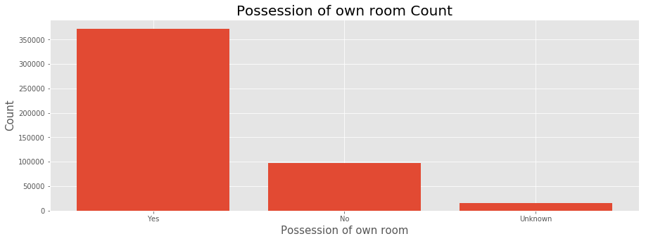
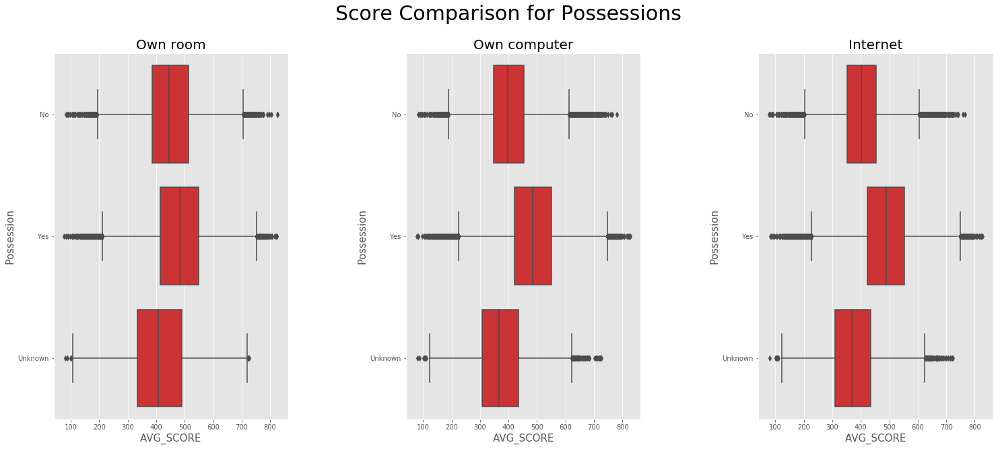
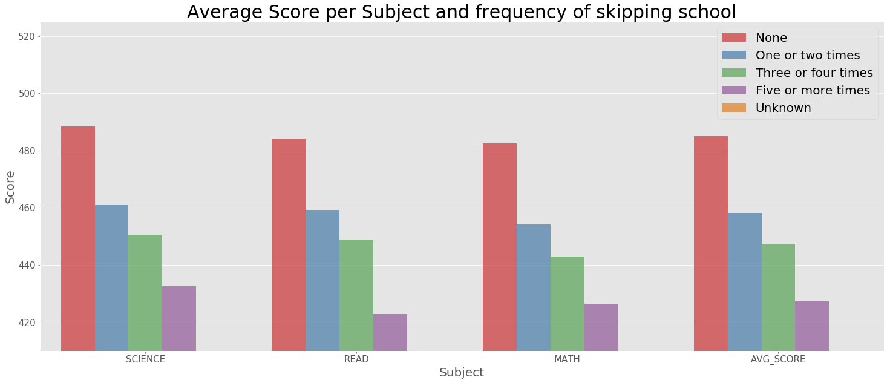
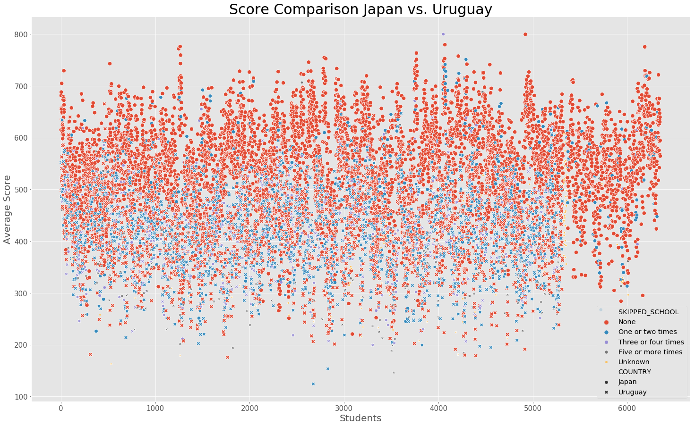
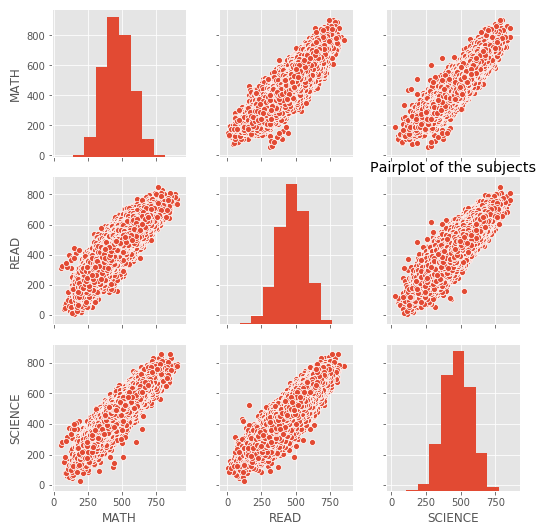
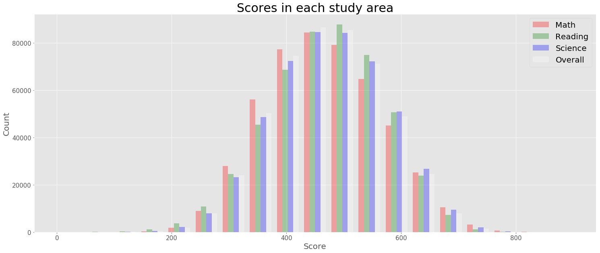

# PISA Data Findings
## by Josip Matic  

## Introduction

### PISA

> PISA is a worldwide study developed by the Organisation for Economic Co-operation and Development (OECD) to examine the skills of 15-year-old school students around the world. The study assesses students’ maths, science, and reading skills and contains a wealth of information on students’ background, their school and the organisation of the education system. For most countries, the sample is around 5,000 students, but in some countries the number is even higher. [source: https://www.oecd.org/pisa/  ]

>This dataset used for this project is from the PISA study in 2012.

## Dataset Quik Overview
Let's have first a look at the dataset after the data is loaded into the dataframe.


```python
# import all packages and set plots to be embedded inline
import numpy as np
import pandas as pd
import matplotlib.pyplot as plt
import matplotlib.style as style
style.available
style.use('ggplot')
import seaborn as sb
%matplotlib inline

# Import dataset
pisa = pd.read_csv(r'C:\Users\Josip\Documents\_Udacity\ND_DA\5_Assessment\pisa2012.csv', encoding = "ISO-8859-1", low_memory=False)
pisa_dict = pd.read_csv(r'C:\Users\Josip\Documents\_Udacity\ND_DA\5_Assessment\pisadict2012.csv', encoding = "ISO-8859-1", names=['ColName','Definition'])
```


```python
pisa.info()
```

    <class 'pandas.core.frame.DataFrame'>
    RangeIndex: 485490 entries, 0 to 485489
    Columns: 636 entries, Unnamed: 0 to VER_STU
    dtypes: float64(250), int64(18), object(368)
    memory usage: 2.3+ GB
    

The dataset contains 636 variables that define a student. Almost half a million students particpated in this study and the dataset used for this project has a size of around 2.3GB.

### Questions to be answered

Some of the questions that were answered in this project were:
- Are there differences between students in scores that skip school or not?
- In what countries do students skip the most often?
- By comparing the country with the highest frequency and the lowest frequency of skipping school are there some visible differences in a plot by comparing them?
- Does possession affect the scoring of a student?
- How do the subjects correlate to each other?

> The questions were answered by explorative and explanoratory data analysis with univariate, bivariate and multivariate plots.

## Data Wrangling


```python
# Copies of original datasets are asigned to new dataframes
pisa_clean = pisa.copy()
pisa_dict_clean = pisa_dict.copy()

# Columns with relevance in this project
col_names = ['CNT','STIDSTD','AGE','ST04Q01','ST08Q01'
            ,'ST11Q01','ST11Q02','ST26Q02','ST26Q04','ST26Q06'
            ,'PV1MATH','PV2MATH','PV3MATH','PV4MATH','PV5MATH'
            ,'PV1READ','PV2READ','PV3READ','PV4READ','PV5READ'
            ,'PV1SCIE','PV2SCIE','PV3SCIE','PV4SCIE','PV5SCIE']
pisa_clean = pisa_clean[col_names]
```

#### Tidiness
Tidiness of the data ensured by taking the mean of each subject. The amount of columns were minimized by 13 rows


```python
# Mean of math calculated
pisa_clean['MATH'] = pisa_clean[['PV1MATH','PV2MATH','PV3MATH','PV4MATH','PV5MATH']].mean(axis=1)
# Mean of reading calculated
pisa_clean['READ'] = pisa_clean[['PV1READ','PV2READ','PV3READ','PV4READ','PV5READ']].mean(axis=1)
# Mean of science calculated
pisa_clean['SCIENCE'] = pisa_clean[['PV1SCIE','PV2SCIE','PV3SCIE','PV4SCIE','PV5SCIE']].mean(axis=1)

# drop columns
pisa_clean.drop(['PV1MATH','PV2MATH','PV3MATH','PV4MATH','PV5MATH',
                 'PV1READ','PV2READ','PV3READ','PV4READ','PV5READ',
                 'PV1SCIE','PV2SCIE','PV3SCIE','PV4SCIE','PV5SCIE'], 1, inplace=True)
```

#### Renaming of the columns
To have a better human-readable text in front of the examiner


```python
# renaming the columns
pisa_clean.columns = ['COUNTRY','STUDENT_ID','AGE','GENDER','SKIPPED_SCHOOL'
                     ,'AT_HOME_MOTHER','AT_HOME_FATHER','POS_OWN_ROOM'
                     ,'POS_OWN_COMP','POS_INTERNET','MATH','READ','SCIENCE']
```

#### Feature Engineering
Adding the average of all subject scores to a new column


```python
# Calc average of all scores
pisa_clean['AVG_SCORE'] = pisa_clean[['MATH','READ','SCIENCE']].mean(axis=1)
```

#### Further ensurance of data quality


```python
# remove blank spaces
pisa_clean.SKIPPED_SCHOOL = pisa_clean.SKIPPED_SCHOOL.str[:-2]
```


```python
# Fill NaN in column AGE with average of all ages
pisa_clean['AGE'] = pisa_clean['AGE'].fillna(pisa_clean['AGE'].mean())
# Replacing all "empty" strings with 'Unknown'
pisa_clean = pisa_clean.replace(np.nan, 'Unknown', regex=True)
```

## Summary of Findings
The students performance was tested in various aspects. For example, how the students scored in the different subjects. In a further step, a couple of variables were picked and analyzed if they affected the scoring of the students.

### Possessions
Among others, it was investigated if the students possessed their own room or not and afterwards investigated if it had an effect on their scoring.


```python
# Count of POS_OWN_ROOM
posOwnRoom_agg = pisa_clean['POS_OWN_ROOM'].value_counts().reset_index(name='COUNT').rename(columns={'index': 'POS_OWN_ROOM'})
posOwnRoom_agg
```


<div>
<style scoped>
    .dataframe tbody tr th:only-of-type {
        vertical-align: middle;
    }

    .dataframe tbody tr th {
        vertical-align: top;
    }

    .dataframe thead th {
        text-align: right;
    }
</style>
<table border="1" class="dataframe">
  <thead>
    <tr style="text-align: right;">
      <th></th>
      <th>POS_OWN_ROOM</th>
      <th>COUNT</th>
    </tr>
  </thead>
  <tbody>
    <tr>
      <th>0</th>
      <td>Yes</td>
      <td>372241</td>
    </tr>
    <tr>
      <th>1</th>
      <td>No</td>
      <td>97452</td>
    </tr>
    <tr>
      <th>2</th>
      <td>Unknown</td>
      <td>15797</td>
    </tr>
  </tbody>
</table>
</div>


```python
plt.figure(figsize = [15, 5])
plt.bar(posOwnRoom_agg['POS_OWN_ROOM'],posOwnRoom_agg['COUNT']);
plt.yticks(fontsize= 10)
plt.xticks(fontsize= 10)
plt.xlabel('Possession of own room', fontsize= 15);
plt.ylabel('Count', fontsize= 15)
plt.title('Possession of own room Count', fontsize=20);
plt.show();
```





```python
# create figure
plt.figure(figsize = [25, 10])
# whitespace between subplots
plt.subplots_adjust(wspace = 0.50) 

plt.suptitle('Score Comparison for Possessions', fontsize= 30)

# 1. subplot
plt.subplot(1, 3, 1)
plt.title('Own room', fontsize= 20)
# set up boxplot
sb.boxplot(x = pisa_clean['AVG_SCORE'], y = pisa_clean['POS_OWN_ROOM'], 
           color=sb.color_palette('Set1')[0]);
# fine-tuning
plt.yticks(fontsize= 10)
plt.xticks(fontsize= 10)
plt.xlabel('AVG_SCORE', fontsize= 15)
plt.ylabel('Possession',fontsize= 15)

# 2. subplot
plt.subplot(1, 3, 2)
plt.title('Own computer', fontsize= 20)
# set up boxplot
sb.boxplot(x = pisa_clean['AVG_SCORE'], y = pisa_clean['POS_OWN_COMP'], 
           color=sb.color_palette('Set1')[0]);
# fine-tuning
plt.yticks(fontsize= 10)
plt.xticks(fontsize= 10)
plt.xlabel('AVG_SCORE', fontsize= 15)
plt.ylabel('Possession',fontsize= 15)

# 3. subplot
plt.subplot(1, 3, 3)
plt.title('Internet', fontsize= 20)
# set up boxplot
sb.boxplot(x = pisa_clean['AVG_SCORE'], y = pisa_clean['POS_INTERNET'], 
           color=sb.color_palette('Set1')[0]);
# fine-tuning
plt.yticks(fontsize= 10)
plt.xticks(fontsize= 10)
plt.xlabel('AVG_SCORE', fontsize= 15)
plt.ylabel('Possession',fontsize= 15)

# save plot as png
plt.savefig('bivariate_bp_ScoreComparisonPossession.png')
plt.show();
```





### Skipping school
Another topic was to investigated thorough if skipping school affected the scores of the students, furthermore, two countries were in greater detail compared.


```python
# Check what selections are possible and the count of each selection
pisa_clean['SKIPPED_SCHOOL'].value_counts()
```


    None                   306065
    One or two times       124380
    Three or four times     29817
    Five or more times      18881
    Unknown                  6347
    Name: SKIPPED_SCHOOL, dtype: int64


```python
# Aggregate cleaned dataset for desired visualization
pisa_skip_school_agg = pisa_clean.groupby('SKIPPED_SCHOOL')['MATH','READ','SCIENCE','AVG_SCORE'].mean().reset_index()

# Create new dataframe for barplot output
pisa_skipped_vis = pd.DataFrame(columns=['SKIPPED_SCHOOL','SUBJECT','AVG_SCORE'])
# iterate row by row and column by column and insert into new dataframe with modified shape
for index, row in pisa_skip_school_agg.iterrows(): 
    for columnname in ['MATH','READ','SCIENCE','AVG_SCORE']:
        pisa_skipped_vis = pisa_skipped_vis.append({ 'SKIPPED_SCHOOL': row['SKIPPED_SCHOOL'],
                                                     'SUBJECT': columnname,
                                                     'AVG_SCORE': row[columnname]}, ignore_index=True)
# Sort dataframe by score
pisa_skipped_vis = pisa_skipped_vis.sort_values(by = ['SUBJECT','AVG_SCORE'], axis=0, ascending=False)

# create figure
plt.figure(figsize = [25, 10])
# create barplot
sb.barplot(x='SUBJECT', y='AVG_SCORE', hue='SKIPPED_SCHOOL', data= pisa_skipped_vis, 
           palette=sb.color_palette('Set1'), alpha=0.7)
# set title and labels
plt.title('Average Score per Subject and frequency of skipping school', fontsize=30)
plt.legend(loc='upper right', fontsize= 20)
plt.yticks(fontsize= 15)
plt.xticks(fontsize= 15)
plt.xlabel('Subject', fontsize= 20)
plt.ylabel('Score',fontsize= 20)
plt.ylim(410, 525)

# save plot as png
plt.savefig('univariate_bp_ScoreSkippingSchool.png')
plt.show()
```





There is an obvious pattern that students that do not skip school are overall in each subject better than 
students skipping school.
The difference from students never skipping school and skipping five or more times in Score is 13.5 % worse.
Students that skip school only one or two times are in average 5.8 % worse than students that never skip school.


```python
# create figure
plt.figure(figsize = [25, 15])
# make scatterplot
sb.scatterplot(x= 'STUDENT_ID', y= 'AVG_SCORE', hue= 'SKIPPED_SCHOOL', size= 'SKIPPED_SCHOOL', style= 'COUNTRY', data= pisa_clean[pisa_clean['COUNTRY'].isin(['Uruguay','Japan'])]);
# fine-tuning
plt.title('Score Comparison Japan vs. Uruguay', fontsize= 30)
plt.yticks(fontsize= 15)
plt.xticks(fontsize= 15)
plt.xlabel('Students', fontsize= 20)
plt.ylabel('Average Score',fontsize= 20)
plt.legend(fontsize='x-large', title_fontsize='40')

# save plot as png
plt.savefig('multivariate_sp_ScoreStudents.png')
plt.show()
```





This plot shows clearly that the higher the grade is the lesser the possibility of a student skipping school. This is visible as all students have never skipped school are colored red. There is a threshold at around 550 to see where the students drastically disapear that have skipped school. But of course there are some outliers as well to see, that managed to reach a score of more than 600.
It appears as in the previous investigations that Uruguay has significantly more students that have skipped school than Japan.

### Subjects overall
One of the main findings is, that students score in one subject with a similar score as in another subject. The correlation between the scores is at a high 0.8 by looking at the plot below.


```python
sb.pairplot(pisa_clean[['MATH','READ','SCIENCE']])
plt.yticks(fontsize= 10)
plt.xticks(fontsize= 10)
plt.title('Pairplot of the subjects')

# save plot as png
plt.savefig('multivariate_pp_GradesCorr.png')
plt.show()
```





Looking at the ovarall scoring, the pairplot and its correlation from before make sense.


```python
plt.figure(figsize = [25, 10])

bins = np.linspace(0, 900, 20)

plt.hist([pisa_clean['MATH'], pisa_clean['READ'], pisa_clean['SCIENCE'], pisa_clean['AVG_SCORE']], bins, 
         alpha=0.3, label=['Math','Reading','Science', 'Overall'], color=['red','green','blue','white'])
plt.legend(loc='upper right', fontsize= 20)
plt.yticks(fontsize= 15)
plt.xticks(fontsize= 15)
plt.xlabel('Score', fontsize= 20);
plt.ylabel('Count', fontsize= 20)
plt.title('Scores in each study area', fontsize=30);
plt.show()
```





## Key Insights

- Are there differences between students in scores that skip school or not?
> With this subset of the dataset it is cleary visible that students have a worse score if they skip school. The score worsens drastically if the students skip school more than once.
- In what countries do students skip the most often?
> Students, comparing to all participants per country skip the most frequent in Uruguay. More than half the students skipped in Uruguay school at least once since they participated at the pisa study in 2012.
- By comparing the country with the highest frequency and the lowest frequency of skipping school are there some visible differences in a plot by comparing them?
> By comparing only the countries on their own and between the students that have never skipped school and those that have skipped school, it is clearly visible the gap in scoring. Comparing those two countries only amplified the findings from before.
- Does possession affect the scoring of a student?
> It is unfair but true, if students do not posses a computer, own room or internet they score worse than their fellow students with these possessions.
- How do the subjects correlate to each other?
> All 3 subjects have a strong correlation. By looking at the pairplot, the correlation is around at 0.8 between all subjects. So, if a student is good in science so should he/she be good in math or reading and vise versa.
